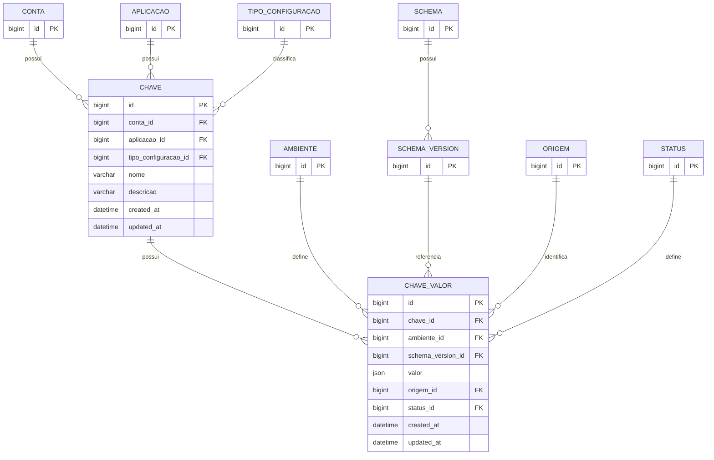

# Feature — Configurações Dinâmicas (Key API)

## 1. Objetivo
A Feature de Configurações é responsável pelo cadastro, gerenciamento e disponibilização de chaves de parametrização (*Feature Toggles* e *Feature Flags*) de uma aplicação por ambiente.

A arquitetura blinda o ecossistema exigindo que toda **CHAVE** possua um contrato estrutural (Schema) associado. Cada ambiente operacional gerencia seu ciclo de vida de forma isolada, podendo utilizar valores e versões diferentes desse mesmo Schema através da promoção controlada.

---

## 2. Abordagem Arquitetural: Catálogo de Schemas Primitivos (Universais)
Para simplificar a experiência do usuário e garantir governança imediata, o sistema nasce com um catálogo global de **Schemas Primitivos e Formatos Comuns** pré-cadastrados (associados a uma conta de sistema ou `conta_id IS NULL` com visibilidade pública).

Toda nova chave criada deve, obrigatoriamente, referenciar uma versão desse catálogo ou um Schema customizado da própria conta. O campo `CHAVE_VALOR.valor` será armazenado no MySQL como tipo binário `JSON` nativo, permitindo validar e salvar com sucesso as seguintes estruturas:

### Matriz de Tipos de Configuração do Catálogo Global

| Nome do Tipo | JSON Schema Base | Exemplo de Payload Válido | Caso de Uso Prático |
| :--- | :--- | :--- | :--- |
| **Booleano** | `{"type": "boolean"}` | `true` ou `false` | *Kill Switch* / Ligar e desligar recursos. |
| **Texto Não Vazio** | `{"type": "string", "minLength": 1}` | `"Estamos em manutenção"` | Mensagens dinâmicas de tela / Banners. |
| **Número Inteiro** | `{"type": "integer"}` | `50` | Limite de paginação, tentativas de reenvio. |
| **Número Decimal** | `{"type": "number"}` | `15.50` | Percentual de juros, taxas ou descontos. |
| **URL / URI** | `{"type": "string", "format": "uri"}` | `"https://pagamentos.com"`| Alterar *endpoints* de parceiros por ambiente. |
| **UUID** | `{"type": "string", "format": "uuid"}`| `"f81d4fae-7dec-11d0-a765..."` | Vinculação de IDs estáveis globais. |
| **Opções Fixas (Enum)**| `{"type": "string", "enum": ["A", "B"]}`| `"RANDOM"` | Seleção de algoritmos de teste A/B. |
| **Lista Não Vazia** | `{"type": "array", "minItems": 1}` | `["PROD-1", "PROD-2"]` | Lista de IDs de produtos com frete grátis. |
| **Objeto Estruturado**| `{"type": "object", "minProperties": 1}`| `{"retry": 3, "timeout": 1000}` | Mapas de propriedades complexas de infra. |
| **Curinga Absoluto** | `{}` | Qualquer valor não-nulo | Permite testes livres sem travas rígidas. |

---


## 3. Diagrama de Relacionamento de Entidades (ERD)



## 3.1 Modelo de Dados e Divisão de Responsabilidades

O ecossistema divide as tabelas para garantir que a **CHAVE** exista de forma agnóstica ao ambiente de execução. Quem detém estado, valor, auditoria de origem e versão de contrato é a tabela **CHAVE_VALOR**.

```text
CHAVE (Identidade Lógica Global)
  │
  └── possui n
        ▼
   CHAVE_VALOR (Inteligência e Estado Isolado por Ambiente)
        ├── AMBIENTE (DEV, HML, PRD)
        ├── SCHEMA_VERSION (Vínculo dinâmico com o contrato)
        ├── STATUS (CRIADA, PUBLICADA, DESATIVADA)
        └── ORIGEM (MANUAL, PROMOCAO, AUTOMACAO, IMPORTACAO)
```

### Matriz de Atribuições de Negócio

| Entidade | Responsabilidade Conceitual |
| :--- | :--- |
| **`CHAVE`** | Define **o que é** a configuração (nome único, contexto, aplicação e escopo). |
| **`CHAVE_VALOR`** | Define **o comportamento operacional e o valor** em um determinado ambiente. |
| **`STATUS`** | Estado do ciclo de vida daquele valor no ambiente (`CRIADA`, `PUBLICADA`, `DESATIVADA`). |
| **`ORIGEM`** | Mecanismo de entrada daquele dado para fins de auditoria (`MANUAL`, `PROMOCAO`). |
| **`TIPO_CONFIGURACAO`**| Classificação técnica ou de negócio da chave (`ENGENHARIA` ou `NEGOCIO`). |

---

## 4. Regras de Integridade e Consistência Contratual

### Da Entidade CHAVE
* A combinação de `conta_id + aplicacao_id + nome` deve ser **estritamente única**.
* O `nome` da chave é **imutável** após a sua criação e deve respeitar a máscara Regex: `^[a-z0-9]+([.-][a-z0-9]+)*$` (Ex: `payment.retry-count`).

### Da Entidade CHAVE_VALOR e amarração de Schemas
* Cada combinação de `chave_id + ambiente_id` deve possuir no máximo um registro vigente: `UNIQUE(chave_id, ambiente_id)`.
* **Consistência Vertical de Contratos:** O `schema_version_id` injetado pelo usuário na tabela `CHAVE_VALOR` deve, obrigatoriamente, pertencer ao mesmo `schema_id` lógico associado à raiz da árvore. A aplicação deve barrar cruzamento de versões de Schemas diferentes para a mesma chave.

---

## 5. Fluxo de Validação e Persistência Dinâmica

Quando a API recebe uma requisição de escrita para salvar ou atualizar um valor por ambiente:
1. O sistema localiza o registro correspondente em `SCHEMA_VERSION` através do `schema_version_id` enviado.
2. Extrai o campo string contendo o `json_schema`.
3. Valida o payload de entrada (mapeado no Java como `JsonNode`) contra o JSON Schema.
4. Se o valor falhar (ex: texto enviado para um schema do tipo Booleano), a transação é abortada e uma exceção descritiva é retornada para a API.
5. Se passar, o registro é persistido de forma nativa na coluna `JSON` do MySQL.

---

## 6. Pipeline de Cache Limpo (Sem Caracteres de Escape)

Para garantir que o **API Gateway** ou os **Microfrontends (MFEs)** consumam os valores de cache de forma ultrarrápida e sem a necessidade de limpar barras invertidas de escape (`"\"Minha String\""`), a camada de escrita no Redis aplica a seguinte regra de extração:

1. **Se o `JsonNode` for textual puro (`isTextual()`):** Salva no Redis usando a extração crua `.asText()`. O Redis armazenará o texto limpo: `Minha String`.
2. **Se for Booleano, Número ou Objeto Complexo:** Salva o valor serializado diretamente. O Redis armazenará `true`, `123` ou `{"retry":3}`.
3. **No método GET da API:** O Controller responde entregando o `JsonNode` tipado polimorficamente dentro do atributo `"valor"`. O Frontend recebe o dado em seu tipo nativo JavaScript, livre de escapes de string.

---

## 7. Scripts de Estrutura de Banco de Dados (DDL - MySQL)

```sql
-- Criado no schema isolado 'key_api'
-- Nota: Constraints para tabelas como CONTA, APLICACAO e AMBIENTE devem ser lógicas (feitas no service da aplicação), 
-- mantendo o isolamento de microsserviços via Views locais de leitura.

CREATE TABLE CHAVE (
    id BIGINT NOT NULL AUTO_INCREMENT,
    conta_id BIGINT NOT NULL,
    aplicacao_id BIGINT NOT NULL,
    tipo_configuracao_id BIGINT NOT NULL,
    nome VARCHAR(150) NOT NULL,
    descricao VARCHAR(255),
    created_at DATETIME(3) NOT NULL,
    updated_at DATETIME(3) NOT NULL,
    
    PRIMARY KEY (id),
    INDEX idx_chave_conta (conta_id),
    INDEX idx_chave_aplicacao (aplicacao_id),
    INDEX idx_chave_tipo (tipo_configuracao_id),
    UNIQUE uk_chave_conta_aplicacao_nome (conta_id, aplicacao_id, nome)
) ENGINE=InnoDB ROW_FORMAT=DYNAMIC;

CREATE TABLE CHAVE_VALOR (
    id BIGINT NOT NULL AUTO_INCREMENT,
    chave_id BIGINT NOT NULL,
    ambiente_id BIGINT NOT NULL,
    schema_version_id BIGINT NOT NULL,
    valor JSON NOT NULL, -- Coluna JSON nativa para suportar números, strings, arrays ou objetos
    origem_id BIGINT NOT NULL,
    status_id BIGINT NOT NULL,
    created_at DATETIME(3) NOT NULL,
    updated_at DATETIME(3) NOT NULL,
    
    PRIMARY KEY (id),
    INDEX idx_chave_valor_chave (chave_id),
    INDEX idx_chave_valor_ambiente (ambiente_id),
    INDEX idx_chave_valor_schema_version (schema_version_id),
    INDEX idx_chave_valor_status (status_id),
    UNIQUE uk_chave_valor_chave_ambiente (chave_id, ambiente_id)
) ENGINE=InnoDB ROW_FORMAT=DYNAMIC;
```

---

## 8. Mapeamento de Entidades no Java (Spring Boot 3.x / Hibernate 6)

Para suportar a polivalência da coluna `JSON` do MySQL de forma transparente (aceitando o número `1`, a string `"texto"`, ou objetos complexos), a Entidade JPA e o DTO expõem o campo utilizando a inteligência de nós do Jackson.

### Entidade JPA Operacional
```java
package com.keyapi.domain.model;

import com.fasterxml.jackson.databind.JsonNode;
import org.hibernate.annotations.JdbcTypeCode;
import org.hibernate.type.SqlTypes;
import jakarta.persistence.*;
import lombok.Data;
import java.time.LocalDateTime;

@Data
@Entity
@Table(name = "CHAVE_VALOR", schema = "key_api")
public class ChaveValor {

    @Id
    @GeneratedValue(strategy = GenerationType.IDENTITY)
    private Long id;

    @Column(name = "chave_id", nullable = false)
    private Long chaveId;

    @Column(name = "ambiente_id", nullable = false)
    private Long ambienteId;

    @Column(name = "schema_version_id", nullable = false)
    private Long schemaVersionId;

    @JdbcTypeCode(SqlTypes.JSON) -- Amarração nativa do Hibernate 6 com o tipo JSON do MySQL
    @Column(name = "valor", nullable = false)
    private JsonNode valor; -- Aceita tipos primitivos puros ou objetos estruturados

    @Column(name = "origem_id", nullable = false)
    private Long origemId;

    @Column(name = "status_id", nullable = false)
    private Long statusId;

    @Column(name = "created_at", nullable = false)
    private LocalDateTime createdAt;

    @Column(name = "updated_at", nullable = false)
    private LocalDateTime updatedAt;
}
```

### Contrato de Resposta HTTP (DTO de Exposição)
```java
package com.keyapi.adapters.http.dto;

import com.fasterxml.jackson.databind.JsonNode;
import lombok.AllArgsConstructor;
import lombok.Data;

@Data
@AllArgsConstructor
public class ConfigurationResponseDTO {
    private String chave;
    private JsonNode valor; -- Renderiza nativamente no JSON de saída sem caracteres de escape
}
```

---

## 9. Critérios de Aceite Iniciais para Homologação do Desenvolvimento

### Ciclo de Definição Lógica (CHAVE)
- [ ] **Validação de Unicidade:** Cadastrar chaves de configuração validando a unicidade estrita da tripla `conta_id + aplicacao_id + nome`. O banco deve rejeitar tentativas de duplicação.
- [ ] **Validação de Nomenclatura:** Aplicar interceptor ou validação via Regex no `nome` da chave, rejeitando camelCase, underscores, espaços ou caracteres especiais na API, aceitando apenas minúsculas, pontos e traços.
- [ ] **Imutabilidade Estrutural:** Bloquear via API qualquer tentativa de atualizar o `nome`, o `aplicacao_id` ou o `conta_id` após a chave ter sido criada.

### Execução e Validação Contratual (CHAVE_VALOR)
- [ ] **Validação de Contrato (JSON Schema):** Executar o motor de validação do `java-json-schema` em tempo de escrita, garantindo o bloqueio de dados incompatíveis com a versão do Schema selecionado (ex: rejeitar texto em chaves do tipo Booleano).
- [ ] **Consistência de Schema:** Validar se o `schema_version_id` enviado pertence ao `schema_id` atrelado à `CHAVE` pai, impedindo o cruzamento acidental de contratos diferentes.
- [ ] **Isolamento de Ambientes:** Validar a restrição de banco impedindo a duplicidade de ambientes para a mesma configuração (`uk_chave_valor_chave_ambiente`).
- [ ] **Independência de Estados:** Confirmar o isolamento operacional: a mesma chave deve poder possuir o valor `5000` com status `PUBLICADA` em `DEV`, e o valor `2000` com status `CRIADA` em `PRD` de forma totalmente independente.

### Camada de Distribuição e Performance (Cache Redis)
- [ ] **Cache de Strings Limpas:** Validar via inspeção direta no Redis que chaves do tipo String não possuem aspas duplas extras de escape ou barras invertidas em seu conteúdo interno (`Minha String` e nunca `"\"Minha String\""`).
- [ ] **Cache de Primitivos e Objetos:** Validar que chaves do tipo Booleano, Número ou Objetos Complexos são serializadas e gravadas de forma nativa (`true`, `123`, `{"retry":3}`).
- [ ] **Resiliência na Recuperação:** Testar o método de leitura do cache (`readTree` / `convertValue`) garantindo que o Java consiga remontar o `JsonNode` perfeitamente, seja o conteúdo do Redis um valor primitivo solto ou um objeto estruturado.
- [ ] **SLA de Performance:** Garantir tempo de resposta da rota de consulta de chave (GET) abaixo de 5ms utilizando o tráfego prioritário pelo Redis.
