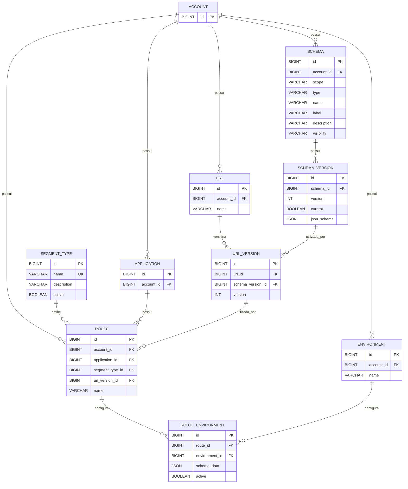

# Modelo de Dados — Route

## 1. Visão geral

O modelo de Route é dividido em quatro níveis principais:

```text
PLATFORM
   │
   └── ROUTE_TYPE
          │
          ▼
ACCOUNT
   │
   ├── SCHEMA
   ├── ENVIRONMENT
   ├── FRIENDLY_URL
   │      └── FRIENDLY_URL_VERSION
   │
   └── APPLICATION
          │
          └── ROUTE
                 │
                 └── ROUTE_ENVIRONMENT
                        ├── ENVIRONMENT
                        ├── SCHEMA
                        └── FRIENDLY_URL_VERSION
```

A separação fundamental é:

```text
route
    → identidade da rota

route_environment
    → configuração da rota em determinado ambiente
```

---

# 2. `route_type`

## Responsabilidade

Catálogo global de tipos de Route administrado pela plataforma.

Exemplos:

```text
REST
GRAPHQL
SOAP
```

## Estrutura

```text
route_type
────────────────────────
id              PK
name
description
active
created_at
updated_at
```

## DDL

```sql
CREATE TABLE route_type (
    id BIGINT NOT NULL AUTO_INCREMENT,
    name VARCHAR(100) NOT NULL,
    description VARCHAR(500),
    active BOOLEAN NOT NULL DEFAULT TRUE,
    created_at TIMESTAMP NOT NULL DEFAULT CURRENT_TIMESTAMP,
    updated_at TIMESTAMP NOT NULL DEFAULT CURRENT_TIMESTAMP
        ON UPDATE CURRENT_TIMESTAMP,

    CONSTRAINT pk_route_type
        PRIMARY KEY (id),

    CONSTRAINT uk_route_type_name
        UNIQUE (name)
);
```

## Índices

A `UNIQUE(name)` já cria o índice necessário para pesquisa por nome.

```text
PK:
    id

UK:
    name
```

---

# 3. `account_route_type_schema`

## Responsabilidade

Define quais Schemas de uma Account podem ser utilizados por determinado `Route Type`.

O `route_type` é global, mas a associação é contextualizada pela Account.

Exemplo:

```text
Account A
    REST
       ├── Schema A
       ├── Schema B
       └── Schema C

Account B
    REST
       ├── Schema X
       └── Schema Y
```

## Estrutura

```text
account_route_type_schema
──────────────────────────────
id                  PK
account_id          FK
route_type_id       FK
schema_id           FK
active
created_at
updated_at
```

## Cardinalidade

```text
route_type  1 ─────── N account_route_type_schema

schema      1 ─────── N account_route_type_schema

account     1 ─────── N account_route_type_schema
```

Consequentemente:

```text
Account N ───── N Schema
       através de
account_route_type_schema
```

## Regra de unicidade

O mesmo Schema não deve ser associado duas vezes ao mesmo Route Type dentro da mesma Account.

```sql
UNIQUE (
    account_id,
    route_type_id,
    schema_id
)
```

## DDL

```sql
CREATE TABLE account_route_type_schema (
    id BIGINT NOT NULL AUTO_INCREMENT,
    account_id BIGINT NOT NULL,
    route_type_id BIGINT NOT NULL,
    schema_id BIGINT NOT NULL,
    active BOOLEAN NOT NULL DEFAULT TRUE,
    created_at TIMESTAMP NOT NULL DEFAULT CURRENT_TIMESTAMP,
    updated_at TIMESTAMP NOT NULL DEFAULT CURRENT_TIMESTAMP
        ON UPDATE CURRENT_TIMESTAMP,

    CONSTRAINT pk_account_route_type_schema
        PRIMARY KEY (id),

    CONSTRAINT fk_account_route_type_schema_route_type
        FOREIGN KEY (route_type_id)
        REFERENCES route_type (id),

    CONSTRAINT uk_account_route_type_schema
        UNIQUE (
            account_id,
            route_type_id,
            schema_id
        ),

    INDEX idx_arts_account
        (account_id),

    INDEX idx_arts_route_type
        (route_type_id),

    INDEX idx_arts_schema
        (schema_id)
);
```

> As FKs de `account_id` e `schema_id` devem apontar para as tabelas existentes no seu modelo (`account` e `schema`), caso essas tabelas estejam no mesmo schema/banco.

---

# 4. `route`

## Responsabilidade

Representa a identidade lógica da Route.

```text
route
────────────────────────
id
account_id
application_id
route_type_id
name
created_at
updated_at
```

A Route **não possui `environment_id`**.

Também não possui `schema_id`.

Isso é intencional.

## Cardinalidade

```text
account       1 ─────── N route

application   1 ─────── N route

route_type    1 ─────── N route

route         1 ─────── N route_environment
```

## Regra de unicidade

Uma Route deve ser única dentro da Application.

```sql
UNIQUE (
    application_id,
    name
)
```

Isso permite:

```text
Application A
├── cliente
├── pedido
└── produto

Application B
├── cliente
└── pedido
```

O mesmo nome pode existir em Applications diferentes.

## DDL

```sql
CREATE TABLE route (
    id BIGINT NOT NULL AUTO_INCREMENT,
    account_id BIGINT NOT NULL,
    application_id BIGINT NOT NULL,
    route_type_id BIGINT NOT NULL,
    name VARCHAR(150) NOT NULL,
    created_at TIMESTAMP NOT NULL DEFAULT CURRENT_TIMESTAMP,
    updated_at TIMESTAMP NOT NULL DEFAULT CURRENT_TIMESTAMP
        ON UPDATE CURRENT_TIMESTAMP,

    CONSTRAINT pk_route
        PRIMARY KEY (id),

    CONSTRAINT fk_route_route_type
        FOREIGN KEY (route_type_id)
        REFERENCES route_type (id),

    CONSTRAINT uk_route_application_name
        UNIQUE (
            application_id,
            name
        ),

    INDEX idx_route_account
        (account_id),

    INDEX idx_route_application
        (application_id),

    INDEX idx_route_route_type
        (route_type_id)
);
```

---

# 5. `route_environment`

## Responsabilidade

Representa a configuração de uma Route em determinado Environment.

É nessa tabela que ficam os dados que podem variar entre ambientes.

```text
route_environment
────────────────────────────────
id
route_id
environment_id
schema_id
friendly_url_version_id
route_privacy
schema_data
created_at
updated_at
```

## Cardinalidade

```text
route
  1 ─────── N route_environment

environment
  1 ─────── N route_environment

schema
  1 ─────── N route_environment

friendly_url_version
  1 ─────── N route_environment
```

## Regra fundamental

Uma Route pode possuir **no máximo uma configuração por Environment**.

Portanto:

```sql
UNIQUE (
    route_id,
    environment_id
)
```

## DDL

```sql
CREATE TABLE route_environment (
    id BIGINT NOT NULL AUTO_INCREMENT,
    route_id BIGINT NOT NULL,
    environment_id BIGINT NOT NULL,
    schema_id BIGINT NOT NULL,
    friendly_url_version_id BIGINT,
    route_privacy VARCHAR(50) NOT NULL,
    schema_data JSON NOT NULL,
    created_at TIMESTAMP NOT NULL DEFAULT CURRENT_TIMESTAMP,
    updated_at TIMESTAMP NOT NULL DEFAULT CURRENT_TIMESTAMP
        ON UPDATE CURRENT_TIMESTAMP,

    CONSTRAINT pk_route_environment
        PRIMARY KEY (id),

    CONSTRAINT fk_route_environment_route
        FOREIGN KEY (route_id)
        REFERENCES route (id),

    CONSTRAINT fk_route_environment_environment
        FOREIGN KEY (environment_id)
        REFERENCES environment (id),

    CONSTRAINT fk_route_environment_schema
        FOREIGN KEY (schema_id)
        REFERENCES schema (id),

    CONSTRAINT fk_route_environment_friendly_url_version
        FOREIGN KEY (friendly_url_version_id)
        REFERENCES friendly_url_version (id),

    CONSTRAINT uk_route_environment
        UNIQUE (
            route_id,
            environment_id
        ),

    INDEX idx_route_environment_route
        (route_id),

    INDEX idx_route_environment_environment
        (environment_id),

    INDEX idx_route_environment_schema
        (schema_id),

    INDEX idx_route_environment_friendly_url_version
        (friendly_url_version_id)
);
```

---

# 6. `friendly_url`

## Responsabilidade

A Friendly URL pertence à **Account**, e não à Application.

Isso permite que múltiplas Applications da mesma Account compartilhem a mesma Friendly URL e suas versões.

```text
friendly_url
────────────────────────
id
account_id
name
created_at
updated_at
```

## Cardinalidade

```text
account
   1 ─────── N friendly_url

friendly_url
   1 ─────── N friendly_url_version
```

Uma Friendly URL pode ser utilizada por várias Routes de várias Applications da mesma Account.

## Regra de unicidade

A Friendly URL deve ser única dentro da Account:

```sql
UNIQUE (
    account_id,
    name
)
```

Exemplo:

```text
Account A

Friendly URLs:
├── cliente
├── pedido
└── produto
```

E:

```text
Application A
└── Route X → cliente V3

Application B
└── Route Y → cliente V3

Application C
└── Route Z → cliente V2
```

## DDL

```sql
CREATE TABLE friendly_url (
    id BIGINT NOT NULL AUTO_INCREMENT,
    account_id BIGINT NOT NULL,
    name VARCHAR(150) NOT NULL,
    created_at TIMESTAMP NOT NULL DEFAULT CURRENT_TIMESTAMP,
    updated_at TIMESTAMP NOT NULL DEFAULT CURRENT_TIMESTAMP
        ON UPDATE CURRENT_TIMESTAMP,

    CONSTRAINT pk_friendly_url
        PRIMARY KEY (id),

    CONSTRAINT uk_friendly_url_account_name
        UNIQUE (
            account_id,
            name
        ),

    INDEX idx_friendly_url_account
        (account_id)
);
```

---

# 7. `friendly_url_version`

## Responsabilidade

Representa a evolução de uma Friendly URL.

```text
friendly_url_version
────────────────────────────
id
friendly_url_id
version
created_at
created_by
```

Exemplo:

```text
cliente
├── V1
├── V2
└── V3
```

A versão pertence à Friendly URL.

Não pertence:

```text
Application
Route
Environment
```

## Cardinalidade

```text
friendly_url
   1 ─────── N friendly_url_version
```

## Regra de unicidade

Uma Friendly URL não pode possuir duas vezes a mesma versão.

```sql
UNIQUE (
    friendly_url_id,
    version
)
```

## DDL

```sql
CREATE TABLE friendly_url_version (
    id BIGINT NOT NULL AUTO_INCREMENT,
    friendly_url_id BIGINT NOT NULL,
    version INT NOT NULL,
    created_at TIMESTAMP NOT NULL DEFAULT CURRENT_TIMESTAMP,
    created_by BIGINT NOT NULL,

    CONSTRAINT pk_friendly_url_version
        PRIMARY KEY (id),

    CONSTRAINT fk_friendly_url_version_friendly_url
        FOREIGN KEY (friendly_url_id)
        REFERENCES friendly_url (id),

    CONSTRAINT uk_friendly_url_version
        UNIQUE (
            friendly_url_id,
            version
        ),

    INDEX idx_friendly_url_version_friendly_url
        (friendly_url_id)
);
```

---

# 8. `schema`

`Schema` é uma entidade existente no modelo.

Conceitualmente:

```text
schema
────────────────────────
id
account_id
scope
type
name
label
description
...
```

Para Route:

```text
scope = ACCOUNT
type  = ROUTE
```

Não é necessário criar:

```text
route_schema
```

O relacionamento com Route ocorre através de:

```text
route_environment.schema_id
```

## Cardinalidade

```text
schema
   1 ─────── N route_environment
```

E também:

```text
schema
   1 ─────── N account_route_type_schema
```

---

# 9. `environment`

Também é uma entidade existente.

Conceitualmente:

```text
environment
────────────────────────
id
account_id
name
...
```

## Cardinalidade

```text
environment
   1 ─────── N route_environment
```

Uma Account pode possuir:

```text
DEV
HML
PROD
```

---

# 10. Relacionamentos completos

```text
                         ROUTE_TYPE
                             │
                             │ 1
                             │
                             │ N
              ACCOUNT_ROUTE_TYPE_SCHEMA
                    ▲              ▲
                    │              │
                    │              │
                  SCHEMA       ACCOUNT
                    │              │
                    │              │
                    │              │
                    │         ┌────┴─────┐
                    │         │          │
                    │         ▼          ▼
                    │   APPLICATION   FRIENDLY_URL
                    │         │          │
                    │         │          │ 1
                    │         ▼          │
                    │       ROUTE        │ N
                    │         │          ▼
                    │         │   FRIENDLY_URL_VERSION
                    │         │          ▲
                    │         │          │
                    │         ▼          │
                    └── ROUTE_ENVIRONMENT
                             │
                ┌────────────┼────────────┐
                │            │            │
                ▼            ▼            ▼
           ENVIRONMENT    SCHEMA    FRIENDLY_URL_VERSION
```

---

# 11. Cardinalidades

| Origem                 | Relação | Destino                     |
| ---------------------- | ------: | --------------------------- |
| `route_type`           |     1:N | `route`                     |
| `route_type`           |     1:N | `account_route_type_schema` |
| `account`              |     1:N | `route`                     |
| `account`              |     1:N | `friendly_url`              |
| `account`              |     1:N | `account_route_type_schema` |
| `application`          |     1:N | `route`                     |
| `route`                |     1:N | `route_environment`         |
| `environment`          |     1:N | `route_environment`         |
| `schema`               |     1:N | `route_environment`         |
| `schema`               |     1:N | `account_route_type_schema` |
| `friendly_url`         |     1:N | `friendly_url_version`      |
| `friendly_url_version` |     1:N | `route_environment`         |

---

# 12. Constraints de unicidade

## `route_type`

```sql
UNIQUE (name)
```

Garante um catálogo global sem tipos duplicados.

---

## `account_route_type_schema`

```sql
UNIQUE (
    account_id,
    route_type_id,
    schema_id
)
```

Garante que o mesmo Schema não seja associado duas vezes ao mesmo Route Type dentro da mesma Account.

---

## `route`

```sql
UNIQUE (
    application_id,
    name
)
```

Garante que uma Application não tenha duas Routes com o mesmo nome.

---

## `route_environment`

```sql
UNIQUE (
    route_id,
    environment_id
)
```

Garante uma única configuração da Route por Environment.

---

## `friendly_url`

```sql
UNIQUE (
    account_id,
    name
)
```

Garante que a Friendly URL seja única dentro da Account.

---

## `friendly_url_version`

```sql
UNIQUE (
    friendly_url_id,
    version
)
```

Garante que não existam duas versões iguais para a mesma Friendly URL.

---

# 13. Índices

Os principais índices são:

```text
route_type
    PK(id)
    UK(name)


account_route_type_schema
    PK(id)
    UK(account_id, route_type_id, schema_id)
    IDX(account_id)
    IDX(route_type_id)
    IDX(schema_id)


route
    PK(id)
    UK(application_id, name)
    IDX(account_id)
    IDX(application_id)
    IDX(route_type_id)


route_environment
    PK(id)
    UK(route_id, environment_id)
    IDX(route_id)
    IDX(environment_id)
    IDX(schema_id)
    IDX(friendly_url_version_id)


friendly_url
    PK(id)
    UK(account_id, name)
    IDX(account_id)


friendly_url_version
    PK(id)
    UK(friendly_url_id, version)
    IDX(friendly_url_id)
```

Observação: em MySQL, os índices criados pelas `PRIMARY KEY` e `UNIQUE` já atendem algumas necessidades de busca. Os índices individuais devem ser mantidos somente quando forem necessários para os padrões reais de consulta.

---

# 14. Regra de compartilhamento da Friendly URL

A alteração mais importante do modelo é:

```text
ACCOUNT
   │
   └── FRIENDLY_URL
          │
          └── FRIENDLY_URL_VERSION
```

e não:

```text
APPLICATION
   │
   └── FRIENDLY_URL
```

Isso permite:

```text
Account A
│
├── Application A
│      └── Route A
│             └── cliente V3
│
├── Application B
│      └── Route B
│             └── cliente V3
│
└── Friendly URL
       └── cliente
            ├── V1
            ├── V2
            └── V3
```

Portanto, a mesma Friendly URL e a mesma versão podem ser utilizadas por várias Applications.

---

# 15. Exemplo completo

Considere:

```text
Account: Itaú
```

Friendly URL:

```text
cliente
```

Versões:

```text
cliente
├── V1
├── V2
└── V3
```

Applications:

```text
Internet Banking
Mobile Banking
```

Routes:

```text
Internet Banking
└── consultar-cliente

Mobile Banking
└── consultar-cliente
```

Configuração:

```text
Internet Banking
└── consultar-cliente
      ├── DEV  → cliente V3
      ├── HML  → cliente V3
      └── PROD → cliente V2


Mobile Banking
└── consultar-cliente
      ├── DEV  → cliente V3
      ├── HML  → cliente V3
      └── PROD → cliente V3
```

Temos apenas uma Friendly URL:

```text
cliente
```

e apenas três versões:

```text
V1
V2
V3
```

Não há necessidade de duplicá-las por Application.

---

# 16. DDL consolidado

Considerando que `account`, `application`, `schema` e `environment` já existem:

```sql
CREATE TABLE route_type (
    id BIGINT NOT NULL AUTO_INCREMENT,
    name VARCHAR(100) NOT NULL,
    description VARCHAR(500),
    active BOOLEAN NOT NULL DEFAULT TRUE,
    created_at TIMESTAMP NOT NULL DEFAULT CURRENT_TIMESTAMP,
    updated_at TIMESTAMP NOT NULL DEFAULT CURRENT_TIMESTAMP
        ON UPDATE CURRENT_TIMESTAMP,

    CONSTRAINT pk_route_type
        PRIMARY KEY (id),

    CONSTRAINT uk_route_type_name
        UNIQUE (name)
);


CREATE TABLE account_route_type_schema (
    id BIGINT NOT NULL AUTO_INCREMENT,
    account_id BIGINT NOT NULL,
    route_type_id BIGINT NOT NULL,
    schema_id BIGINT NOT NULL,
    active BOOLEAN NOT NULL DEFAULT TRUE,
    created_at TIMESTAMP NOT NULL DEFAULT CURRENT_TIMESTAMP,
    updated_at TIMESTAMP NOT NULL DEFAULT CURRENT_TIMESTAMP
        ON UPDATE CURRENT_TIMESTAMP,

    CONSTRAINT pk_account_route_type_schema
        PRIMARY KEY (id),

    CONSTRAINT fk_arts_account
        FOREIGN KEY (account_id)
        REFERENCES account (id),

    CONSTRAINT fk_arts_route_type
        FOREIGN KEY (route_type_id)
        REFERENCES route_type (id),

    CONSTRAINT fk_arts_schema
        FOREIGN KEY (schema_id)
        REFERENCES schema (id),

    CONSTRAINT uk_account_route_type_schema
        UNIQUE (
            account_id,
            route_type_id,
            schema_id
        ),

    INDEX idx_arts_account
        (account_id),

    INDEX idx_arts_route_type
        (route_type_id),

    INDEX idx_arts_schema
        (schema_id)
);


CREATE TABLE friendly_url (
    id BIGINT NOT NULL AUTO_INCREMENT,
    account_id BIGINT NOT NULL,
    name VARCHAR(150) NOT NULL,
    created_at TIMESTAMP NOT NULL DEFAULT CURRENT_TIMESTAMP,
    updated_at TIMESTAMP NOT NULL DEFAULT CURRENT_TIMESTAMP
        ON UPDATE CURRENT_TIMESTAMP,

    CONSTRAINT pk_friendly_url
        PRIMARY KEY (id),

    CONSTRAINT fk_friendly_url_account
        FOREIGN KEY (account_id)
        REFERENCES account (id),

    CONSTRAINT uk_friendly_url_account_name
        UNIQUE (
            account_id,
            name
        ),

    INDEX idx_friendly_url_account
        (account_id)
);


CREATE TABLE friendly_url_version (
    id BIGINT NOT NULL AUTO_INCREMENT,
    friendly_url_id BIGINT NOT NULL,
    version INT NOT NULL,
    created_at TIMESTAMP NOT NULL DEFAULT CURRENT_TIMESTAMP,
    created_by BIGINT NOT NULL,

    CONSTRAINT pk_friendly_url_version
        PRIMARY KEY (id),

    CONSTRAINT fk_friendly_url_version_friendly_url
        FOREIGN KEY (friendly_url_id)
        REFERENCES friendly_url (id),

    CONSTRAINT uk_friendly_url_version
        UNIQUE (
            friendly_url_id,
            version
        ),

    INDEX idx_friendly_url_version_friendly_url
        (friendly_url_id)
);


CREATE TABLE route (
    id BIGINT NOT NULL AUTO_INCREMENT,
    account_id BIGINT NOT NULL,
    application_id BIGINT NOT NULL,
    route_type_id BIGINT NOT NULL,
    name VARCHAR(150) NOT NULL,
    created_at TIMESTAMP NOT NULL DEFAULT CURRENT_TIMESTAMP,
    updated_at TIMESTAMP NOT NULL DEFAULT CURRENT_TIMESTAMP
        ON UPDATE CURRENT_TIMESTAMP,

    CONSTRAINT pk_route
        PRIMARY KEY (id),

    CONSTRAINT fk_route_account
        FOREIGN KEY (account_id)
        REFERENCES account (id),

    CONSTRAINT fk_route_application
        FOREIGN KEY (application_id)
        REFERENCES application (id),

    CONSTRAINT fk_route_route_type
        FOREIGN KEY (route_type_id)
        REFERENCES route_type (id),

    CONSTRAINT uk_route_application_name
        UNIQUE (
            application_id,
            name
        ),

    INDEX idx_route_account
        (account_id),

    INDEX idx_route_application
        (application_id),

    INDEX idx_route_route_type
        (route_type_id)
);


CREATE TABLE route_environment (
    id BIGINT NOT NULL AUTO_INCREMENT,
    route_id BIGINT NOT NULL,
    environment_id BIGINT NOT NULL,
    schema_id BIGINT NOT NULL,
    friendly_url_version_id BIGINT,
    route_privacy VARCHAR(50) NOT NULL,
    schema_data JSON NOT NULL,
    created_at TIMESTAMP NOT NULL DEFAULT CURRENT_TIMESTAMP,
    updated_at TIMESTAMP NOT NULL DEFAULT CURRENT_TIMESTAMP
        ON UPDATE CURRENT_TIMESTAMP,

    CONSTRAINT pk_route_environment
        PRIMARY KEY (id),

    CONSTRAINT fk_route_environment_route
        FOREIGN KEY (route_id)
        REFERENCES route (id),

    CONSTRAINT fk_route_environment_environment
        FOREIGN KEY (environment_id)
        REFERENCES environment (id),

    CONSTRAINT fk_route_environment_schema
        FOREIGN KEY (schema_id)
        REFERENCES schema (id),

    CONSTRAINT fk_route_environment_friendly_url_version
        FOREIGN KEY (friendly_url_version_id)
        REFERENCES friendly_url_version (id),

    CONSTRAINT uk_route_environment
        UNIQUE (
            route_id,
            environment_id
        ),

    INDEX idx_route_environment_route
        (route_id),

    INDEX idx_route_environment_environment
        (environment_id),

    INDEX idx_route_environment_schema
        (schema_id),

    INDEX idx_route_environment_friendly_url_version
        (friendly_url_version_id)
);
```

---

# 17. Consideração importante sobre integridade entre Account

Existe um ponto importante no DDL acima.

Como `route`, `schema`, `environment` e `friendly_url` pertencem a uma Account, conceitualmente devemos impedir situações como:

```text
Route
  account_id = 10

Environment
  account_id = 20
```

sendo associados na mesma `route_environment`.

Da mesma forma, devemos evitar:

```text
Route
  account_id = 10

Schema
  account_id = 20
```

Isso significa que **FKs simples por ID não garantem sozinhas o mesmo contexto de Account**.

Se essa integridade precisar ser garantida pelo banco, o modelo deve utilizar chaves compostas ou uma estratégia equivalente.

Por exemplo:

```text
route
├── id
└── account_id

environment
├── id
└── account_id
```

e a associação poderia considerar:

```text
(route_id, account_id)
(environment_id, account_id)
```

Essa decisão é especialmente importante no seu modelo porque **Account é um boundary de isolamento**.

---

# 18. Modelo conceitual final

A arquitetura final pode ser resumida assim:

```text
                         PLATFORM
                            │
                            ▼
                       ROUTE_TYPE
                            │
                            │
                            ▼
                ACCOUNT_ROUTE_TYPE_SCHEMA
                            │
                            ▼
                         SCHEMA
                            ▲
                            │
                            │
ACCOUNT ────────────────────┼──────────────────────┐
  │                         │                      │
  │                         │                      │
  ▼                         │                      ▼
APPLICATION                 │                FRIENDLY_URL
  │                         │                      │
  │                         │                      ▼
  ▼                         │              FRIENDLY_URL_VERSION
 ROUTE                       │                      ▲
  │                          │                      │
  │                          ▼                      │
  └──────────────► ROUTE_ENVIRONMENT ◄─────────────┘
                         │
                         │
                         ▼
                    ENVIRONMENT
```

## Responsabilidades finais

| Tabela                      | Escopo                | Responsabilidade                               |
| --------------------------- | --------------------- | ---------------------------------------------- |
| `route_type`                | Plataforma            | Catálogo global de tipos de Route              |
| `account_route_type_schema` | Account               | Define Schemas permitidos para cada Route Type |
| `route`                     | Account + Application | Identidade lógica da Route                     |
| `route_environment`         | Route + Environment   | Configuração ambiental da Route                |
| `friendly_url`              | **Account**           | Identidade da Friendly URL compartilhável      |
| `friendly_url_version`      | Friendly URL          | Histórico/versionamento da Friendly URL        |
| `schema`                    | Account               | Estrutura utilizada pelo `schema_data`         |
| `environment`               | Account               | Ambiente de execução/configuração              |

## Princípio central

```text
ROUTE
    = identidade

ROUTE_ENVIRONMENT
    = configuração por ambiente

FRIENDLY_URL
    = recurso compartilhado da ACCOUNT

FRIENDLY_URL_VERSION
    = versão da Friendly URL

SCHEMA
    = recurso da ACCOUNT

ROUTE_TYPE
    = catálogo global da PLATFORM
```

Esse desenho permite que **Applications diferentes da mesma Account compartilhem Friendly URLs e suas versões**, enquanto cada Route continua podendo selecionar, por ambiente, o Schema, a Privacy, o Schema Data e a versão da Friendly URL que deve utilizar.


##  Versao 



