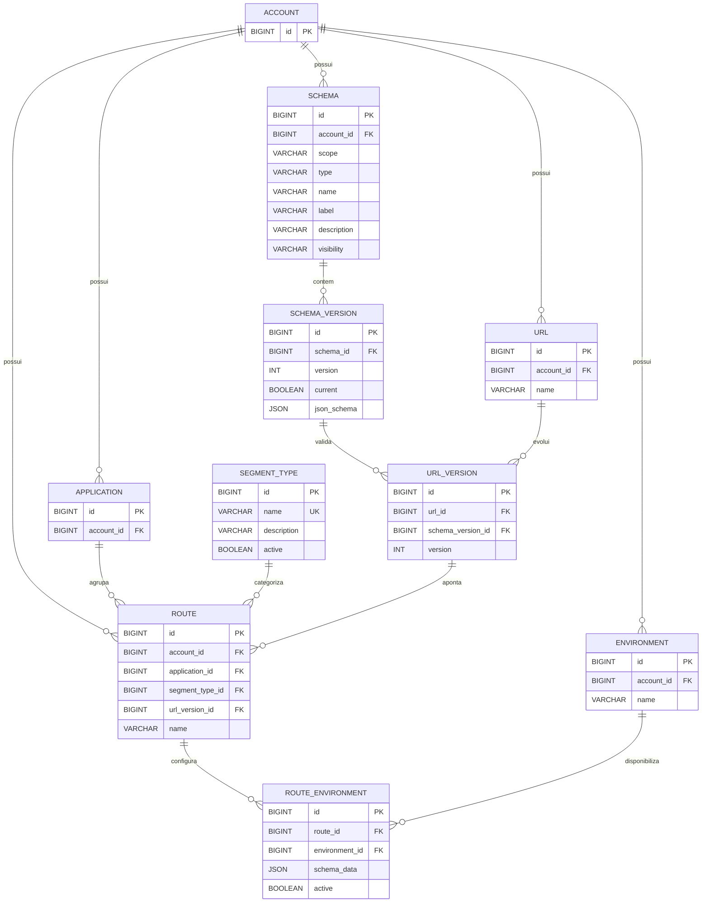

# Feature — Rotas

## 1. Objetivo
Disponibilizar o cadastro e gerenciamento de Rotas associadas a uma aplicação, permitindo que uma mesma URL evolua por versões de contrato sem alterar os acoplamentos já utilizados por clientes antigos.

A Route é composta por:
* Aplicação corporativa vinculada;
* Tipo de segmento (catálogo global);
* URL lógica;
* Versão da URL;
* Contrato de dados (Schema Version) utilizado pela versão;
* Configuração operacional por ambiente.

> **Premissa de Design:** A entidade `ROUTE` é uma casca lógica estável e não possui versionamento próprio (`ROUTE_VERSION`). O verdadeiro controle de imutabilidade e evolução de contratos ocorre na camada de `URL_VERSION`.

---

## 2. Conceito e Arquitetura de Ambientes
O ecossistema preserva a identidade global dos contratos enquanto isola os estados operacionais (`active` e `schema_data`) por ambiente de execução:

```text
ACCOUNT
   │
   ├── APPLICATION
   │
   ├── URL
   │     └── URL_VERSION
   │             └── SCHEMA_VERSION
   │
   └── ROUTE (Identidade global estável e agnóstica a ambientes)
          │
          └── ROUTE_ENVIRONMENT (Configuração operacional isolada)
                 ├── ENVIRONMENT (DEV, HML, PROD)
                 ├── schema_data
                 └── active
```

---

## 3. Modelo de Dados e Entidades

### ACCOUNT
Conta proprietária e isoladora de recursos no ecossistema multi-tenant.

### APPLICATION
Aplicação de negócio pertencente a uma conta.
* **Regra de Integridade:** `APPLICATION.account_id` deve ser idêntico ao `ROUTE.account_id`.

### ENVIRONMENT
Ambiente de execução controlado pela conta (Ex: `DEV`, `HML`, `PROD`).

### SCHEMA & SCHEMA_VERSION
Representa o contrato de dados que valida os payloads daquela rota.
* **Escopo e Visibilidade:** O Schema pode ser público ou privado. Um Schema público (`visibility = 'PUBLIC'`) pode ser consumido por rotas de outras contas (`ACCOUNT`), garantindo reaproveitamento corporativo, mas apenas a conta proprietária original pode alterá-lo.

### SEGMENT_TYPE
Catálogo global (sem `account_id`) responsável por categorizar o contexto de negócio da rota. Exemplos: `CLIENTES`, `PRODUTOS`, `PEDIDOS`, `FINANCEIRO`.

### URL & URL_VERSION
A `URL` define o endereço lógico base (Ex: `/clientes`). A `URL_VERSION` dita a imutabilidade do contrato daquele endereço. Se houver uma quebra de contrato, uma nova `URL_VERSION` deve ser gerada vinculando-se a um novo `SCHEMA_VERSION`.

### ROUTE & ROUTE_ENVIRONMENT
A `ROUTE` amarra a aplicação, o segmento e o contrato de URL. A sua operação física por ambiente acontece via `ROUTE_ENVIRONMENT`, garantindo que chaves de ativação (`active`) ou metadados de infraestrutura (`schema_data`) variem de forma segura entre os ambientes (impedindo que testes em `DEV` derrubem o tráfego de `PROD`).

---

## 4. Fluxos de Criação e Evolução de Ciclo de Vida

### Cenário A: Criação de Nova Rota e URL Inexistente
Quando o usuário tenta cadastrar um endereço inédito no ecossistema:
1. O sistema cria o registro base na entidade `URL`.
2. Instancia a `URL_VERSION` (V1).
3. Vincula o `SCHEMA_VERSION` selecionado à versão da URL.
4. Cria a entidade lógica estável `ROUTE`.
5. Inicializa o estado operacional populando a tabela `ROUTE_ENVIRONMENT` apontando exclusivamente para o ambiente de `DEV`.

### Cenário B: Nova Rota compartilhando o mesmo Endereço (Evolução)
Se o usuário tentar cadastrar uma rota para um endereço lógico que já existe no banco de dados (Ex: `/clientes`):
1. O sistema barra a duplicação da entidade `URL`.
2. Cria uma nova `URL_VERSION` sequencial (Ex: V2).
3. Vincula o novo `SCHEMA_VERSION` (o qual não deve coincidir com a combinação de contrato idêntica de outra versão ativa da mesma URL).
4. Cria o novo registro correspondente em `ROUTE`.
5. Inicializa as configurações operacionais para esta nova rota em `DEV`.

---

## 5. Regras de Imutabilidade e Governança
Para blindar o sistema contra quebras catastróficas de contratos em produção, o ciclo de vida aplica as seguintes regras de restrição:
* **Entidades Estritas e Imutáveis:** Os registros de `URL`, `URL_VERSION` e `SCHEMA_VERSION` são protegidos contra escrita (`UPDATE`) após a sua criação oficial. Qualquer modificação estrutural de payload exige uma nova versão ou novo Schema.
* **Entidades Dinâmicas:** Apenas a tabela `ROUTE_ENVIRONMENT` aceita atualizações frequentes em seus atributos `schema_data` e `active`, permitindo ligar/desligar caminhos de tráfego dinamicamente no gateway.

---

## 6. Motor de Promoção entre Ambientes
O processo de deploy de rotas segue a estratégia de promoção de agregados logísticos:
1. A rota nasce obrigatoriamente configurada no ambiente de `DEV`.
2. Ao disparar o gatilho de promoção para `HML` ou `PROD`, o motor valida se a estrutura global (`ROUTE`, `URL_VERSION`, `SCHEMA_VERSION`) está íntegra e se os recursos dependentes (como Schemas Públicos de terceiros) existem no ambiente de destino.
3. Garante-se o congelamento dos contratos corporativos, gerando apenas a nova linha operacional na tabela `ROUTE_ENVIRONMENT` com o identificador do novo ambiente.
4. **Alçada de Aprovação:** Promoções direcionadas ao ambiente de `PROD` são retidas pelo sistema e exigem a vinculação compulsória de uma **GMude** (Gestão de Mudança) aprovada.

---

## 7. Critérios de Aceite Iniciais

### Gestão Lógica de URLs e Contratos
- [ ] Criar e consultar registros de `URL` garantindo o isolamento correto por conta proprietária.
- [ ] Gerar novas instâncias de `URL_VERSION` de forma imutável, rejeitando atualizações em registros salvos.
- [ ] Validar o acoplamento com `SCHEMA_VERSION` públicos de outras contas e bloquear o uso de Schemas de terceiros marcados como privados.

### Cadastro e Governança de Rotas
- [ ] Cadastrar a entidade global `ROUTE` garantindo a consistência das chaves externas (`APPLICATION.account_id == ROUTE.account_id`).
- [ ] Rejeitar a criação de múltiplas instâncias de `URL` textuais idênticas para a mesma conta, forçando o fluxo de reaproveitamento e versionamento via `URL_VERSION`.

### Operação e Isolamento Ambiental
- [ ] Configurar propriedades operacionais (`schema_data` e chaves de ativação) na tabela `ROUTE_ENVIRONMENT`.
- [ ] Garantir a restrição de unicidade composta do banco de dados `UNIQUE(route_id, environment_id)`.
- [ ] Validar e garantir via testes automatizados que a alteração de chaves operacionais e cargas de payload em `DEV` não alteram e nem geram efeitos colaterais na rota rodando em `PROD`.

### Fluxo de Deploy (Promoção)
- [ ] Executar o pipeline de cópia atômica de definições estruturais entre os ambientes de origem e destino.
- [ ] Bloquear execuções de promoção voltadas para o ambiente produtivo caso o identificador de aprovação da GMude corporativa esteja ausente ou inválido.

---

## 8. Diagrama de Relacionamento de Entidades (ERD)


