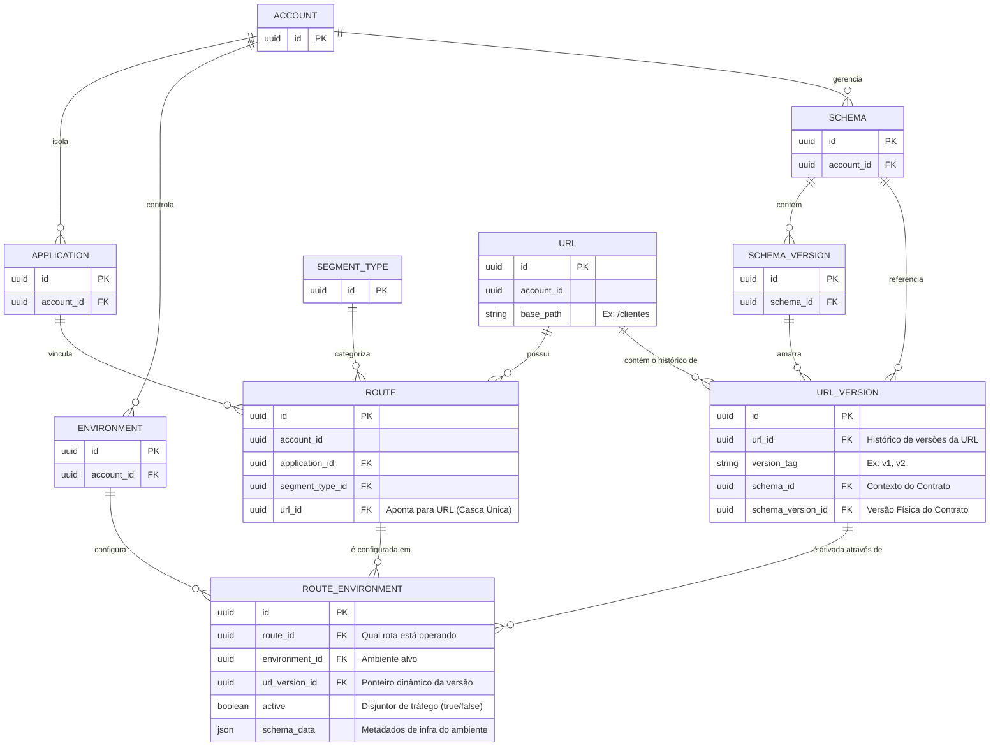

# Documento de Refinamento Técnico — Feature: Rotas

Este documento consolida as especificações técnicas, regras de negócio e o modelo de dados para o desenvolvimento do módulo de **Gerenciamento de Rotas e Contratos**. O objetivo principal é garantir o desacoplamento entre a casca lógica da rota e as versões de contrato de dados, permitindo evolução contínua e convivência em paralelo sem quebra de clientes antigos.

---

## 1. Arquitetura e Modelo de Dados

### Diagrama de Entidade e Relacionamento (ERD)

### Detalhamento das Tabelas Principais

1. **`URL`** *(O endereço base do recurso)*
   * `id` (UUID, PK)
   * `account_id` (UUID, FK)
   * `base_path` (VARCHAR - Ex: `/clientes`)
   * *Constraint:* `UNIQUE (account_id, base_path)` — Garante que uma conta não tenha caminhos duplicados.

2. **`ROUTE`** *(A casca lógica estável que une o App ao endereço)*
   * `id` (UUID, PK)
   * `account_id` (UUID, FK)
   * `application_id` (UUID, FK)
   * `segment_type_id` (UUID, FK)
   * `url_id` (UUID, FK)
   * *Constraint:* `UNIQUE (application_id, url_id)` — Impede a criação de "rotas fantasmas" ou duplicadas para o mesmo endereço base dentro da mesma aplicação.

3. **`URL_VERSION`** *(Onde moram os contratos e schemas informados)*
   * `id` (UUID, PK)
   * `url_id` (UUID, FK)
   * `version_tag` (VARCHAR - Ex: `v1`, `v2`)
   * `schema_id` (UUID, FK)
   * `schema_version_id` (UUID, FK)
   * *Constraint:* `UNIQUE (url_id, version_tag)` — Impede tags de versão repetidas no mesmo recurso.

4. **`ROUTE_ENVIRONMENT`** *(O ponteiro dinâmico que diz qual versão está ativa por ambiente)*
   * `id` (UUID, PK)
   * `route_id` (UUID, FK)
   * `environment_id` (UUID, FK)
   * `url_version_id` (UUID, FK)
   * `active` (BOOLEAN)
   * `schema_data` (JSONB - Metadados de infraestrutura específicos do ambiente)
   * *Constraint:* `UNIQUE INDEX (environment_id, url_id, url_version_id) WHERE (active = true)` — Evita conflitos de roteamento no Gateway, impedindo duas versões idênticas ativas em paralelo no mesmo ambiente.

---

## 2. Regras de Negócio Fundamentais

### RN01 – Cadastro Inteligente (Nova Rota vs. Nova Versão)
* Ao enviar uma requisição de criação informando `account_id`, `application_id`, `base_path`, `version_tag`, `schema_id` e `schema_version_id`:
  * **Se a Rota NÃO existir:** O backend cria o registro na tabela `ROUTE` e herda a criação do endereço na tabela `URL`. Na sequência, insere a primeira `URL_VERSION` (Ex: `v1`).
  * **Se a Rota JÁ existir:** O sistema **reutiliza** a `ROUTE` existente (bloqueia inserção duplicada) e desvia o fluxo automaticamente para criar uma nova linha na tabela `URL_VERSION`, incrementando a tag (Ex: de `v1` para `v2`), exigindo obrigatoriamente o novo `schema_id` e `schema_version_id` informados pelo usuário.

### RN02 – Convivência em Paralelo (Múltiplas Versões Ativas)
* O sistema suporta que uma rota sirva múltiplos contratos simultaneamente no mesmo ambiente (Ex: `v1` e `v2` rodando juntas em `PROD`).
* Para viabilizar a execução paralela, o `ROUTE_ENVIRONMENT` permite que mais de uma `url_version_id` distinta esteja com a flag `active = true` para a mesma rota.
* *Nota de Integração:* O Gateway de APIs utilizará o cabeçalho da requisição (Ex: `Accept-Version: v1` ou `Accept-Version: v2`) ou o prefixo do path dinâmico como critério de desempate no roteamento.

### RN03 – Imutabilidade de Contratos em Uso
* Uma `URL_VERSION` cadastrada **nunca poderá ter seus schemas alterados ou editados** se ela já estiver sendo utilizada pelo ecossistema.
* *Validação de Bloqueio:* Antes de qualquer operação de `UPDATE` na tabela `URL_VERSION`, o backend deve obrigatoriamente validar se o ID da versão possui algum registro correspondente na tabela `ROUTE_ENVIRONMENT` onde `active = true`. Em caso positivo, a operação é rejeitada com erro de conflito estrutural (HTTP 409).

### RN04 – Promoção Cirúrgica por Ambiente (Deploy)
* O usuário tem total autonomia para escolher a dedo qual versão quer promover (Ex: promover apenas a `v2` de `DEV` para `HML`).
* A promoção não duplica ou altera entidades globais (`ROUTE` ou `URL_VERSION`), ela apenas manipula os estados na tabela `ROUTE_ENVIRONMENT` no ambiente alvo.
* No momento da promoção, o usuário escolhe a estratégia de tráfego:
  1. **Substituição:** O sistema altera as versões antigas do ambiente alvo para `active = false` e ativa a nova versão escolhida (`active = true`).
  2. **Convivência:** O sistema ativa a nova versão escolhida mantendo as versões anteriores com `active = true` rodando em paralelo.

---

## 3. Critérios de Aceite para Desenvolvimento

### API de Cadastro (`POST /v1/routes`)
- [ ] Validar integridade de Tenant (`application_id` e `url_id` devem pertencer ao mesmo `account_id`).
- [ ] Validar se o Schema informado é público ou pertence à conta proprietária.
- [ ] Executar o fluxo de Cadastro Inteligente de forma atômica (Transacional).
- [ ] Inicializar os registros de ambiente desativados (`active = false`) por padrão de segurança.

### API de Edição de Versão (`PUT /v1/url-versions/{id}`)
- [ ] Validar se a versão está ativa em algum ambiente através de `ROUTE_ENVIRONMENT`.
- [ ] Bloquear edição de `schema_id` e `schema_version_id` se a versão estiver ativa.
- [ ] Permitir alteração apenas de metadados não estruturais (Ex: descrições, chaves de infra no JSON).

### API de Promoção de Ambiente (`POST /v1/routes/{id}/promote`)
- [ ] Receber o `environment_id` alvo, a `url_version_id` desejada e a estratégia de tráfego (`substituir` ou `conviver`).
- [ ] Atualizar as flags de ativação na tabela `ROUTE_ENVIRONMENT` respeitando a estratégia escolhida de forma transacional.
