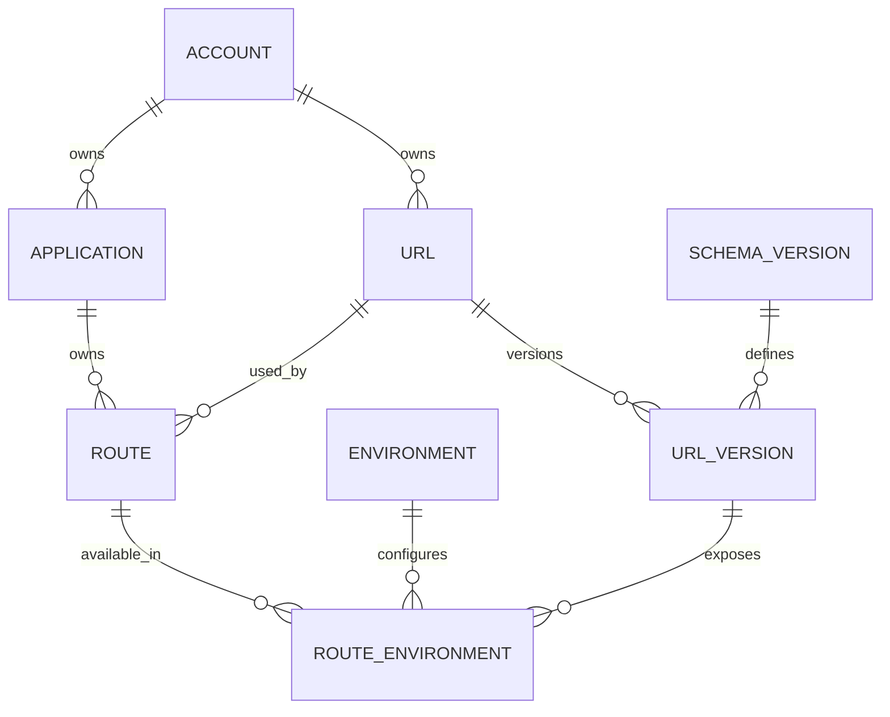

# Feature Rotas — Regras de Negócio, Modelo e Cenários

> **Versão V2 — consolidação das regras de negócio da Feature Rotas.**
>
> Esta versão preserva os cenários de cadastro, reuso e evolução da V1,
> mas passa a declarar explicitamente as regras, invariantes, escopos e
> responsabilidades de cada entidade antes dos exemplos.

---

# 1. Objetivo

A Feature Rotas representa o vínculo entre uma aplicação e uma URL lógica,
permitindo versionamento contratual, coexistência de versões e
disponibilização controlada por ambiente.

O modelo separa quatro conceitos:

```text
URL
    = identidade lógica do caminho dentro da conta

URL_VERSION
    = versão contratual da URL

ROUTE
    = uso da URL por uma aplicação

ROUTE_ENVIRONMENT
    = disponibilização de uma versão da rota em um ambiente
```

A regra central é:

> **URL, URL_VERSION e ROUTE não pertencem a um ambiente.**
> O ambiente entra no modelo somente em `ROUTE_ENVIRONMENT`.

---

# 2. Escopo das entidades

| Entidade | Escopo | Por ambiente? | Responsabilidade |
|---|---|---:|---|
| `URL` | Conta | Não | Identidade única do caminho lógico, por exemplo `/clientes`. |
| `URL_VERSION` | URL | Não | Evolução contratual da URL, associada a uma `SCHEMA_VERSION`. |
| `ROUTE` | Conta + Aplicação | Não | Representa que determinada aplicação utiliza aquela URL. |
| `ROUTE_ENVIRONMENT` | Rota + Ambiente + Versão | Sim | Define em qual ambiente determinada versão está disponibilizada. |

Exemplo:

```text
ACCOUNT ACC-01
│
├── URL /clientes
│   ├── URL_VERSION v1 -> Schema Version 1
│   └── URL_VERSION v2 -> Schema Version 2
│
├── APP-A
│   └── ROUTE /clientes
│       ├── DEV
│       │   ├── v1
│       │   └── v2
│       ├── HML
│       │   └── v1
│       └── PROD
│           └── v1
│
└── APP-B
    └── ROUTE /clientes
        └── DEV
            └── v1
```

`v2` não é uma versão de DEV. É uma versão da URL `/clientes`.
DEV apenas indica que essa versão está disponibilizada ali.

---

# 3. Regras de negócio

## 3.1 URL

1. `URL` pertence à Account.
2. O mesmo `base_path` não pode existir duas vezes dentro da mesma Account.
3. A mesma URL pode ser utilizada por várias Applications da mesma Account.
4. Uma URL de uma Account não pode ser reutilizada por Application de outra Account.
5. Criar nova Application consumidora não cria nova URL se o `base_path` já existir na Account.

Unicidade:

```text
UNIQUE(account_id, base_path)
```

---

## 3.2 URL_VERSION

1. `URL_VERSION` pertence à `URL`, não à Application e não ao Environment.
2. Cada `URL_VERSION` representa um contrato associado a uma `SCHEMA_VERSION`.
3. O mesmo par `URL + SCHEMA_VERSION` deve reutilizar a versão existente.
4. Nova `SCHEMA_VERSION` para a mesma URL gera nova `URL_VERSION`.
5. `version_tag` é gerada pelo backend.
6. O consumidor não escolhe manualmente `v1`, `v2`, `v3`.
7. A criação de nova versão não desativa automaticamente versões anteriores.
8. Uma `URL_VERSION` pode ser usada por várias Applications da mesma Account.
9. Uma `URL_VERSION` pode ser disponibilizada em vários Environments sem ser recriada.

Unicidades:

```text
UNIQUE(url_id, schema_version_id)
UNIQUE(url_id, version_tag)
```

---

## 3.3 ROUTE

1. `ROUTE` representa o uso de uma URL por uma Application.
2. Cada Application possui sua própria Route para determinada URL.
3. A Route pertence à mesma Account da Application e da URL.
4. Evoluir o contrato não cria nova Route.
5. A Route é uma identidade estável da relação Application + URL.
6. Duas Applications podem apontar para a mesma URL e para a mesma URL_VERSION sem compartilhar a mesma ROUTE.

Unicidade:

```text
UNIQUE(account_id, application_id, url_id)
```

---

## 3.4 ROUTE_ENVIRONMENT

1. É a única entidade da feature diretamente dependente de Environment.
2. Representa a disponibilização de uma `URL_VERSION` de uma Route em um Environment.
3. Uma mesma Route pode ter várias versões simultaneamente no mesmo Environment.
4. A mesma combinação `Route + Environment + URL_VERSION` não pode ser duplicada.
5. A configuração específica por ambiente fica em `schema_data`.
6. O estado operacional da disponibilização pode ser controlado por `active`.
7. Criar ou promover uma disponibilização não cria nova URL, Route ou URL_VERSION.

Unicidade:

```text
UNIQUE(route_id, environment_id, url_version_id)
```

---

# 4. Regras de ownership e consistência

Antes de criar ou reutilizar qualquer estrutura, o backend deve garantir:

1. Account existe.
2. Application existe.
3. Application pertence à Account informada.
4. Environment é válido para a Account/Application.
5. URL pertence à mesma Account.
6. URL_VERSION pertence à URL.
7. ROUTE pertence à Application e à Account.
8. ROUTE_ENVIRONMENT referencia uma URL_VERSION pertencente à mesma URL utilizada pela ROUTE.
9. Schema Version é válida para o tipo de contrato esperado pela feature.
10. Nenhuma relação pode atravessar Accounts indevidamente.

---

# 5. Regra de cadastro

Entrada conceitual:

```text
accountId
applicationId
environmentId
basePath
schemaVersionId
schemaData
```

O backend resolve os objetos internos.

Fluxo:

```text
1. localizar/criar URL por account + basePath
2. localizar/criar ROUTE por account + application + URL
3. localizar/criar URL_VERSION por URL + schemaVersion
4. validar duplicidade de ROUTE_ENVIRONMENT
5. criar ROUTE_ENVIRONMENT
```

O usuário não informa:

```text
urlId
routeId
urlVersionId
routeEnvironmentId
versionTag
```

---

# 6. Reuso

O reuso acontece em dois níveis:

```text
URL
  reutilizada entre Applications da mesma Account

URL_VERSION
  reutilizada quando URL + SCHEMA_VERSION forem iguais
```

A ROUTE não é reutilizada entre Applications.

Exemplo:

```text
APP-A -> ROUTE-A -> /clientes -> v1
APP-B -> ROUTE-B -> /clientes -> v1
```

`/clientes` e `v1` são compartilhados.

`ROUTE-A` e `ROUTE-B` são independentes.

---

# 7. Evolução contratual

Quando uma Application evolui de:

```text
/clientes + Schema v1
```

para:

```text
/clientes + Schema v2
```

o sistema:

```text
reutiliza URL
reutiliza ROUTE
cria/reutiliza nova URL_VERSION
cria nova ROUTE_ENVIRONMENT
preserva versões anteriores
```

A evolução de APP-A não altera APP-B.

---

# 8. Promoção

Promover não significa versionar novamente.

Exemplo:

```text
APP-A / ROUTE-A / URL_VERSION v2
DEV -> HML
```

A promoção cria apenas a disponibilização em HML:

```text
ROUTE_ENVIRONMENT
ROUTE-A + HML + v2
```

Não cria:

```text
nova URL
nova ROUTE
nova URL_VERSION
```

A mesma regra vale para HML -> PROD.

---

# 9. Convivência de versões

A feature deve suportar:

```text
ROUTE-A + DEV + v1
ROUTE-A + DEV + v2
```

simultaneamente.

Isso permite:

- clientes legados continuarem em v1;
- novos consumidores utilizarem v2;
- evolução sem quebra imediata;
- promoção controlada de cada versão.

---

# 10. Duplicidade

Se já existir:

```text
ROUTE-A + DEV + v1
```

uma nova tentativa de cadastrar exatamente a mesma combinação deve ser rejeitada.

Resposta esperada:

```text
409 Conflict
```

Nenhum novo registro deve ser criado ou alterado.

---

# 11. Modelo de relacionamentos



---

# 12. Invariantes consolidadas

1. URL é única por `Account + basePath`.
2. URL pertence à Account.
3. URL pode ser compartilhada entre Applications da mesma Account.
4. URL_VERSION pertence à URL.
5. URL_VERSION não pertence a Environment.
6. URL_VERSION não pertence a Application.
7. `URL + SCHEMA_VERSION` identifica uma versão contratual reutilizável.
8. `version_tag` é controlada pelo backend.
9. ROUTE pertence à Application.
10. ROUTE representa `Application + URL`.
11. ROUTE não muda quando o contrato evolui.
12. ROUTE_ENVIRONMENT é a única entidade por ambiente.
13. Várias versões podem coexistir no mesmo ambiente.
14. Duplicidade exata de Route + Environment + Version é inválida.
15. Promoção reutiliza URL_VERSION existente.
16. Nova versão não desativa automaticamente versões anteriores.
17. Evolução de uma Application não altera outras Applications.
18. Todos os vínculos devem respeitar ownership da Account.
19. IDs internos são resolvidos pelo backend.
20. Cadastro/evolução inicial ocorre no ambiente de entrada definido pela plataforma; promoção cuida dos demais ambientes.

---

# 13. Cenários de validação

A partir deste ponto, os cenários da V1 são mantidos como exemplos
práticos das regras acima.

---

# 5. Ciclo 1 --- Primeiro cadastro de `/clientes`

## Objetivo do ciclo

Cadastrar `/clientes` pela primeira vez para a `APP-A`, utilizando o
contrato `SV-1.0.0`.

### Dados informados pelo usuário

  Dado             Valor
  ---------------- -------------
  Conta            `ACC-01`
  Aplicação        `APP-A`
  Ambiente         `ENV-DEV`
  URL              `/clientes`
  Schema Version   `SV-1.0.0`

### Processamento do backend

1.  Busca `URL` por `ACC-01 + /clientes`.
2.  A URL não existe, portanto cria `URL-01`.
3.  Busca `ROUTE` por `ACC-01 + APP-A + URL-01`.
4.  A rota não existe, portanto cria `ROT-AAA`.
5.  Busca `URL_VERSION` por `URL-01 + SV-1.0.0`.
6.  A versão não existe, portanto cria `VER-V1` e gera
    `version_tag = v1`.
7.  Cria a disponibilização `ROT-AAA + ENV-DEV + VER-V1`.
8.  A versão fica ativa em DEV.
9.  Nenhuma versão é automaticamente disponibilizada em PROD.

### Resultado da operação

**Cadastro realizado com sucesso.**

Foram criados:

``` text
URL-01
ROT-AAA
VER-V1
RE-01
```

### Estado do banco após o Ciclo 1

#### `URL`

  id         account_id   base_path
  ---------- ------------ -------------
  `URL-01`   `ACC-01`     `/clientes`

#### `ROUTE`

  id          account_id   application_id   url_id
  ----------- ------------ ---------------- ----------
  `ROT-AAA`   `ACC-01`     `APP-A`          `URL-01`

#### `URL_VERSION`

  id         url_id     version_tag   schema_version_id
  ---------- ---------- ------------- -------------------
  `VER-V1`   `URL-01`   `v1`          `SV-1.0.0`

#### `ROUTE_ENVIRONMENT`

  id        route_id    environment_id   url_version_id   active
  --------- ----------- ---------------- ---------------- --------
  `RE-01`   `ROT-AAA`   `ENV-DEV`        `VER-V1`         `true`

------------------------------------------------------------------------

# 6. Ciclo 2 --- Outra aplicação cadastra a mesma URL e contrato

## Objetivo do ciclo

A `APP-B` também precisa utilizar `/clientes` com `SV-1.0.0`.

O sistema deve reutilizar tudo o que for compartilhável, mantendo o
isolamento da rota por aplicação.

### Dados informados pelo usuário

  Dado             Valor
  ---------------- -------------
  Conta            `ACC-01`
  Aplicação        `APP-B`
  Ambiente         `ENV-DEV`
  URL              `/clientes`
  Schema Version   `SV-1.0.0`

### Processamento do backend

1.  Busca `URL` por `ACC-01 + /clientes`.
2.  Encontra `URL-01` e **reutiliza** a URL.
3.  Busca `ROUTE` por `ACC-01 + APP-B + URL-01`.
4.  Não encontra rota para a `APP-B`.
5.  Cria `ROT-BBB`.
6.  Busca `URL_VERSION` por `URL-01 + SV-1.0.0`.
7.  Encontra `VER-V1` e **reutiliza** a versão.
8.  Cria `ROT-BBB + ENV-DEV + VER-V1`.
9.  Ativa a versão em DEV para a `APP-B`.

### Resultado da operação

**Cadastro realizado com sucesso por reuso inteligente.**

  Objeto      Ação
  ----------- -------------
  `URL-01`    Reutilizado
  `ROT-BBB`   Criado
  `VER-V1`    Reutilizado
  `RE-02`     Criado

### Estado do banco após o Ciclo 2

#### `URL`

  id         account_id   base_path
  ---------- ------------ -------------
  `URL-01`   `ACC-01`     `/clientes`

#### `ROUTE`

  id          account_id   application_id   url_id
  ----------- ------------ ---------------- ----------
  `ROT-AAA`   `ACC-01`     `APP-A`          `URL-01`
  `ROT-BBB`   `ACC-01`     `APP-B`          `URL-01`

#### `URL_VERSION`

  id         url_id     version_tag   schema_version_id
  ---------- ---------- ------------- -------------------
  `VER-V1`   `URL-01`   `v1`          `SV-1.0.0`

#### `ROUTE_ENVIRONMENT`

  id        route_id    environment_id   url_version_id   active
  --------- ----------- ---------------- ---------------- --------
  `RE-01`   `ROT-AAA`   `ENV-DEV`        `VER-V1`         `true`
  `RE-02`   `ROT-BBB`   `ENV-DEV`        `VER-V1`         `true`

### O que esse ciclo demonstra

``` text
                    URL-01 /clientes
                           |
                     URL_VERSION v1
                       SV-1.0.0
                      /          \
                 APP-A            APP-B
               ROT-AAA          ROT-BBB
                  |                |
                 DEV              DEV
```

A URL e sua versão contratual são compartilhadas. A `ROUTE`, porém,
continua isolada por aplicação.

------------------------------------------------------------------------

# 7. Ciclo 3 --- Tentativa de cadastro duplicado

## Objetivo do ciclo

Validar o comportamento quando a `APP-A` tenta cadastrar exatamente a
mesma combinação que já possui.

### Dados informados pelo usuário

  Dado             Valor
  ---------------- -------------
  Conta            `ACC-01`
  Aplicação        `APP-A`
  Ambiente         `ENV-DEV`
  URL              `/clientes`
  Schema Version   `SV-1.0.0`

### Processamento do backend

1.  Encontra `URL-01`.
2.  Encontra `ROT-AAA`.
3.  Encontra `VER-V1`.
4.  Encontra `ROT-AAA + ENV-DEV + VER-V1`.
5.  Identifica que a mesma versão já está cadastrada para a mesma rota e
    ambiente.
6.  Nenhum novo estado seria produzido.
7.  A operação é rejeitada como duplicidade.

### Resultado da operação

``` text
HTTP 409 Conflict
```

**Nenhum registro é criado ou alterado.**

### Estado do banco após o Ciclo 3

O banco permanece exatamente igual ao final do Ciclo 2.

#### `URL`

  id         account_id   base_path
  ---------- ------------ -------------
  `URL-01`   `ACC-01`     `/clientes`

#### `ROUTE`

  id          account_id   application_id   url_id
  ----------- ------------ ---------------- ----------
  `ROT-AAA`   `ACC-01`     `APP-A`          `URL-01`
  `ROT-BBB`   `ACC-01`     `APP-B`          `URL-01`

#### `URL_VERSION`

  id         url_id     version_tag   schema_version_id
  ---------- ---------- ------------- -------------------
  `VER-V1`   `URL-01`   `v1`          `SV-1.0.0`

#### `ROUTE_ENVIRONMENT`

  id        route_id    environment_id   url_version_id   active
  --------- ----------- ---------------- ---------------- --------
  `RE-01`   `ROT-AAA`   `ENV-DEV`        `VER-V1`         `true`
  `RE-02`   `ROT-BBB`   `ENV-DEV`        `VER-V1`         `true`

------------------------------------------------------------------------

# 8. Ciclo 4 --- Evolução do contrato da APP-A

## Objetivo do ciclo

A `APP-A` continua utilizando `/clientes`, porém agora precisa
disponibilizar uma nova versão baseada em `SV-2.0.0`.

A versão antiga deve continuar disponível para consumidores legados.

### Dados informados pelo usuário

  Dado             Valor
  ---------------- -------------
  Conta            `ACC-01`
  Aplicação        `APP-A`
  Ambiente         `ENV-DEV`
  URL              `/clientes`
  Schema Version   `SV-2.0.0`

### Processamento do backend

1.  Busca `URL` por `ACC-01 + /clientes`.
2.  Encontra `URL-01` e reutiliza.
3.  Busca `ROUTE` por `ACC-01 + APP-A + URL-01`.
4.  Encontra `ROT-AAA` e reutiliza.
5.  Busca `URL_VERSION` por `URL-01 + SV-2.0.0`.
6.  Não encontra uma versão correspondente.
7.  Calcula a próxima `version_tag` da URL.
8.  Cria `VER-V2` com `version_tag = v2` e
    `schema_version_id = SV-2.0.0`.
9.  Cria `ROT-AAA + ENV-DEV + VER-V2`.
10. Mantém `ROT-AAA + ENV-DEV + VER-V1` ativo.
11. As versões `v1` e `v2` passam a coexistir em DEV.

### Resultado da operação

**Nova versão criada com sucesso.**

  Objeto      Ação
  ----------- -------------
  `URL-01`    Reutilizado
  `ROT-AAA`   Reutilizado
  `VER-V1`    Mantido
  `VER-V2`    Criado
  `RE-03`     Criado

### Estado do banco após o Ciclo 4

#### `URL`

  id         account_id   base_path
  ---------- ------------ -------------
  `URL-01`   `ACC-01`     `/clientes`

#### `ROUTE`

  id          account_id   application_id   url_id
  ----------- ------------ ---------------- ----------
  `ROT-AAA`   `ACC-01`     `APP-A`          `URL-01`
  `ROT-BBB`   `ACC-01`     `APP-B`          `URL-01`

#### `URL_VERSION`

  id         url_id     version_tag   schema_version_id
  ---------- ---------- ------------- -------------------
  `VER-V1`   `URL-01`   `v1`          `SV-1.0.0`
  `VER-V2`   `URL-01`   `v2`          `SV-2.0.0`

#### `ROUTE_ENVIRONMENT`

  ----------------------------------------------------------------------------------
  id          route_id    environment_id   url_version_id   active      Uso
  ----------- ----------- ---------------- ---------------- ----------- ------------
  `RE-01`     `ROT-AAA`   `ENV-DEV`        `VER-V1`         `true`      Consumidor
                                                                        legado da
                                                                        APP-A

  `RE-02`     `ROT-BBB`   `ENV-DEV`        `VER-V1`         `true`      APP-B
                                                                        continua na
                                                                        v1

  `RE-03`     `ROT-AAA`   `ENV-DEV`        `VER-V2`         `true`      Novo
                                                                        consumidor
                                                                        da APP-A
  ----------------------------------------------------------------------------------

### Estado lógico após a evolução

``` text
URL-01 /clientes
│
├── VER-V1
│   └── SV-1.0.0
│       ├── APP-A / DEV  → ativo
│       └── APP-B / DEV  → ativo
│
└── VER-V2
    └── SV-2.0.0
        └── APP-A / DEV  → ativo
```

A evolução da `APP-A` não altera a `APP-B` e não desativa
automaticamente a versão anterior.

------------------------------------------------------------------------

# 9. Ciclo 5 --- Promoção da versão v1 da APP-A para PROD

## Objetivo do ciclo

Demonstrar que o ambiente é uma disponibilização da versão e não exige a
criação de uma nova `URL_VERSION`.

Neste exemplo, `VER-V1` da `APP-A` é promovida de DEV para PROD.

### Dados recebidos pelo fluxo de promoção

  Dado               Valor
  ------------------ ------------
  Rota               `ROT-AAA`
  Ambiente destino   `ENV-PROD`
  URL Version        `VER-V1`

### Processamento do backend

1.  Valida a existência de `ROT-AAA`.
2.  Valida que `VER-V1` pertence à URL utilizada por `ROT-AAA`.
3.  Verifica se `ROT-AAA + ENV-PROD + VER-V1` já existe.
4.  Como não existe, cria a associação no ambiente destino.
5.  Nenhuma nova `URL`, `ROUTE` ou `URL_VERSION` é criada.

### Resultado da operação

**Versão disponibilizada em PROD.**

### Estado do banco após o Ciclo 5

#### `URL`

  id         account_id   base_path
  ---------- ------------ -------------
  `URL-01`   `ACC-01`     `/clientes`

#### `ROUTE`

  id          account_id   application_id   url_id
  ----------- ------------ ---------------- ----------
  `ROT-AAA`   `ACC-01`     `APP-A`          `URL-01`
  `ROT-BBB`   `ACC-01`     `APP-B`          `URL-01`

#### `URL_VERSION`

  id         url_id     version_tag   schema_version_id
  ---------- ---------- ------------- -------------------
  `VER-V1`   `URL-01`   `v1`          `SV-1.0.0`
  `VER-V2`   `URL-01`   `v2`          `SV-2.0.0`

#### `ROUTE_ENVIRONMENT`

  ---------------------------------------------------------------------------------
  id          route_id    environment_id   url_version_id   active      Uso
  ----------- ----------- ---------------- ---------------- ----------- -----------
  `RE-01`     `ROT-AAA`   `ENV-DEV`        `VER-V1`         `true`      APP-A
                                                                        legado em
                                                                        DEV

  `RE-02`     `ROT-BBB`   `ENV-DEV`        `VER-V1`         `true`      APP-B em
                                                                        DEV

  `RE-03`     `ROT-AAA`   `ENV-DEV`        `VER-V2`         `true`      APP-A nova
                                                                        versão em
                                                                        DEV

  `RE-04`     `ROT-AAA`   `ENV-PROD`       `VER-V1`         `true`      APP-A v1
                                                                        promovida
                                                                        para PROD
  ---------------------------------------------------------------------------------

------------------------------------------------------------------------

# 10. Matriz de decisão do backend

A decisão principal pode ser resumida pela existência ou não dos
registros.

  ----------------------------------------------------------------------------
  URL            Route da App   URL Version    Route          Ação
                                para o Schema  Environment    
  -------------- -------------- -------------- -------------- ----------------
  Não existe     Não existe     Não existe     Não existe     Criar tudo

  Existe         Não existe     Existe         Não existe     Reusar URL e
                                                              versão; criar
                                                              Route e Route
                                                              Environment

  Existe         Existe         Existe         Existe         `409 Conflict`

  Existe         Existe         Não existe     Não existe     Criar nova URL
                                                              Version e Route
                                                              Environment

  Existe         Existe         Existe         Não existe     Reusar versão e
                                                              criar Route
                                                              Environment
  ----------------------------------------------------------------------------

------------------------------------------------------------------------

# 11. Algoritmo resumido do cadastro

``` text
Entrada:
  accountId
  applicationId
  environmentId
  basePath
  schemaVersionId
  schemaData

1. URL = buscar(accountId, basePath)

2. se URL não existir:
      criar URL

3. ROUTE = buscar(accountId, applicationId, URL.id)

4. se ROUTE não existir:
      criar ROUTE

5. URL_VERSION = buscar(URL.id, schemaVersionId)

6. se URL_VERSION não existir:
      gerar próxima version_tag
      criar URL_VERSION

7. ROUTE_ENVIRONMENT =
      buscar(ROUTE.id, environmentId, URL_VERSION.id)

8. se ROUTE_ENVIRONMENT existir:
      retornar HTTP 409

9. criar ROUTE_ENVIRONMENT

10. retornar cadastro criado
```

------------------------------------------------------------------------

# 12. Regras de negócio consolidadas

1.  `URL` é compartilhável entre aplicações da mesma conta.
2.  O mesmo `base_path` não deve ser duplicado dentro da conta.
3.  Cada aplicação possui uma `ROUTE` própria para a URL.
4.  `ROUTE` não deve ser recriada quando a aplicação evolui o contrato
    da mesma URL.
5.  `URL_VERSION` é compartilhável entre aplicações quando
    `URL + SCHEMA_VERSION` forem iguais.
6.  Uma nova `SCHEMA_VERSION` para a mesma URL gera uma nova
    `URL_VERSION`.
7.  `version_tag` é gerada pelo backend e evolui dentro da URL.
8.  O usuário não escolhe manualmente `v1`, `v2`, `v3`.
9.  `ROUTE_ENVIRONMENT` disponibiliza uma versão específica da URL em um
    ambiente.
10. Uma rota pode possuir várias versões simultaneamente no mesmo
    ambiente.
11. O cadastro idêntico de `ROUTE + ENVIRONMENT + URL_VERSION` é
    duplicidade e retorna `409 Conflict`.
12. A evolução de uma aplicação não altera automaticamente as outras
    aplicações que compartilham a URL.
13. Criar uma nova versão não desativa automaticamente versões
    anteriores.
14. A promoção para outro ambiente reutiliza a `URL_VERSION`; não cria
    uma nova versão contratual.
15. A criação/evolução ocorre inicialmente em DEV e a promoção é tratada
    pelo fluxo responsável por ambientes.

------------------------------------------------------------------------

# 13. Unicidades recomendadas

``` sql
-- URL lógica única dentro da conta
UNIQUE (account_id, base_path)

-- Uma aplicação possui apenas uma casca de rota para a URL
UNIQUE (account_id, application_id, url_id)

-- O mesmo contrato não gera duas versões da mesma URL
UNIQUE (url_id, schema_version_id)

-- A tag não pode se repetir dentro da URL
UNIQUE (url_id, version_tag)

-- A mesma versão não pode ser cadastrada duas vezes
-- para a mesma rota e ambiente
UNIQUE (route_id, environment_id, url_version_id)
```

------------------------------------------------------------------------

# 14. Resultado final da simulação

Ao final dos ciclos:

``` text
ACC-01
│
├── URL-01 /clientes
│   │
│   ├── VER-V1 / SV-1.0.0
│   │   ├── APP-A
│   │   │   ├── DEV  → ativo
│   │   │   └── PROD → ativo
│   │   │
│   │   └── APP-B
│   │       └── DEV  → ativo
│   │
│   └── VER-V2 / SV-2.0.0
│       └── APP-A
│           └── DEV → ativo
```

O modelo permite que `/clientes` seja uma URL única e reutilizável
dentro da conta, enquanto cada aplicação mantém sua própria `ROUTE`. As
versões contratuais são centralizadas em `URL_VERSION`, e
`ROUTE_ENVIRONMENT` controla onde cada versão está efetivamente
disponibilizada.

Isso mantém separados os conceitos de **URL**, **aplicação**,
**contrato/versionamento** e **ambiente**, permitindo reuso sem perder
isolamento e evolução independente.


## Escopo das Entidades por Conta e Ambiente

No modelo consolidado da Feature de Rotas, `URL`, `URL_VERSION` e
`ROUTE` **não são entidades por ambiente**.

O ambiente passa a fazer parte do modelo somente em `ROUTE_ENVIRONMENT`.

Essa separação é importante para evitar a duplicação de URLs, rotas e
versões durante o processo de promoção entre ambientes.

### Responsabilidade por entidade
```
  ----------------------------------------------------------------------------
  Entidade              Escopo            Por ambiente?     Responsabilidade
  --------------------- ----------------- ----------------- ------------------
  `URL`                 Conta             Não               Representa a
                                                            identidade do
                                                            caminho lógico,
                                                            por exemplo
                                                            `/clientes`

  `URL_VERSION`         URL               Não               Representa uma
                                                            versão contratual
                                                            da URL, como `v1`,
                                                            `v2`, `v3`

  `ROUTE`               Conta + Aplicação Não               Representa o uso
                                                            daquela URL por
                                                            uma aplicação

  `ROUTE_ENVIRONMENT`   Rota + Ambiente   **Sim**           Define quais
                                                            versões da rota
                                                            estão
                                                            disponibilizadas
                                                            em determinado
                                                            ambiente
  ----------------------------------------------------------------------------
```
### Exemplo conceitual

``` text
ACCOUNT ACC-01
│
├── URL /clientes
│   │
│   ├── URL_VERSION v1 → Schema Version 1
│   └── URL_VERSION v2 → Schema Version 2
│
├── APP-A
│   └── ROUTE /clientes
│       │
│       ├── DEV
│       │   ├── v1 → ativo
│       │   └── v2 → ativo
│       │
│       ├── HML
│       │   └── v1 → ativo
│       │
│       └── PROD
│           └── v1 → ativo
│
└── APP-B
    └── ROUTE /clientes
        │
        └── DEV
            └── v1 → ativo
```

Nesse exemplo, `v2` **não é uma versão específica de DEV**.

`v2` é uma versão da URL `/clientes`. O ambiente apenas determina se
aquela versão está ou não disponibilizada para determinada rota.

Portanto:

``` text
URL_VERSION v2
```

é criada uma única vez e pode posteriormente ser disponibilizada em:

``` text
DEV
HML
PROD
```

sem que uma nova `URL_VERSION` seja criada em cada ambiente.

------------------------------------------------------------------------

### Estrutura das referências

A distribuição das principais chaves estrangeiras fica:

``` text
URL
────────────────────────
account_id


URL_VERSION
────────────────────────
url_id
schema_version_id


ROUTE
────────────────────────
account_id
application_id
url_id


ROUTE_ENVIRONMENT
────────────────────────
route_id
environment_id
url_version_id
schema_data
active
```

A relação pode ser visualizada como:

``` text
ACCOUNT
   │
   ├── URL
   │    │
   │    └── URL_VERSION
   │             │
   │             └── SCHEMA_VERSION
   │
   └── APPLICATION
          │
          └── ROUTE
                 │
                 └── ROUTE_ENVIRONMENT
                        │
                        ├── ENVIRONMENT
                        └── URL_VERSION
```

------------------------------------------------------------------------

### Unicidades recomendadas

#### URL

Uma URL é única dentro da conta:

``` text
UNIQUE(account_id, base_path)
```

#### URL_VERSION

O mesmo contrato não deve gerar duas versões diferentes para a mesma
URL:

``` text
UNIQUE(url_id, schema_version_id)
```

A tag da versão também é única dentro da URL:

``` text
UNIQUE(url_id, version_tag)
```

#### ROUTE

Uma aplicação possui apenas uma rota lógica para determinada URL:

``` text
UNIQUE(account_id, application_id, url_id)
```

#### ROUTE_ENVIRONMENT

Uma mesma versão não pode ser cadastrada duas vezes para a mesma rota e
ambiente:

``` text
UNIQUE(route_id, environment_id, url_version_id)
```

A presença de `url_version_id` nessa constraint permite a convivência:

``` text
ROUTE-A + DEV + v1
ROUTE-A + DEV + v2
```

e impede a duplicidade:

``` text
ROUTE-A + DEV + v1
ROUTE-A + DEV + v1  ← inválido
```

------------------------------------------------------------------------

### Impacto no fluxo de promoção

Essa separação simplifica o processo de promoção.

Considere inicialmente:

``` text
APP-A
└── ROUTE /clientes
    └── DEV
        └── v2
```

Ao promover `v2` para HML, o sistema **não cria**:

-   uma nova `URL`;
-   uma nova `URL_VERSION`;
-   uma nova `ROUTE`.

Ele apenas disponibiliza a versão existente no novo ambiente:

``` text
ROUTE_ENVIRONMENT

route       environment     url_version
────────────────────────────────────────
ROT-AAA     DEV             VER-V2
ROT-AAA     HML             VER-V2
```

Posteriormente, a promoção para PROD segue o mesmo princípio:

``` text
ROUTE_ENVIRONMENT

route       environment     url_version
────────────────────────────────────────
ROT-AAA     DEV             VER-V2
ROT-AAA     HML             VER-V2
ROT-AAA     PROD            VER-V2
```

Portanto, **promover uma rota significa disponibilizar uma `URL_VERSION`
existente em outro ambiente**, e não criar uma nova versão da URL.

------------------------------------------------------------------------

### Regra consolidada

A regra conceitual do modelo pode ser resumida da seguinte forma:

> **URL** identifica o caminho dentro da conta.\
> **URL_VERSION** representa a evolução contratual desse caminho.\
> **ROUTE** representa o uso da URL por uma aplicação.\
> **ROUTE_ENVIRONMENT** determina em quais ambientes e versões essa rota
> está efetivamente disponibilizada.

Dessa forma, somente `ROUTE_ENVIRONMENT` possui dependência direta de
`ENVIRONMENT`.
