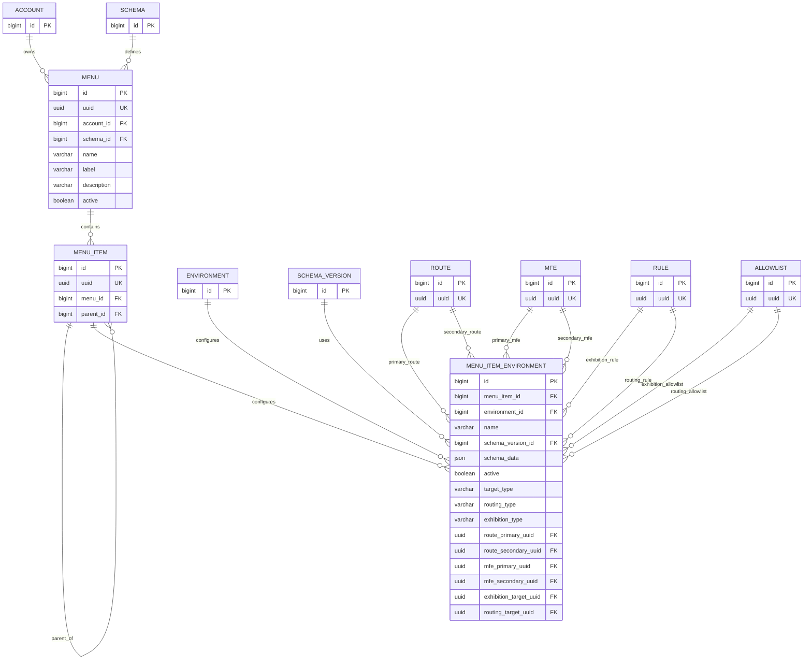

# Feature Menu — Regras de Negócio e Modelo de Dados

> **Versão V2 — consolidação do refinamento posterior da Feature Menu.**
>
> Esta versão substitui conceitualmente partes do modelo da V1. A V1 é
> preservada apenas como histórico.
>
> Alterações estruturais em relação à V1:
>
> - a hierarquia passa a pertencer a `MENU_ITEM.parent_id`;
> - `MENU_ITEM_TARGET` deixa de existir como tabela separada;
> - toda configuração ambiental, destinos e políticas ficam concentrados
>   em `MENU_ITEM_ENVIRONMENT`;
> - cada configuração ambiental referencia uma `SCHEMA_VERSION`;
> - entram destinos `PRIMARY` e `SECONDARY`;
> - entram as políticas independentes de `EXHIBITION` e `ROUTING`;
> - a promoção do Menu é tratada como uma operação atômica do agregado.

## 1. Objetivo
Implementar a feature de Menus, permitindo que uma conta configure menus hierárquicos compostos por itens, com:
* Configuração específica por ambiente (dados visuais e destinos);
* Versionamento do schema do item;
* Destino para Route ou MFE;
* Definição de destino Primary e Secondary;
* Regras de Exhibition (Exibição);
* Regras de Routing (Roteamento);
* Suporte à promoção atômica entre ambientes.

A feature permite que o mesmo Menu tenha configurações visuais, de roteamento e de regras totalmente diferentes em **DEV, HML e PROD**, sem duplicar a identidade estrutural do Menu ou dos seus itens e sem que alterações em um ambiente impactem os demais.

---

## 2. Modelo Conceitual
A estrutura principal é simplificada através da centralização da inteligência ambiental:

```text
ACCOUNT
   │
   └── MENU (Identidade lógica global)
        │
        └── MENU_ITEM (Identidade estrutural e hierarquia global)
             │
             └── MENU_ITEM_ENVIRONMENT (Toda a configuração por ambiente)
                    ├── ENVIRONMENT (Ambiente específico)
                    ├── SCHEMA_VERSION / SCHEMA_DATA (Nome, ícone, ordem)
                    ├── TARGET (Tipo, Rotas Primária/Secundária, MFE)
                    └── POLÍTICAS (Exhibition e Routing - RULE/ALLOWLIST)

```

### 2.1 Diagrama




### Matriz de Responsabilidade

| Entidade | Responsabilidade |
| :--- | :--- |
| **MENU** | Define a identidade única do menu para a conta. |
| **MENU_ITEM** | Define a identidade do item e sua posição na árvore (hierarquia). |
| **MENU_ITEM_ENVIRONMENT** | Centraliza o estado, dados visuais, destinos e regras do item para um ambiente específico. |

---

## 3. MENU
Representa o menu lógico pertencente a uma conta.

### Estrutura de Dados
* `id` (Internal PK)
* `uuid` (Global Unique ID)
* `account_id`
* `schema_id`
* `name` (Identificador técnico)
* `label` (Apresentação/Descrição)
* `description`
* `active` (Status global do menu)
* `created_at` / `updated_at`

### Regras de Negócio
* O Menu pertence a uma única `ACCOUNT`.
* O Menu possui um `SCHEMA` do tipo `MENU`. O `schema_id` identifica o contrato estrutural do Menu.
* O Menu **não** possui `environment_id`. Ele é uma entidade lógica única entre os ambientes.

---

## 4. MENU_ITEM
Representa a estrutura e a posição hierárquica do item no Menu.

### Estrutura de Dados
* `id` (Internal PK)
* `uuid` (Global Unique ID)
* `menu_id`
* `parent_id` (Auto-relacionamento para hierarquia)
* `created_at` / `updated_at`

### Hierarquia
O campo `parent_id` permite construir menus multinível. Exemplo:
* **Dashboard** (raiz: `parent_id = NULL`)
* **Clientes** (raiz: `parent_id = NULL`)
  * ├── **Ativos** (`parent_id = id_clientes`)
  * └── **Inativos** (`parent_id = id_clientes`)

### Regras de Negócio
* **Isolamento de Menu:** O `parent_id` deve obrigatoriamente pertencer ao mesmo Menu. Não é permitido que um item do Menu A aponte para um pai do Menu B.

---

## 5. MENU_ITEM_ENVIRONMENT
Esta é a camada de configuração do item isolada por ambiente. Ela une os dados visuais (`schema_data`) e o destino do item (`target`), evitando conflitos ou vazamento de configurações entre DEV, HML e PROD.

### Estrutura de Dados
* `id` (Internal PK)
* `menu_item_id`
* `environment_id`
* `name` (Label do item no ambiente)
* `active` (Status do item neste ambiente específico)
* `schema_version_id` (Versão do JSON Schema para validação do payload)
* `schema_data` (JSON contendo dados visuais adicionais como ícone, ordem, etc.)
* **Campos de Destino (Target):**
  * `target_type` (`ROUTE` ou `MFE`)
  * `route_primary_uuid` / `route_secondary_uuid`
  * `mfe_primary_uuid` / `mfe_secondary_uuid`
* **Campos de Políticas (Exhibition & Routing):**
  * `exhibition_type` (`RULE` ou `ALLOWLIST`)
  * `exhibition_target_uuid` (UUID global da regra/lista de exibição)
  * `routing_type` (`RULE` ou `ALLOWLIST`)
  * `routing_target_uuid` (UUID global da regra/lista de roteamento)
* `created_at` / `updated_at`

### Constraint
* Deve existir apenas uma única configuração por item por ambiente:  
  `UNIQUE(menu_item_id, environment_id)`

---

## 6. Validação do Schema Visível (`schema_data`)
O objeto `schema_data` deve respeitar estritamente o `SCHEMA_VERSION` associado.

**Exemplo de payload:**
```json
{
  "visible": true,
  "icon": "users",
  "order": 10
}
```
A validação em tempo de escrita utiliza o JSON Schema da versão referenciada em `schema_version_id`. O dado só é salvo se for totalmente válido.

---

## 7. Regras de Destino (Target Type)
O campo `target_type` determina para onde o usuário será enviado ao clicar no item:

* **Quando `target_type = ROUTE`:** Os campos `route_primary_uuid` (obrigatório) e `route_secondary_uuid` (opcional) devem ser preenchidos. Os campos de MFE devem permanecer `NULL`.
* **Quando `target_type = MFE`:** Os campos `mfe_primary_uuid` (obrigatório) e `mfe_secondary_uuid` (opcional) devem ser preenchidos. Os campos de Rota devem permanecer `NULL`.

---

## 8. Destinos Primary e Secondary
O modelo suporta dois destinos simultâneos para viabilizar rollouts graduais, experimentos ou migrações:
* **PRIMARY:** Destino oficial e padrão do item.
* **SECONDARY:** Destino candidato (nova versão, rota piloto).

A decisão de qual usuário será direcionado para o destino Primary ou Secondary **não** é estática. Ela é calculada dinamicamente pelo mecanismo de **Routing**.

---

## 9. Exhibition x Routing
São conceitos complementares e independentes processados sequencialmente.

* **Exhibition:** Responde à pergunta: *"Este item de menu deve aparecer para este usuário?"* Baseia-se no `exhibition_type` e no `exhibition_target_uuid`.
* **Routing:** Responde à pergunta: *"Se o item apareceu, para qual destino (Primary ou Secondary) o usuário deve ser direcionado?"* Baseia-se no `routing_type` e no `routing_target_uuid`.

### Fluxo de Decisão Logicial
```text
                 MENU ITEM
                     │
                     ▼
              EXHIBITION
             /           \
           NÃO            SIM
           │               │
           ▼               ▼
     Oculta o Item      ROUTING
                           │
                    ┌──────┴──────┐
                    ▼             ▼
                 PRIMARY       SECONDARY
```

---

## 10. Regras de Integridade e Validações da Aplicação

### Menu
* `MENU.account_id` deve existir e estar ativa.
* `MENU.schema_id` deve referenciar um schema válido do tipo `MENU`.

### Menu Item
* `MENU_ITEM.menu_id` deve existir.
* `parent_id` deve ser `NULL` ou deve pertencer obrigatoriamente ao mesmo `menu_id`.

### Menu Item Environment
* `environment_id` deve pertencer à mesma conta (`ACCOUNT`) dona do menu.
* `schema_version_id` deve pertencer ao contrato de schemas aceito pelo Menu.
* **Consistência de Destinos:**
  * Se `target_type = ROUTE` $\rightarrow$ `route_primary_uuid` é obrigatório, campos `mfe_*` devem ser nulos.
  * Se `target_type = MFE` $\rightarrow$ `mfe_primary_uuid` é obrigatório, campos `route_*` devem ser nulos.
* **Políticas:** Os alvos (`exhibition_target_uuid` e `routing_target_uuid`) devem referenciar UUIDs existentes do tipo especificado no `*_type` (`RULE` ou `ALLOWLIST`).

---

## 11. API Inicial (Contratos Simplificados)

### Nível do Menu (Global)
* `POST   /api/v1/accounts/{accountId}/menus`
* `GET    /api/v1/accounts/{accountId}/menus`
* `GET    /api/v1/accounts/{accountId}/menus/{menuUuid}`
* `PUT    /api/v1/accounts/{accountId}/menus/{menuUuid}`
* `DELETE /api/v1/accounts/{accountId}/menus/{menuUuid}`

### Nível dos Itens (Estrutura Global)
* `POST   /api/v1/accounts/{accountId}/menus/{menuUuid}/items`
* `GET    /api/v1/accounts/{accountId}/menus/{menuUuid}/items`
* `GET    /api/v1/accounts/{accountId}/menus/{menuUuid}/items/{itemUuid}`
* `PUT    /api/v1/accounts/{accountId}/menus/{menuUuid}/items/{itemUuid}`
* `DELETE /api/v1/accounts/{accountId}/menus/{menuUuid}/items/{itemUuid}`

### Nível do Ambiente (Visual + Destino + Regras)
* `PUT /api/v1/accounts/{accountId}/menus/{menuUuid}/items/{itemUuid}/environments/{environmentId}`
* `GET /api/v1/accounts/{accountId}/menus/{menuUuid}/items/{itemUuid}/environments`
* `GET /api/v1/accounts/{accountId}/menus/{menuUuid}/items/{itemUuid}/environments/{environmentId}`

---

## 12. Fluxo de Promoção de Ambientes
O Menu e suas ramificações são tratados como um **Aggregate de Promoção**. Como todas as propriedades de comportamento (destinos e regras) estão fundidas na tabela de ambiente, a promoção torna-se uma operação atômica e segura.

### Ordem de Resolução de Dependências pelo Motor:
1. Validar e garantir que o `SCHEMA_VERSION` necessário já existe no ambiente de destino.
2. Promover a estrutura base caso não exista (`MENU` e `MENU_ITEM`).
3. Copiar/atualizar o registro completo da `MENU_ITEM_ENVIRONMENT` do ambiente de origem para o ambiente de destino.

### Regras de Governança

A promoção deve respeitar o mecanismo de governança definido pela plataforma
para cada transição de ambiente. O domínio de Menu não deve codificar uma
política corporativa específica de aprovação; ele fornece o agregado e as
validações necessárias para que o motor de promoção aplique a governança
vigente.

---

## 13. Critérios de Aceite Iniciais

### Menu
- [ ] Criar, consultar e atualizar um Menu lógico.
- [ ] Inativar Menu e garantir que a validação do `schema_id` impeça cadastros fora do padrão corporativo.

### Menu Item (Estrutura)
- [ ] Criar itens gerando a árvore hierárquica pelo `parent_id`.
- [ ] Validar via API que um item não pode apontar para um `parent_id` de outro menu.

### Configuração Ambiental (Environment + Target Unificados)
- [ ] Permitir configurações visuais (`schema_data`) e de destino independentes por ambiente.
- [ ] Validar e garantir a restrição de unicidade (apenas 1 registro por item por ambiente).
- [ ] Validar em tempo de execução o payload do `schema_data` contra o JSON Schema da versão selecionada.


---

# 14. Regras consolidadas da V2

1. O Menu pertence a uma única Account.
2. Uma Account pode possuir vários Menus.
3. O Menu não pertence diretamente a uma Application.
4. O Menu possui um Schema do tipo MENU.
5. O Menu não possui Environment.
6. MENU_ITEM representa identidade estrutural do item.
7. A hierarquia é definida por MENU_ITEM.parent_id.
8. parent_id deve ser NULL ou apontar para item do mesmo Menu.
9. A hierarquia estrutural é global entre ambientes.
10. MENU_ITEM_ENVIRONMENT concentra a configuração específica de ambiente.
11. Deve existir no máximo um MENU_ITEM_ENVIRONMENT por item e ambiente.
12. name, active, schema_data, destinos e políticas podem variar por ambiente.
13. MENU_ITEM_ENVIRONMENT referencia a SCHEMA_VERSION usada para validar schema_data.
14. schema_data só pode ser persistido se for válido para a SCHEMA_VERSION referenciada.
15. target_type pode ser ROUTE ou MFE.
16. Para ROUTE, o destino PRIMARY é obrigatório e SECONDARY é opcional.
17. Para MFE, o destino PRIMARY é obrigatório e SECONDARY é opcional.
18. Campos de ROUTE e MFE são mutuamente exclusivos conforme target_type.
19. PRIMARY é o destino padrão.
20. SECONDARY representa destino candidato para rollout/migração/experimento.
21. Exhibition decide se o item deve ser exibido.
22. Routing decide, após a exibição, se o destino será PRIMARY ou SECONDARY.
23. Exhibition e Routing são conceitos independentes.
24. Exhibition pode referenciar RULE ou ALLOWLIST.
25. Routing pode referenciar RULE ou ALLOWLIST.
26. Um Menu pode apontar para Routes de Applications diferentes, desde que pertençam à mesma Account.
27. Route é independente de Menu e não conhece Menu.
28. Environment associado ao item deve ser válido para a Account proprietária do Menu.
29. Destinos ROUTE/MFE referenciados devem pertencer a contexto autorizado e compatível com a Account.
30. Alterações em um Environment não alteram automaticamente os demais.
31. Promoção copia/atualiza atomicamente a configuração ambiental completa do item.
32. A promoção deve garantir previamente as dependências exigidas no ambiente destino, como SCHEMA_VERSION.
33. A identidade de MENU e MENU_ITEM não é duplicada por ambiente.
34. O modelo deve impedir vazamento de configuração entre DEV, HML e PROD.

---

# 15. Divergências resolvidas em relação à V1

| Tema | V1 | V2 |
|---|---|---|
| Hierarquia | `parent_id` em `MENU_ITEM_ENVIRONMENT` | `parent_id` em `MENU_ITEM` |
| Árvore | poderia variar por Environment | estrutura hierárquica é global; configuração visual/comportamental varia por Environment |
| Target | tabela `MENU_ITEM_TARGET` | incorporado a `MENU_ITEM_ENVIRONMENT` |
| Configuração ambiental | fragmentada | centralizada em `MENU_ITEM_ENVIRONMENT` |
| Schema | Menu + `schema_data` | `SCHEMA_VERSION` explícita por configuração ambiental |
| Destinos | target + role | PRIMARY/SECONDARY explícitos |
| Exibição | não consolidada | Exhibition com RULE/ALLOWLIST |
| Roteamento | `routing_rule_id` no target | Routing independente com RULE/ALLOWLIST |
| Promoção | mudanças ambientais diversas | promoção atômica do agregado/configuração ambiental |

A V2 deve ser utilizada como referência atual da Feature Menu.
