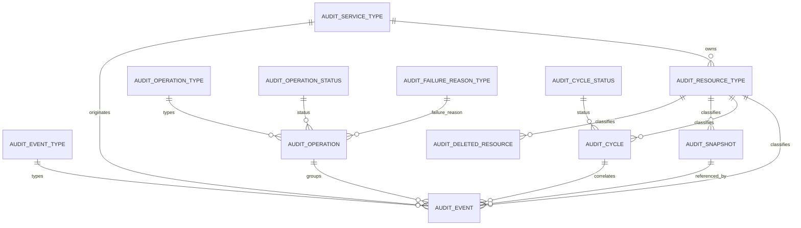
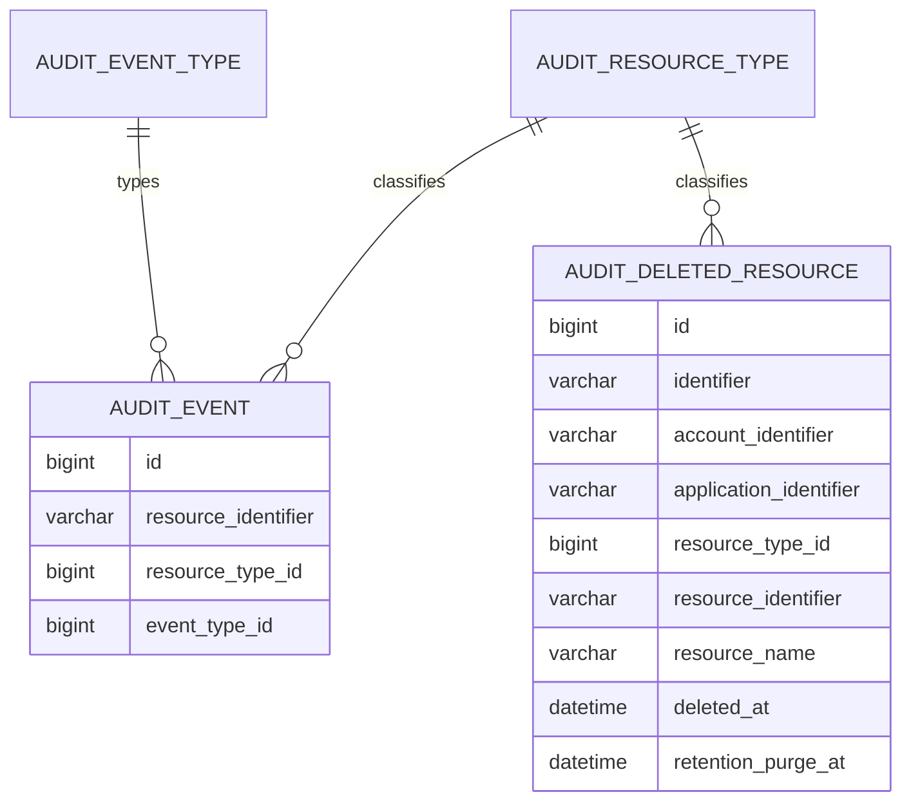

# Audit Service --- Especificação Funcional, Catálogos e Modelo de Dados

> **Versão V3 — consolidação do modelo administrativo, transacional e rastreabilidade pós-purge.**
>
> Esta versão preserva integralmente as regras consolidadas da V2 e adiciona
> a capacidade de rastreabilidade mínima de recursos removidos fisicamente,
> por meio de `AUDIT_DELETED_RESOURCE`, retenção controlada e tratamento
> especial do evento `PURGED`.
>
> **Nomenclatura:** o catálogo de motivo de falha é
> `AUDIT_FAILURE_REASON_TYPE`. Não existe, nesta definição, um catálogo
> `AUDIT_FILE_VERSION_TYPE`/`AUDIT_FILES_VERSION_TYPE`.
>
> Documento consolidado das regras de negócio definidas para o
> `audit-service`, revisado para incorporar o modelo administrativo de
> tipos, serviços e recursos.

------------------------------------------------------------------------

# 1. Objetivo

O `audit-service` será o serviço centralizado responsável por registrar,
correlacionar, reconciliar e consultar fatos relevantes ocorridos sobre
recursos da plataforma.

O serviço deverá permitir reconstruir:

-   o que aconteceu com um recurso;
-   o que foi solicitado em uma operação;
-   quais recursos participaram da operação;
-   qual microserviço e tipo de recurso originaram o evento;
-   quem realizou a ação;
-   quando ela ocorreu;
-   quais recursos tiveram sucesso;
-   quais tiveram falha conhecida;
-   quais não produziram um desfecho esperado;
-   como uma operação foi encerrada;
-   qual era o estado completo do recurso, quando snapshot estiver
    configurado;
-   qual ciclo de ambientes está associado ao recurso, quando ciclo
    estiver configurado.

> **Princípio central:** o Audit Service registra e reconcilia fatos de
> auditoria. Ele não executa publicação, promoção, rollback ou qualquer
> outro processo de negócio.

------------------------------------------------------------------------

# 2. Limites de responsabilidade

## 2.1 Responsabilidades

O Audit Service é responsável por:

-   registrar eventos imutáveis;
-   permitir eventos independentes de operação;
-   criar operações que agrupam eventos quando necessário;
-   criar em batch os eventos de intenção de uma operação;
-   correlacionar eventos com operação, recurso e ciclo;
-   registrar eventos de sucesso e falha;
-   reconciliar eventos antes de fechar uma operação;
-   gerar `UNHANDLED_FAILURE` quando uma operação for encerrada sem
    desfecho para algum recurso;
-   identificar e fechar operações abandonadas por timeout;
-   armazenar snapshots no S3 quando configurado para o tipo de recurso;
-   controlar ciclos internamente quando configurado para o tipo de
    recurso;
-   consultar histórico;
-   utilizar o fluxo de ambientes para resolução de ciclos;
-   fornecer mensagens e possíveis orientações associadas aos fatos
    auditados;
-   administrar os catálogos internos de tipos reconhecidos pelo Audit
    Service.

## 2.2 Fora de responsabilidade

O Audit Service não é responsável por:

-   executar publicação;
-   executar promoção;
-   executar rollback;
-   fazer retry do processo de negócio;
-   reprocessar recursos;
-   controlar fila operacional;
-   controlar execução individual por uma tabela de itens;
-   substituir logs e observabilidade;
-   armazenar stack trace;
-   diagnosticar a causa técnica de uma exceção não tratada;
-   duplicar cadastros de conta, aplicação ou ambiente;
-   funcionar como workflow engine.

------------------------------------------------------------------------

# 3. Conceitos principais

``` text
AUDIT_SERVICE_TYPE
        |
        | 1:N
        v
AUDIT_RESOURCE_TYPE
        |
        +── configuration JSON
        |      ├── snapshotEnabled
        |      └── cycleEnabled
        |
        v
    AUDIT_EVENT
        |
        +── AUDIT_OPERATION (opcional)
        +── AUDIT_CYCLE     (opcional)
        └── AUDIT_SNAPSHOT  (opcional)
```

## 3.1 Service Type

Representa o microserviço/domínio técnico reconhecido pelo Audit
Service.

Exemplos:

``` text
KEY_SERVICE
MENU_SERVICE
ROUTE_SERVICE
```

O `service type` identifica **quem é responsável/origem do recurso**, e
não o recurso em si.

## 3.2 Resource Type

Representa o tipo de recurso auditável pertencente a um serviço.

Um serviço pode possuir vários recursos.

Exemplo:

``` text
KEY_SERVICE
   ├── KEY
   └── TOGGLE
```

O comportamento técnico do recurso é definido no campo `configuration`
do próprio `AUDIT_RESOURCE_TYPE`.

## 3.3 Event

Representa um fato auditável e imutável.

Pode representar:

-   ação direta;
-   intenção;
-   sucesso;
-   falha conhecida;
-   ausência de desfecho detectada pela auditoria.

Um evento pode existir sem operação.

## 3.4 Operation

Agrupa eventos pertencentes à mesma execução quando existe necessidade
de correlação operacional, principalmente em fluxos assíncronos ou em
lote.

A operação não é workflow e não controla estado individual de item.

## 3.5 Cycle

Representa a jornada de alteração de um recurso através do fluxo de
ambientes.

É controlado internamente pelo Audit Service quando o tipo de recurso
possuir `cycleEnabled = true`.

## 3.6 Snapshot

Representa o estado completo e imutável de um recurso em determinado
momento.

É utilizado quando o tipo de recurso possuir `snapshotEnabled = true`.

------------------------------------------------------------------------

# 4. Administração de catálogos

Os tipos reconhecidos pelo Audit Service serão persistidos em tabelas
administrativas.

Catálogos:

``` text
AUDIT_SERVICE_TYPE
AUDIT_RESOURCE_TYPE
AUDIT_EVENT_TYPE
AUDIT_OPERATION_TYPE
AUDIT_OPERATION_STATUS
AUDIT_FAILURE_REASON_TYPE
AUDIT_CYCLE_STATUS
```

Essas tabelas substituem strings livres no modelo transacional.

Os registros transacionais deverão referenciar os respectivos IDs.

------------------------------------------------------------------------

# 5. Associação Service Type → Resource Type

A relação será:

``` text
AUDIT_SERVICE_TYPE 1 ─────── N AUDIT_RESOURCE_TYPE
```

Exemplo:

``` text
KEY_SERVICE
   |
   ├── KEY
   │    configuration:
   │    {
   │      "snapshotEnabled": true,
   │      "cycleEnabled": true
   │    }
   │
   └── TOGGLE
        configuration:
        {
          "snapshotEnabled": true,
          "cycleEnabled": false
        }

MENU_SERVICE
   |
   └── MENU
        configuration:
        {
          "snapshotEnabled": true,
          "cycleEnabled": true
        }

ROUTE_SERVICE
   |
   └── ROUTE
        configuration:
        {
          "snapshotEnabled": true,
          "cycleEnabled": true
        }
```

Não haverá uma tabela `AUDIT_RESOURCE_CONFIG`.

A configuração pertence ao próprio `AUDIT_RESOURCE_TYPE`.

------------------------------------------------------------------------

# 6. Configuração extensível do recurso

`AUDIT_RESOURCE_TYPE.configuration` será um campo `JSON` no MySQL.

Configuração inicial:

``` json
{
  "snapshotEnabled": true,
  "cycleEnabled": true
}
```

A configuração é interna da plataforma e administrada pelo mesmo time
responsável pelo Audit Service.

Na primeira versão:

-   não haverá schema associado ao JSON;
-   não haverá versionamento de schema;
-   não haverá tabela separada de configuração;
-   não haverá `snapshot_enabled` ou `cycle_enabled` como colunas;
-   não haverá `operationEnabled`.

O JSON permite evolução sem alteração estrutural da tabela.

Exemplo futuro:

``` json
{
  "snapshotEnabled": true,
  "cycleEnabled": true,
  "retentionDays": 180,
  "snapshotStrategy": "FULL"
}
```

Na aplicação Java, a configuração deverá ser desserializada para um
objeto tipado, evitando espalhar `Map<String, Object>` pelas regras de
domínio.

------------------------------------------------------------------------

# 7. Catálogo de eventos

## 7.1 Eventos diretos

``` text
CREATED
UPDATED
ACTIVATED
DEACTIVATED
DELETED
PURGED
```

## 7.2 Publicação

``` text
PUBLISH_REQUESTED
PUBLISHED
PUBLISH_FAILED
```

## 7.3 Promoção

``` text
PROMOTION_REQUESTED
PROMOTED
PROMOTION_FAILED
```

## 7.4 Rollback

``` text
ROLLBACK_REQUESTED
ROLLBACK
ROLLBACK_FAILED
```

## 7.5 Falha sem desfecho tratado

``` text
UNHANDLED_FAILURE
```

`resource_type` e `event_type` continuam conceitos independentes.

Não serão criados tipos como:

``` text
KEY_PUBLISHED
MENU_PUBLISHED
ROUTE_PROMOTED
```

O correto conceitualmente é:

``` text
resource_type = KEY
event_type    = PUBLISHED
```

Fisicamente, as tabelas transacionais armazenarão os IDs dos catálogos.

------------------------------------------------------------------------

# 8. Modelo intenção → desfecho

Ações assíncronas possuem um evento inicial de intenção e posteriormente
exatamente um evento terminal quando a operação é fechada.

## Publicação

``` text
PUBLISH_REQUESTED
        |
        +── PUBLISHED
        +── PUBLISH_FAILED
        └── UNHANDLED_FAILURE
```

## Promoção

``` text
PROMOTION_REQUESTED
        |
        +── PROMOTED
        +── PROMOTION_FAILED
        └── UNHANDLED_FAILURE
```

## Rollback

``` text
ROLLBACK_REQUESTED
        |
        +── ROLLBACK
        +── ROLLBACK_FAILED
        └── UNHANDLED_FAILURE
```

`*_FAILED` significa que o processador encontrou uma falha conhecida e
informou explicitamente o desfecho.

`UNHANDLED_FAILURE` significa que o Audit Service precisou materializar
a ausência de um desfecho durante o fechamento/reconciliação.

------------------------------------------------------------------------

# 9. Eventos independentes de operação

Nem todo evento pertence a uma operação.

Exemplos:

``` text
KEY-123 CREATED
KEY-123 UPDATED
KEY-123 ACTIVATED
KEY-123 DEACTIVATED
```

Nesses casos:

``` text
AUDIT_EVENT.operation_id = null
```

Regra:

> **Evento pode existir sem operação. Operação existe para agrupar
> eventos de uma mesma execução.**

As regras de reconciliação, fechamento e timeout aplicam-se somente aos
eventos vinculados a uma operação.

------------------------------------------------------------------------

# 10. Criação de operação

Exemplo: publicação de 500 chaves.

``` text
1. criar AUDIT_OPERATION com status STARTED
2. criar 500 PUBLISH_REQUESTED em batch
3. confirmar a persistência da operação e das intenções
4. devolver operationUuid
5. iniciar processamento assíncrono fora do Audit Service
```

A criação da operação e das intenções é síncrona.

O processamento do negócio é assíncrono.

``` text
OPERATION + REQUESTED = SÍNCRONO

PUBLICAÇÃO / PROMOÇÃO / ROLLBACK = ASSÍNCRONO
```

O `operationUuid` somente será retornado depois que a operação e todas
as intenções estiverem persistidas.

------------------------------------------------------------------------

# 11. Processamento e desfechos

O processador registra o desfecho de cada recurso.

Exemplo:

``` text
KEY-001 PUBLISH_REQUESTED → PUBLISHED
KEY-002 PUBLISH_REQUESTED → PUBLISHED
KEY-003 PUBLISH_REQUESTED → PUBLISH_FAILED
KEY-004 PUBLISH_REQUESTED → PUBLISHED
```

Não haverá estado intermediário `PROCESSING` no Audit Service.

------------------------------------------------------------------------

# 12. Falha conhecida

Quando o processador identificar uma falha conhecida, deverá registrar o
evento terminal correspondente.

Exemplo:

``` text
KEY-003 PUBLISH_REQUESTED
KEY-003 PUBLISH_FAILED
```

O evento poderá possuir:

``` text
message
solution
```

A causa técnica detalhada permanece nos logs/observabilidade.

------------------------------------------------------------------------

# 13. Ausência temporária de desfecho

Enquanto a operação estiver `STARTED`, uma intenção pode ainda não
possuir desfecho.

Isso não é automaticamente uma falha.

``` text
KEY-001 PUBLISH_REQUESTED → PUBLISHED
KEY-002 PUBLISH_REQUESTED → ainda sem desfecho
```

O Audit Service não gera `UNHANDLED_FAILURE` apenas porque o
processamento ainda está em andamento.

------------------------------------------------------------------------

# 14. Reconciliação no fechamento

Antes de fechar uma operação, o Audit Service deverá reconciliar todas
as intenções.

Exemplo:

``` text
KEY-001 PUBLISH_REQUESTED → PUBLISHED
KEY-002 PUBLISH_REQUESTED → PUBLISHED
KEY-003 PUBLISH_REQUESTED → PUBLISH_FAILED
KEY-004 PUBLISH_REQUESTED → sem desfecho
```

No fechamento:

``` text
KEY-004 UNHANDLED_FAILURE
```

Regra:

> **REQUESTED sem desfecho é permitido somente enquanto a operação
> estiver aberta.**

------------------------------------------------------------------------

# 15. Status da operação

Catálogo inicial:

``` text
STARTED
COMPLETED
FAILED
```

Não haverá `PARTIAL`.

Uma operação é `COMPLETED` somente quando todas as intenções possuem
desfecho de sucesso.

Qualquer falha tratada ou `UNHANDLED_FAILURE` resulta em `FAILED`.

------------------------------------------------------------------------

# 16. Invariante de operação fechada

Uma operação `COMPLETED` ou `FAILED` nunca poderá possuir intenção sem
desfecho terminal correspondente.

Exemplo:

``` text
500 PUBLISH_REQUESTED

493 PUBLISHED
  5 PUBLISH_FAILED
  2 UNHANDLED_FAILURE
─────────────────────
500 desfechos
```

------------------------------------------------------------------------

# 17. Operação abandonada e scheduler

Uma operação pode permanecer `STARTED` caso o processador sofra uma
quebra inesperada e não solicite o fechamento.

O Audit Service possuirá scheduler para operações expiradas.

Conceitualmente:

``` text
status = STARTED
AND started_at < agora - operation_timeout
```

Valores iniciais de referência:

``` text
scheduler = a cada 1 hora
timeout   = 1 hora
```

Ambos serão configuráveis.

O scheduler não faz retry nem reprocessamento.

------------------------------------------------------------------------

# 18. Fechamento por timeout

Quando uma operação expirar:

``` text
1. localizar intenções
2. localizar desfechos
3. identificar intenções sem desfecho
4. gerar UNHANDLED_FAILURE para cada ausência
5. fechar operação como FAILED
6. failure_reason = TIMEOUT
7. registrar message/solution
```

`TIMEOUT` explica por que a operação foi fechada pelo Audit Service.

`UNHANDLED_FAILURE` identifica os recursos que ficaram sem desfecho.

------------------------------------------------------------------------

# 19. Concorrência no fechamento

Uma operação somente poderá ser finalizada uma vez.

Transições permitidas:

``` text
STARTED → COMPLETED
STARTED → FAILED
```

Depois de terminal, a operação não poderá ser reaberta nem ter seu
resultado alterado.

A implementação deverá garantir concorrência segura entre fechamento
solicitado pelo motor e fechamento pelo scheduler.

------------------------------------------------------------------------

# 20. Failure Reason

Catálogo inicial:

``` text
PROCESSING_FAILURE
TIMEOUT
UNHANDLED_FAILURE
```

Semântica:

``` text
PROCESSING_FAILURE
→ motor encerrou explicitamente a operação contendo falha conhecida.

TIMEOUT
→ Audit Service encerrou uma operação que permaneceu aberta além do limite.

UNHANDLED_FAILURE
→ fechamento normal encontrou recurso sem desfecho e materializou UNHANDLED_FAILURE.
```

Em sucesso:

``` text
status = COMPLETED
failure_reason = null
```

------------------------------------------------------------------------

# 21. Message e Solution

`AUDIT_OPERATION` e `AUDIT_EVENT` poderão possuir:

``` text
message
solution
```

`message` explica de forma legível o fato.

`solution` fornece orientação quando houver ação possível e pode ser
nula.

O padrão de mensagens poderá aproveitar o módulo de messaging da
plataforma.

Não serão armazenados como mensagem de auditoria:

``` text
stack trace
classe Java
linha de código
dump de exceção
detalhes internos de infraestrutura
```

------------------------------------------------------------------------

# 22. Operação como agrupador

`AUDIT_OPERATION` não terá `resource_type_id` ou `resource_id`.

Uma operação pode agrupar recursos diferentes:

``` text
OPERATION OP-100
   ├── KEY-001
   ├── KEY-002
   ├── MENU-010
   └── ROUTE-020
```

Os recursos pertencem aos eventos.

A operação poderá manter `request_id` e `package_id` para correlação com
o motor/origem.

------------------------------------------------------------------------

# 23. Rollback e versionamento

Rollback segue o mesmo modelo intenção/desfecho.

``` text
ROLLBACK_REQUESTED
        |
        +── ROLLBACK
        +── ROLLBACK_FAILED
        └── UNHANDLED_FAILURE
```

Uma operação de rollback poderá referenciar outra operação através de
`parent_operation_id`.

Rollback não sobrescreve versões anteriores.

Exemplo:

``` text
v1 CREATED
v2 UPDATED
v3 UPDATED
v4 UPDATED

rollback para conteúdo da v2
        ↓
v5 ROLLBACK
```

------------------------------------------------------------------------

# 24. Ciclo

O ciclo representa a jornada de alteração de um recurso.

O consumidor não cria nem fecha ciclos diretamente.

O Audit Service resolve o ciclo conforme:

-   conta;
-   ambiente;
-   tipo do recurso;
-   identificador do recurso;
-   `AUDIT_RESOURCE_TYPE.configuration`;
-   fluxo de ambientes.

O ciclo somente é aplicado quando:

``` json
{
  "cycleEnabled": true
}
```

Status iniciais:

``` text
OPEN
COMPLETED
```

Não haverá `CANCELLED` na primeira versão.

------------------------------------------------------------------------

# 25. Fluxo de ambientes

O Audit Service não é dono dos ambientes.

Utilizará a view read-only:

``` text
VW_AUDIT_ACCOUNT_ENVIRONMENT_FLOW
```

com:

``` text
account_id
environment_id
position
initial_environment
final_environment
```

Essa informação será utilizada principalmente para resolução de ciclos.

------------------------------------------------------------------------

# 26. Snapshot

O snapshot somente será aplicado quando a configuração do tipo de
recurso possuir:

``` json
{
  "snapshotEnabled": true
}
```

Quando aplicável, o consumidor fornece o estado completo do recurso.

O Audit Service deverá:

``` text
estado completo
      |
      v
serialização/normalização determinística
      |
      +── SHA-256
      +── size_bytes
      |
      v
upload dos mesmos bytes no S3
      |
      v
persistência dos metadados no banco
```

O snapshot é imutável.

------------------------------------------------------------------------

# 27. Consultas

Filtros esperados:

``` text
accountId
applicationId
environmentId
serviceType
resourceType
resourceId
eventType
operationUuid
actorId
período
```

As consultas de eventos serão paginadas.

Também deverá ser possível:

-   consultar uma operação;
-   localizar eventos relacionados;
-   identificar sucessos;
-   identificar falhas tratadas;
-   identificar `UNHANDLED_FAILURE`;
-   identificar motivo de encerramento.

------------------------------------------------------------------------

# 28. APIs conceituais

## Eventos

``` text
registrar evento
consultar eventos
consultar evento específico
```

## Operações

``` text
criar operação + intenções em batch
finalizar operação
consultar operação
```

## Administração

A API administrativa deverá permitir gerenciar os catálogos reconhecidos
pelo Audit Service, respeitando as regras de integridade e uso.

Principais recursos administrativos:

``` text
service types
resource types
event types
operation types
operation statuses
failure reason types
cycle statuses
```

Não haverá API pública de negócio para criação direta de:

``` text
cycle
snapshot
```

Ciclo e snapshot são comportamentos internos.

------------------------------------------------------------------------

# 29. Modelo de dados consolidado

Estruturas:

``` text
CATÁLOGOS / ADMINISTRAÇÃO

AUDIT_SERVICE_TYPE
AUDIT_RESOURCE_TYPE
AUDIT_EVENT_TYPE
AUDIT_OPERATION_TYPE
AUDIT_OPERATION_STATUS
AUDIT_FAILURE_REASON_TYPE
AUDIT_CYCLE_STATUS

TRANSACIONAL

AUDIT_OPERATION
AUDIT_EVENT
AUDIT_CYCLE
AUDIT_SNAPSHOT
AUDIT_DELETED_RESOURCE

INTEGRAÇÃO / LEITURA

VW_AUDIT_ACCOUNT_ENVIRONMENT_FLOW
```

A antiga `AUDIT_RESOURCE_CONFIG` foi removida.

------------------------------------------------------------------------

# 29A. Visão consolidada do modelo de dados

A separação definitiva é:

| Camada | Estruturas | Responsabilidade |
|---|---|---|
| Administração | `AUDIT_SERVICE_TYPE`, `AUDIT_RESOURCE_TYPE`, `AUDIT_EVENT_TYPE`, `AUDIT_OPERATION_TYPE`, `AUDIT_OPERATION_STATUS`, `AUDIT_FAILURE_REASON_TYPE`, `AUDIT_CYCLE_STATUS` | Define os tipos reconhecidos pelo Audit Service e substitui strings livres. |
| Transacional | `AUDIT_OPERATION`, `AUDIT_EVENT`, `AUDIT_CYCLE`, `AUDIT_SNAPSHOT`, `AUDIT_DELETED_RESOURCE` | Preserva fatos, operações, ciclos, snapshots e a identidade mínima de recursos removidos fisicamente. |
| Integração | `VW_AUDIT_ACCOUNT_ENVIRONMENT_FLOW` | Fornece ao Audit Service o fluxo de ambientes por conta. |
| Conteúdo | S3 | Armazena o conteúdo completo e imutável dos snapshots. |

## 29A.1 Diagrama consolidado



## 29A.2 Fluxo lógico

```text
AUDIT_SERVICE_TYPE
        |
        v
AUDIT_RESOURCE_TYPE
        |
        +--> configuration JSON
        |      snapshotEnabled
        |      cycleEnabled
        |
        +-----------------------------+
        |                             |
        v                             v
AUDIT_EVENT <---------------- AUDIT_OPERATION
        |
        +------------------> AUDIT_CYCLE
        |
        +------------------> AUDIT_SNAPSHOT --> S3
```

O `AUDIT_EVENT` é o centro do histórico. Ele identifica:

- serviço de origem;
- recurso;
- tipo do evento;
- conta;
- aplicação;
- ambiente;
- ator;
- versão;
- operação, quando existir;
- ciclo, quando existir;
- snapshot, quando existir.

------------------------------------------------------------------------

# 29B. Catálogos administrativos consolidados

## 29B.1 `AUDIT_SERVICE_TYPE`

Exemplos:

| id | name | description | active |
|---:|---|---|---|
| 1 | `KEY_SERVICE` | Serviço responsável por chaves e toggles | true |
| 2 | `MENU_SERVICE` | Serviço responsável por menus | true |
| 3 | `ROUTE_SERVICE` | Serviço responsável por rotas | true |
| 4 | `RULE_SERVICE` | Serviço responsável por regras | true |

## 29B.2 `AUDIT_RESOURCE_TYPE`

Exemplos:

| id | service_type_id | name | configuration | active |
|---:|---:|---|---|---|
| 1 | 1 | `KEY` | `{"snapshotEnabled":true,"cycleEnabled":true}` | true |
| 2 | 1 | `TOGGLE` | `{"snapshotEnabled":true,"cycleEnabled":false}` | true |
| 3 | 2 | `MENU` | `{"snapshotEnabled":true,"cycleEnabled":true}` | true |
| 4 | 3 | `ROUTE` | `{"snapshotEnabled":true,"cycleEnabled":true}` | true |
| 5 | 4 | `RULE` | `{"snapshotEnabled":true,"cycleEnabled":true}` | true |

A combinação `service_type_id + name` é única.

## 29B.3 `AUDIT_EVENT_TYPE`

Catálogo inicial:

```text
CREATED
UPDATED
ACTIVATED
DEACTIVATED
DELETED

PUBLISH_REQUESTED
PUBLISHED
PUBLISH_FAILED

PROMOTION_REQUESTED
PROMOTED
PROMOTION_FAILED

ROLLBACK_REQUESTED
ROLLBACK
ROLLBACK_FAILED

UNHANDLED_FAILURE
```

## 29B.4 `AUDIT_OPERATION_TYPE`

```text
PUBLISH
PROMOTION
ROLLBACK
```

A lista pode evoluir com novos tipos de operação sem alterar a estrutura
de `AUDIT_OPERATION`.

## 29B.5 `AUDIT_OPERATION_STATUS`

```text
STARTED
COMPLETED
FAILED
```

Não existe `PARTIAL`.

## 29B.6 `AUDIT_FAILURE_REASON_TYPE`

Este é o catálogo utilizado para explicar **por que uma operação terminou
em falha**.

```text
PROCESSING_FAILURE
TIMEOUT
UNHANDLED_FAILURE
```

Semântica:

- `PROCESSING_FAILURE`: o processador informou uma ou mais falhas conhecidas;
- `TIMEOUT`: a operação permaneceu aberta além do limite e foi encerrada pelo Audit Service;
- `UNHANDLED_FAILURE`: fechamento normal encontrou pelo menos uma intenção sem desfecho e o Audit Service precisou materializar o evento `UNHANDLED_FAILURE`.

## 29B.7 `AUDIT_CYCLE_STATUS`

```text
OPEN
COMPLETED
```

Na V1/V2 não existe `CANCELLED` no catálogo inicial.

------------------------------------------------------------------------

# 29C. Exemplo completo dos catálogos

Considere:

```text
AUDIT_SERVICE_TYPE
1 | KEY_SERVICE | true

AUDIT_RESOURCE_TYPE
1 | service=1 | KEY
  | configuration={"snapshotEnabled":true,"cycleEnabled":true}

AUDIT_EVENT_TYPE
6 | PUBLISH_REQUESTED
7 | PUBLISHED
8 | PUBLISH_FAILED
15| UNHANDLED_FAILURE

AUDIT_OPERATION_TYPE
1 | PUBLISH

AUDIT_OPERATION_STATUS
1 | STARTED
2 | COMPLETED
3 | FAILED

AUDIT_FAILURE_REASON_TYPE
1 | PROCESSING_FAILURE
2 | TIMEOUT
3 | UNHANDLED_FAILURE

AUDIT_CYCLE_STATUS
1 | OPEN
2 | COMPLETED
```

Com isso, as tabelas transacionais não precisam persistir:

```text
"KEY_SERVICE"
"KEY"
"PUBLISH"
"STARTED"
```

como strings livres.

Elas persistem os respectivos IDs dos catálogos.

------------------------------------------------------------------------

# 29D. Exemplo transacional completo

Cenário: publicação de duas chaves da mesma aplicação.

## Operação

```text
AUDIT_OPERATION

id                     = 100
uuid                   = OP-100
account_id             = ACC-01
environment_id         = ENV-DEV
operation_type_id      = 1    // PUBLISH
status_id              = 1    // STARTED
failure_reason_type_id = null
actor_id               = USER-10
started_at             = 2026-09-13T10:00:00
```

## Ciclo da KEY-001

```text
AUDIT_CYCLE

id               = 500
uuid             = CYCLE-500
account_id       = ACC-01
resource_type_id = 1           // KEY
resource_id      = KEY-001
status_id        = 1           // OPEN
started_at       = 2026-09-13T09:45:00
completed_at     = null
```

## Snapshot da versão

```text
AUDIT_SNAPSHOT

id               = 900
uuid             = SNAP-900
account_id       = ACC-01
resource_type_id = 1
resource_id      = KEY-001
version          = 3
bucket           = platform-audit
key              = keys/KEY-001/3/SNAP-900.json
hash             = <sha-256>
size_bytes       = 824
```

## Eventos de intenção

```text
AUDIT_EVENT

EV-001
operation_id     = 100
cycle_id         = 500
service_type_id  = 1            // KEY_SERVICE
resource_type_id = 1            // KEY
resource_id      = KEY-001
event_type_id    = 6            // PUBLISH_REQUESTED
version          = 3
snapshot_id      = 900
environment_id   = ENV-DEV
actor_id         = USER-10
```

```text
EV-002
operation_id     = 100
service_type_id  = 1            // KEY_SERVICE
resource_type_id = 1            // KEY
resource_id      = KEY-002
event_type_id    = 6            // PUBLISH_REQUESTED
environment_id   = ENV-DEV
actor_id         = USER-10
```

## Desfechos

```text
KEY-001
PUBLISH_REQUESTED -> PUBLISHED

KEY-002
PUBLISH_REQUESTED -> PUBLISH_FAILED
```

Ao fechar:

```text
AUDIT_OPERATION.status_id              = FAILED
AUDIT_OPERATION.failure_reason_type_id = PROCESSING_FAILURE
AUDIT_OPERATION.completed_at           = preenchido
```

A operação falha como um todo, porém o histórico mantém o resultado
individual de cada recurso por meio dos eventos.

------------------------------------------------------------------------

# 29E. Exemplo de ausência de desfecho

```text
KEY-001 PUBLISH_REQUESTED -> PUBLISHED
KEY-002 PUBLISH_REQUESTED -> sem desfecho
```

Enquanto a operação está `STARTED`, esse estado é permitido.

No fechamento normal:

```text
KEY-002 UNHANDLED_FAILURE
```

e:

```text
operation.status         = FAILED
operation.failure_reason = UNHANDLED_FAILURE
```

Se o fechamento ocorrer pelo scheduler por expiração:

```text
KEY-002 UNHANDLED_FAILURE

operation.status         = FAILED
operation.failure_reason = TIMEOUT
```

O evento explica o recurso sem desfecho.

O failure reason explica **por que a operação foi encerrada**.

------------------------------------------------------------------------

# 29F. Exemplo de ciclo DEV → HML → PRD

Considere uma conta cujo fluxo é:

```text
DEV -> HML -> PRD
```

A view informa:

| account_id | environment_id | position | initial_environment | final_environment |
|---|---|---:|---|---|
| ACC-01 | DEV | 1 | true | false |
| ACC-01 | HML | 2 | false | false |
| ACC-01 | PRD | 3 | false | true |

Para uma `KEY` com `cycleEnabled=true`:

```text
KEY-001 / ciclo CYCLE-500

UPDATED
   |
PUBLISHED DEV
   |
PROMOTED HML
   |
PROMOTED PRD
   |
CYCLE COMPLETED
```

O mesmo `resource_id` permanece correlacionado ao ciclo. O Audit
Service controla o ciclo; o serviço de negócio continua responsável pela
publicação/promoção.

------------------------------------------------------------------------

# 29G. Exemplo de rollback com snapshot

Histórico:

```text
v1 CREATED
v2 UPDATED
v3 UPDATED
v4 UPDATED
```

Solicitação:

```text
ROLLBACK para conteúdo da v2
```

Resultado:

```text
v5 ROLLBACK
sourceVersion = 2
snapshot de v5 = conteúdo completo restaurado a partir de v2
```

O histórico anterior permanece imutável.

------------------------------------------------------------------------

# 29H. Regras de integridade do modelo consolidado

1. Todo `AUDIT_RESOURCE_TYPE` pertence a exatamente um `AUDIT_SERVICE_TYPE`.
2. Um `AUDIT_SERVICE_TYPE` pode possuir vários recursos.
3. `AUDIT_EVENT.service_type_id` e `resource_type_id` devem formar uma associação válida.
4. Evento pode existir sem operação.
5. Evento pode existir sem ciclo.
6. Snapshot só é criado quando `snapshotEnabled=true`.
7. Ciclo só é criado/controlado quando `cycleEnabled=true`.
8. Operação não possui `resource_id`; os recursos ficam nos eventos.
9. Operação fechada não pode possuir intenção sem desfecho terminal.
10. `COMPLETED` exige todos os desfechos de sucesso.
11. Qualquer falha resulta em `FAILED`.
12. Não existe `PARTIAL`.
13. Catálogos referenciados pelo histórico não devem ser excluídos fisicamente.
14. Desativação de catálogo impede novos usos, mas preserva o histórico.
15. Snapshot é imutável e seu conteúdo completo fica no S3.
16. Evento é imutável.
17. Rollback cria nova versão; nunca reescreve uma versão anterior.
18. Conta, aplicação e ambiente continuam sendo identificadores dos domínios de origem.
19. O Audit Service não executa o processo de negócio.
20. O Audit Service registra, correlaciona, reconcilia e explica fatos.

------------------------------------------------------------------------

# 30. Relacionamentos consolidados

``` text
AUDIT_SERVICE_TYPE
        1
        |
        N
AUDIT_RESOURCE_TYPE
        |
        └── configuration JSON


AUDIT_OPERATION_TYPE     1 ───── N AUDIT_OPERATION
AUDIT_OPERATION_STATUS   1 ───── N AUDIT_OPERATION
AUDIT_FAILURE_REASON_TYPE 1 ──── N AUDIT_OPERATION


AUDIT_SERVICE_TYPE       1 ───── N AUDIT_EVENT
AUDIT_RESOURCE_TYPE      1 ───── N AUDIT_EVENT
AUDIT_EVENT_TYPE         1 ───── N AUDIT_EVENT


AUDIT_OPERATION          1 ───── N AUDIT_EVENT
                         evento pode não possuir operação

AUDIT_CYCLE              1 ───── N AUDIT_EVENT
                         evento pode não possuir ciclo

AUDIT_CYCLE_STATUS       1 ───── N AUDIT_CYCLE

AUDIT_EVENT              0 ─── 0..1 AUDIT_SNAPSHOT

AUDIT_RESOURCE_TYPE      1 ───── N AUDIT_CYCLE
AUDIT_RESOURCE_TYPE      1 ───── N AUDIT_SNAPSHOT
```

------------------------------------------------------------------------

# 31. Tabela `AUDIT_SERVICE_TYPE`

  Coluna          Tipo
  --------------- --------------
  `id`            BIGINT

------------------------------------------------------------------------

# 32. Rastreabilidade pós-purge

## 32.1 Objetivo

Após o purge físico de um recurso, o registro funcional deixa de existir
no domínio de origem.

Mesmo assim, pode existir necessidade operacional ou de auditoria de
responder perguntas como:

```text
"Esta Key existiu?"
"Ela foi removida fisicamente?"
"Quando isso aconteceu?"
"Qual era o identifier e o nome?"
"Quais eventos ocorreram antes da remoção?"
```

Para esse propósito, o Audit Service manterá uma estrutura mínima
denominada:

```text
AUDIT_DELETED_RESOURCE
```

Essa estrutura funciona como um **tombstone de auditoria**.

Ela não preserva o payload completo do recurso e não substitui
`AUDIT_EVENT` ou `AUDIT_SNAPSHOT`.

Sua responsabilidade é somente preservar identidade suficiente para
localizar o histórico do recurso após sua remoção física.

------------------------------------------------------------------------

# 33. Evento `PURGED`

A V3 adiciona ao catálogo de eventos:

```text
PURGED
```

Semântica:

```text
DELETED
= fato de exclusão/lifecycle lógico, conforme o domínio.

PURGED
= confirmação de que o recurso foi removido fisicamente.
```

Somente o evento `PURGED` dispara a criação de
`AUDIT_DELETED_RESOURCE`.

Eventos como:

```text
DELETED
DEACTIVATED
UPDATED
PENDING_DELETION
```

não devem criar tombstone de recurso removido.

------------------------------------------------------------------------

# 34. Regra central do purge na auditoria

O consumidor não deve persistir diretamente em
`AUDIT_DELETED_RESOURCE`.

O domínio informa o fato de purge através do contrato normal de
auditoria.

Fluxo:

```text
Domínio executa purge físico
        |
        v
registra evento PURGED
        |
        v
Audit Service
   ├── persiste AUDIT_EVENT
   └── persiste AUDIT_DELETED_RESOURCE
```

Regra:

> O comportamento adicional de criar o tombstone é responsabilidade da
> capacidade de auditoria, e não de cada domínio consumidor.

Assim, Key, Rule, Menu, Route, Application ou qualquer outro domínio não
precisam conhecer a tabela `AUDIT_DELETED_RESOURCE`.

------------------------------------------------------------------------

# 35. Atomicidade do processamento de `PURGED`

Dentro da capacidade de auditoria, a gravação deve ser atômica:

```text
BEGIN

INSERT AUDIT_EVENT (PURGED)
INSERT AUDIT_DELETED_RESOURCE

COMMIT
```

Se a criação do tombstone falhar, o processamento do evento `PURGED`
não deve ser considerado concluído.

A implementação deve ser idempotente para permitir retry sem gerar
duplicidade.

------------------------------------------------------------------------

# 36. Tabela `AUDIT_DELETED_RESOURCE`

Estrutura conceitual:

```text
AUDIT_DELETED_RESOURCE
────────────────────────────────
id
identifier

account_identifier
application_identifier

resource_type_id
resource_identifier
resource_name

deleted_at
retention_purge_at

created_at
```

## 36.1 Campos

| Campo | Regra |
|---|---|
| `id` | PK técnica numérica. |
| `identifier` | Identifier único do tombstone. |
| `account_identifier` | Identifier da Account à qual o recurso pertencia. Obrigatório. |
| `application_identifier` | Identifier da Application, quando aplicável. Pode ser nulo para recursos no nível de Account. |
| `resource_type_id` | FK para `AUDIT_RESOURCE_TYPE`. |
| `resource_identifier` | Identifier público do recurso removido. |
| `resource_name` | Nome/label mínimo para identificação humana. |
| `deleted_at` | Momento em que o recurso foi removido fisicamente. |
| `retention_purge_at` | Momento a partir do qual o tombstone pode ser removido conforme política de retenção. |
| `created_at` | Data de criação do registro de tombstone. |

O campo `deleted_at` representa o purge físico do recurso.

O campo `retention_purge_at` representa exclusivamente a expiração da
retenção do tombstone e evita ambiguidade com o purge funcional do recurso.

------------------------------------------------------------------------

# 37. Dados mínimos do evento `PURGED`

Para um evento `PURGED`, o contrato de auditoria deve possuir os dados
necessários para criar o tombstone:

```text
accountIdentifier
applicationIdentifier
resourceType
resourceIdentifier
resourceName
actor
sourceService
occurredAt
```

`applicationIdentifier` poderá ser nulo quando o recurso não pertencer
a uma Application.

Exemplo para uma Key:

```text
accountIdentifier     = ACC-01
applicationIdentifier = APP-10
resourceType          = KEY
resourceIdentifier    = KEY-123
resourceName          = api.timeout
eventType             = PURGED
```

------------------------------------------------------------------------

# 38. Idempotência e unicidade

A V3 deve impedir tombstones duplicados para a mesma identidade lógica
removida.

Chave de unicidade inicial:

```text
account_identifier
+ resource_type_id
+ resource_identifier
```

Exemplo:

```text
UNIQUE (
    account_identifier,
    resource_type_id,
    resource_identifier
)
```

Se o mesmo evento `PURGED` for reprocessado por retry, a operação deve
produzir o mesmo estado final sem duplicar o tombstone.

Caso futuramente seja permitido reutilizar o mesmo
`resource_identifier` para uma nova vida lógica do recurso, esta regra
deverá ser revisada com um identificador de geração/instância. Na V3,
identifiers são tratados como identidade estável e não reutilizável.

------------------------------------------------------------------------

# 39. Consulta pós-exclusão

O fluxo operacional esperado é:

```text
1. recurso não é encontrado no domínio atual
2. consulta AUDIT_DELETED_RESOURCE
3. tombstone é localizado
4. usa resource_type + resource_identifier para consultar AUDIT_EVENT
5. reconstrói o histórico
```

Exemplo:

```text
AUDIT_DELETED_RESOURCE

resourceType       = KEY
resourceIdentifier = KEY-123
resourceName       = api.timeout
deletedAt          = 2026-09-23T21:00:00
```

Histórico correlacionado:

```text
KEY-123 CREATED
KEY-123 UPDATED
KEY-123 PUBLISHED
KEY-123 DEACTIVATED
KEY-123 DELETED
KEY-123 PURGED
```

O tombstone não precisa duplicar actor, mensagens, snapshots ou detalhes
do histórico, pois esses dados continuam pertencendo aos eventos.

------------------------------------------------------------------------

# 40. Retenção

`AUDIT_DELETED_RESOURCE` possui retenção própria e controlada.

Ao criar o tombstone:

```text
deleted_at          = occurredAt do PURGED
retention_purge_at  = deleted_at + política de retenção
```

A política deve ser configurável pela plataforma.

Exemplos possíveis de política:

```text
3 anos
4 anos
5 anos
```

A V3 não fixa o prazo definitivo.

O período deve ser definido conforme requisitos corporativos,
regulatórios e operacionais.

Regra de consistência:

> A retenção do tombstone não deve ultrapassar de forma útil a retenção
> do histórico necessário para investigá-lo.

Preferencialmente:

```text
retention(AUDIT_DELETED_RESOURCE)
<= retention(AUDIT_EVENT)
```

ou ambas devem utilizar a mesma política.

------------------------------------------------------------------------

# 41. Scheduler de retenção

O Audit Service terá um scheduler responsável exclusivamente pela
limpeza dos tombstones cuja retenção expirou.

Frequência inicial recomendada:

```text
semanal
```

Consulta conceitual:

```sql
DELETE FROM AUDIT_DELETED_RESOURCE
WHERE retention_purge_at <= NOW();
```

A execução deve ocorrer em batch para evitar deletes massivos em uma
única transação.

Esse scheduler:

- não executa purge de recursos de negócio;
- não remove eventos automaticamente por consequência;
- não altera lifecycle;
- não executa reconciliação;
- remove somente tombstones cuja política de retenção venceu.

A política de retenção de `AUDIT_EVENT`, snapshots e demais estruturas
de auditoria continua sendo tratada separadamente.

------------------------------------------------------------------------

# 42. Relação com snapshot

`AUDIT_DELETED_RESOURCE` não substitui snapshot.

Responsabilidades:

```text
AUDIT_DELETED_RESOURCE
= identidade mínima pós-purge

AUDIT_EVENT
= histórico de fatos

AUDIT_SNAPSHOT
= estado completo de versões quando habilitado
```

Se houver necessidade de investigar o conteúdo antigo de um recurso,
deve-se utilizar o evento e o snapshot correspondente, respeitando a
política de retenção dessas estruturas.

------------------------------------------------------------------------

# 43. Relação com Resource Reference

`AUDIT_DELETED_RESOURCE` e `resource_reference` são capacidades
transversais, porém possuem responsabilidades diferentes e não devem ser
misturadas.

```text
platform_reference.resource_reference
= quem usa quem no estado atual

AUDIT_DELETED_RESOURCE
= quem existiu e foi fisicamente removido
```

`resource_reference` pertence à capacidade de referências transversais.

`AUDIT_DELETED_RESOURCE` pertence à capacidade de auditoria e deve
permanecer no mesmo schema/domínio de persistência das demais tabelas do
Audit Service.

------------------------------------------------------------------------

# 44. Modelo consolidado V3

Estruturas da auditoria:

```text
CATÁLOGOS / ADMINISTRAÇÃO

AUDIT_SERVICE_TYPE
AUDIT_RESOURCE_TYPE
AUDIT_EVENT_TYPE
AUDIT_OPERATION_TYPE
AUDIT_OPERATION_STATUS
AUDIT_FAILURE_REASON_TYPE
AUDIT_CYCLE_STATUS

TRANSACIONAL / HISTÓRICO

AUDIT_OPERATION
AUDIT_EVENT
AUDIT_CYCLE
AUDIT_SNAPSHOT
AUDIT_DELETED_RESOURCE

INTEGRAÇÃO / LEITURA

VW_AUDIT_ACCOUNT_ENVIRONMENT_FLOW

CONTEÚDO

S3
```

Diagrama complementar:



Não é necessário FK entre `AUDIT_EVENT` e
`AUDIT_DELETED_RESOURCE`.

A correlação ocorre pela identidade funcional:

```text
account
+ resource_type
+ resource_identifier
```

------------------------------------------------------------------------

# 45. Critérios de aceite da capacidade pós-purge

- [ ] O catálogo `AUDIT_EVENT_TYPE` possui `PURGED`.
- [ ] `DELETED` e `PURGED` possuem semânticas distintas.
- [ ] Apenas `PURGED` cria tombstone.
- [ ] Existe tabela `AUDIT_DELETED_RESOURCE`.
- [ ] O consumidor não escreve diretamente na tabela.
- [ ] O consumidor registra apenas o evento `PURGED`.
- [ ] Audit Service persiste evento + tombstone no mesmo processamento transacional.
- [ ] Retry de `PURGED` não cria tombstone duplicado.
- [ ] Tombstone mantém Account, Application quando aplicável, Resource Type, Resource Identifier e Resource Name.
- [ ] Tombstone mantém `deleted_at`.
- [ ] Tombstone mantém `retention_purge_at`.
- [ ] É possível localizar um recurso fisicamente removido pelo identifier.
- [ ] A partir do tombstone é possível consultar seus eventos históricos.
- [ ] O tombstone não duplica payload completo nem histórico.
- [ ] Existe política configurável de retenção.
- [ ] Existe scheduler periódico para remover tombstones expirados.
- [ ] Scheduler de retenção não executa lifecycle nem purge funcional.
- [ ] Retenção é coerente com a retenção do histórico de auditoria.

------------------------------------------------------------------------

# 46. Testes mínimos da V3

## 46.1 Evento PURGED

- registrar `PURGED` e criar `AUDIT_EVENT`;
- registrar `PURGED` e criar `AUDIT_DELETED_RESOURCE`;
- falha no tombstone não pode concluir parcialmente o processamento;
- retry não pode gerar duplicidade.

## 46.2 Consulta

- localizar tombstone por Account + Resource Type + Resource Identifier;
- recuperar nome do recurso;
- correlacionar tombstone aos eventos históricos.

## 46.3 Retenção

- calcular `retention_purge_at` conforme política;
- não remover registro antes da data;
- remover registro após expiração;
- processar limpeza em batch;
- garantir idempotência do scheduler.

## 46.4 Contexto

- recurso de Application deve persistir `application_identifier`;
- recurso no nível de Account pode possuir `application_identifier = null`;
- `resource_type_id` deve existir no catálogo;
- `resource_identifier` é obrigatório;
- `resource_name` é obrigatório no evento `PURGED`.

------------------------------------------------------------------------

# 47. Resumo da evolução V2 → V3

A V3 preserva o modelo funcional e transacional da V2 e adiciona:

1. evento `PURGED` para representar remoção física;
2. tabela `AUDIT_DELETED_RESOURCE`;
3. criação automática de tombstone ao registrar `PURGED`;
4. atomicidade entre evento e tombstone dentro da auditoria;
5. identidade mínima de Account/Application/recurso após exclusão física;
6. consulta pós-purge correlacionada ao histórico de eventos;
7. retenção configurável;
8. `retention_purge_at`;
9. scheduler periódico de limpeza de tombstones expirados;
10. idempotência para retry de eventos de purge;
11. separação explícita entre auditoria pós-purge e Resource Reference.

A finalidade da nova estrutura é permitir responder, mesmo meses ou anos
após a remoção física:

> **"Esse recurso existiu, quando foi removido e qual é o histórico de
> auditoria associado a ele?"**
