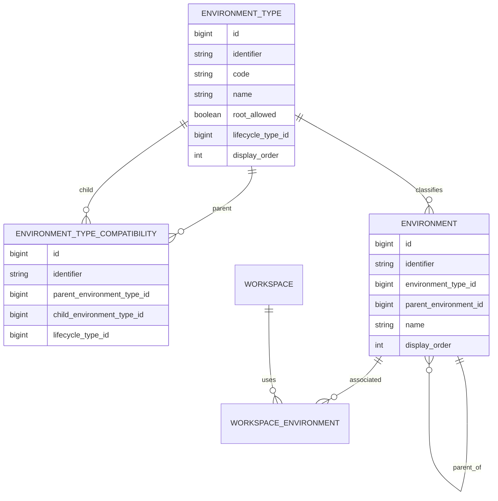

# Refinamento V2 — Environment Hierárquico, Environment Type e Topologia

> Baseline técnica: `BrunoBS/account-service`, branch `main`.

## 1. Modelo consolidado

Tipos iniciais:

```text
DEFAULT
CUSTOM
SHARD
CELL
```

Topologia inicial:

```text
DEFAULT ──→ SHARD ──→ CELL
CUSTOM  ──→ SHARD ──→ CELL
```

`DEFAULT` e `CUSTOM` são raízes. `SHARD` pode ser folha; `CELL` é opcional. Shard e Cell continuam sendo `Environment`, não features independentes.

## 2. EnvironmentType dentro da feature

A baseline possui `EnvironmentType` em `foundation/catalog/environmenttype`. Com a hierarquia, o tipo passa a governar regras específicas do domínio Environment. A direção é mover sua responsabilidade Java para `core/environment`.

```text
core/environment
├── domain
│   ├── Environment
│   ├── EnvironmentType
│   └── EnvironmentTypeCompatibility
├── service
├── usecase
└── infra
```

Mover a responsabilidade Java não implica recriar automaticamente a tabela física existente. A evolução de código e a evolução do banco devem ser tratadas separadamente.

## 3. Governança

Os tipos são governados pela plataforma. O usuário cria instâncias de Environment, não tipos arbitrários no fluxo normal.

```text
QA / TESTE / PERFORMANCE → CUSTOM
SHARD-01 / SHARD-02      → SHARD
CELL-01 / CELL-02        → CELL
```

Por isso `system_type` não é necessário: no modelo atual todos os tipos são controlados pela plataforma.

## 4. environment_type

Modelo mínimo proposto:

```sql
CREATE TABLE environment_type (
    id                  BIGINT PRIMARY KEY AUTO_INCREMENT,
    identifier          VARCHAR(36)  NOT NULL,
    code                VARCHAR(50)  NOT NULL,
    name                VARCHAR(100) NOT NULL,
    description         VARCHAR(255) NULL,
    root_allowed        BOOLEAN      NOT NULL DEFAULT FALSE,
    lifecycle_type_id   BIGINT       NOT NULL,
    display_order       INT          NOT NULL DEFAULT 0,
    created_at          TIMESTAMP    NOT NULL,
    updated_at          TIMESTAMP    NOT NULL,
    CONSTRAINT uk_environment_type_identifier UNIQUE (identifier),
    CONSTRAINT uk_environment_type_code UNIQUE (code)
);
```

Carga inicial:

| id | code | root_allowed | lifecycle | order |
|---:|---|---:|---|---:|
| 1 | DEFAULT | true | ACTIVE | 1 |
| 2 | CUSTOM | true | ACTIVE | 2 |
| 3 | SHARD | false | ACTIVE | 3 |
| 4 | CELL | false | ACTIVE | 4 |

Foram removidos `parent_required`, `children_allowed` e `system_type`.

- `system_type` seria sempre verdadeiro;
- `children_allowed` é derivado da existência de compatibilidade ativa onde o tipo é pai;
- `parent_required` é redundante no modelo atual quando combinado com `root_allowed` e a validação de criação.

`root_allowed` permanece porque a compatibilidade não responde se um tipo pode iniciar uma árvore sem pai.

## 5. environment_type_compatibility

A compatibilidade é N:N e fica em tabela própria:

```sql
CREATE TABLE environment_type_compatibility (
    id                          BIGINT PRIMARY KEY AUTO_INCREMENT,
    identifier                  VARCHAR(36) NOT NULL,
    parent_environment_type_id  BIGINT      NOT NULL,
    child_environment_type_id   BIGINT      NOT NULL,
    lifecycle_type_id           BIGINT      NOT NULL,
    created_at                  TIMESTAMP   NOT NULL,
    updated_at                  TIMESTAMP   NOT NULL,
    CONSTRAINT uk_environment_type_compat_identifier UNIQUE (identifier),
    CONSTRAINT uk_environment_type_parent_child UNIQUE (parent_environment_type_id, child_environment_type_id),
    CONSTRAINT fk_environment_type_compat_parent FOREIGN KEY (parent_environment_type_id) REFERENCES environment_type(id),
    CONSTRAINT fk_environment_type_compat_child FOREIGN KEY (child_environment_type_id) REFERENCES environment_type(id)
);
```

Carga inicial:

| parent | child | lifecycle |
|---|---|---|
| DEFAULT | SHARD | ACTIVE |
| CUSTOM | SHARD | ACTIVE |
| SHARD | CELL | ACTIVE |

A ausência de relação significa que a combinação não é permitida. `DEFAULT → CELL`, por exemplo, é inválido.

## 6. Exemplo de extensibilidade: REGION

Se futuramente a plataforma adicionar `REGION` e DEFAULT/CUSTOM puderem ter SHARD ou REGION, nenhuma alteração de schema é necessária.

Novo tipo:

| code | root_allowed |
|---|---:|
| REGION | false |

Novas compatibilidades:

| parent | child |
|---|---|
| DEFAULT | REGION |
| CUSTOM | REGION |

Resultado:

```text
DEFAULT ──┬──→ SHARD ──→ CELL
          └──→ REGION

CUSTOM  ──┬──→ SHARD ──→ CELL
          └──→ REGION
```

Se depois `REGION → SHARD` for permitido, basta cadastrar essa compatibilidade.

## 7. environment

`Environment` materializa a árvore real de cada workspace.

```sql
CREATE TABLE environment (
    id                    BIGINT PRIMARY KEY AUTO_INCREMENT,
    identifier            VARCHAR(36)  NOT NULL,
    workspace_identifier  VARCHAR(36)  NULL,
    environment_type_id   BIGINT       NOT NULL,
    parent_environment_id BIGINT       NULL,
    code                  VARCHAR(100) NULL,
    name                  VARCHAR(150) NOT NULL,
    description           VARCHAR(255) NULL,
    display_order         INT          NOT NULL DEFAULT 0,
    lifecycle_type_id     BIGINT       NOT NULL,
    created_at            TIMESTAMP    NOT NULL,
    updated_at            TIMESTAMP    NOT NULL,
    CONSTRAINT uk_environment_identifier UNIQUE (identifier),
    CONSTRAINT fk_environment_type FOREIGN KEY (environment_type_id) REFERENCES environment_type(id),
    CONSTRAINT fk_environment_parent FOREIGN KEY (parent_environment_id) REFERENCES environment(id)
);
```

Na implementação real, a tabela existente deve ser evoluída por migration incremental, não recriada.

Exemplo:

| name | type | parent | workspace |
|---|---|---|---|
| DEV | DEFAULT | null | plataforma |
| HML | DEFAULT | null | plataforma |
| PRD | DEFAULT | null | plataforma |
| QA INTERNO | CUSTOM | null | WS-001 |
| SHARD 01 | SHARD | DEV | WS-001 |
| SHARD 02 | SHARD | DEV | WS-001 |
| CELL 01 | CELL | SHARD 01 | WS-001 |

## 8. Workspace × Environment

Reutilizar/evoluir a associação existente na baseline. Antes da implementação, confrontar a estrutura física atual para escolher uma única fonte de verdade de ownership e evitar duplicação entre `environment.workspace_identifier` e a associação Workspace × Environment.

## 9. Tabelas necessárias

```text
environment_type
environment_type_compatibility
environment
workspace_environment   // reutilizar/evoluir a existente
```

Não criar `shard`, `cell`, `environment_tree`, `environment_path`, `environment_leaf` ou `environment_destination`.

## 10. ER conceitual



## 11. Regra de criação

Sem pai, o tipo precisa ter `root_allowed=true`.

Com pai, o sistema resolve `parent.environmentType` e o tipo solicitado e exige uma compatibilidade ACTIVE `(parentType, childType)`.

```text
DEV [DEFAULT] → SHARD-01 [SHARD]  ✓ DEFAULT→SHARD existe
DEV [DEFAULT] → CELL-01 [CELL]    ✗ DEFAULT→CELL não existe
```

## 12. Validações

EnvironmentType/Compatibility:

- identifier e code únicos;
- `(parent_type, child_type)` único;
- evitar self-compatibility sem decisão explícita;
- não remover/inativar compatibilidade em uso sem tratamento definido;
- não inativar tipo em uso sem regra definida;
- impedir ciclos no grafo de tipos caso novas relações sejam administráveis.

Environment:

- pai existe;
- self-parent proibido;
- pai pertence à topologia válida do workspace;
- sem pai exige `root_allowed=true`;
- com pai exige compatibilidade ativa;
- ciclos de ambientes proibidos;
- nó não pode ser movido para descendente;
- nome único entre irmãos;
- delete com filhos bloqueado inicialmente;
- preservar regras atuais de default/workspace.

## 13. Repository e consultas

Ampliar `EnvironmentRepository` com capacidades equivalentes a:

```text
findChildren(parentIdentifier)
hasChildren(identifier)
findRoots(workspaceIdentifier)
existsSiblingByName(...)
```

`EnvironmentQueryService` pode expor `findChildren`, `findRoots` e `findTree`. Não introduzir cache antecipado; otimizações ficam para o refinamento específico de consultas do Golden.

## 14. API Environment

Manter recurso único.

```json
{
  "name": "SHARD 01",
  "environmentTypeCode": "SHARD",
  "parentIdentifier": "<DEV>"
}
```

```json
{
  "name": "QA INTERNO",
  "environmentTypeCode": "CUSTOM",
  "parentIdentifier": null
}
```

```json
{
  "name": "CELL 01",
  "environmentTypeCode": "CELL",
  "parentIdentifier": "<SHARD-01>"
}
```

Não criar `/shards` ou `/cells`.

## 15. Administração dos tipos

`EnvironmentType` pertence à feature, mas não é cadastro livre de usuário. Inicialmente DEFAULT/CUSTOM/SHARD/CELL e suas compatibilidades podem ser provisionados por migration/seed.

Não é requisito desta fase expor CRUD público completo de tipos. Uma futura API administrativa deverá respeitar lifecycle, uso existente e integridade do grafo.

## 16. Nó folha

```text
leaf(environment) = !hasChildren(environment)
```

```text
PRD [DEFAULT]
├── SHARD A
│   ├── CELL 01
│   └── CELL 02
└── SHARD B
```

Folhas: `CELL 01`, `CELL 02` e `SHARD B`.

## 17. Configuração/publicação por folha — pendente

Ainda não assumir que ambiente com filhos deixa automaticamente de ser configurável/publicável. Essa decisão impacta configuração existente, promoção, rollback e alteração de topologia.

## 18. Destination Resolver

Componente posterior responsável por transformar destino solicitado + topologia em folhas efetivas. Não conhece tipo de conta e não executa publicação.

## 19. Application e Publisher

Application × Environment precisa de refinamento posterior para decidir referência, cópia, subconjunto e propagação da árvore. Publisher continua associado a `Environment`, nunca a entidades Shard/Cell separadas.

## 20. Migration

Não alterar migrations aplicadas. Criar migrations incrementais para preservar dados atuais, mover a responsabilidade Java de EnvironmentType, adicionar `root_allowed`, criar compatibilidade N:N, provisionar os quatro tipos e três relações, adicionar parent ao Environment e criar FKs/índices.

## 21. GAP analysis

| Área | AS-IS | TO-BE | Ação |
|---|---|---|---|
| Environment | plano | árvore | adicionar parent |
| EnvironmentType | Foundation/catalog | domínio Environment | mover responsabilidade |
| Tipos | DEFAULT/CUSTOM | + SHARD/CELL | ampliar |
| Root | implícito | root_allowed | persistir regra mínima |
| Compatibilidade | inexistente | N:N | nova tabela |
| Validator | centralizado | root + compatibilidade + árvore | ampliar |
| API type | catálogo | administração da plataforma | sem CRUD público obrigatório |
| Migration | baseline | incremental | preservar dados |
| Publicação | sem topologia | resolver folhas futuramente | onda posterior |

## 22. Ondas

### E0 — Baseline
Mapear referências ao catálogo atual, dados DEFAULT/CUSTOM, regressão e upgrade Flyway.

### E1 — EnvironmentType
Mover responsabilidade para a feature, adicionar `root_allowed`, criar compatibilidade N:N, provisionar tipos/relações e testar.

### E2 — Environment hierárquico
Adicionar parent, FKs/índices, validações de root/compatibilidade/ciclos e CRUD.

### E3 — Consultas
Roots, children e tree, sem cache antecipado.

### E4 — Semântica de folha
Definir configuração/publicação em agrupador, transições folha↔agrupador e dados existentes.

### E5 — Destination Resolver
Resolver folhas sem publicar e sem regra por tipo de conta.

### E6 — Promoção/publicação
Múltiplos destinos, seleção parcial se aprovada, status, falha parcial, retry/idempotência, auditoria e rollback.

### E7 — Application/Publisher
Fechar integração com a árvore.

## 23. Decisões consolidadas

1. DEFAULT, CUSTOM, SHARD e CELL são os tipos iniciais.
2. DEFAULT e CUSTOM podem ser raiz.
3. SHARD e CELL não podem ser raiz inicialmente.
4. DEFAULT→SHARD, CUSTOM→SHARD e SHARD→CELL são as compatibilidades iniciais.
5. SHARD pode ser folha.
6. Shard/Cell continuam sendo Environment.
7. EnvironmentType passa para a responsabilidade da feature Environment.
8. Tipos são governados pela plataforma; `system_type` não é necessário.
9. Compatibilidade é N:N em tabela própria.
10. `root_allowed` é o único metadado hierárquico diretamente no tipo.
11. `parent_required` e `children_allowed` são removidos.
12. A árvore real é materializada por `Environment.parent`.
13. Migrations existentes permanecem imutáveis.

## 24. Pendências

- nó com filhos deixa de ser configurável?
- nó com filhos deixa de ser publicável?
- novos EnvironmentTypes serão apenas provisionados ou haverá API administrativa?
- mover Environment na árvore será permitido?
- lifecycle do pai propaga para descendentes?
- como Application consome a árvore?
- como Publisher é resolvido?
- como promoção trata sucesso parcial?

Essas pendências não devem virar comportamento por suposição.
