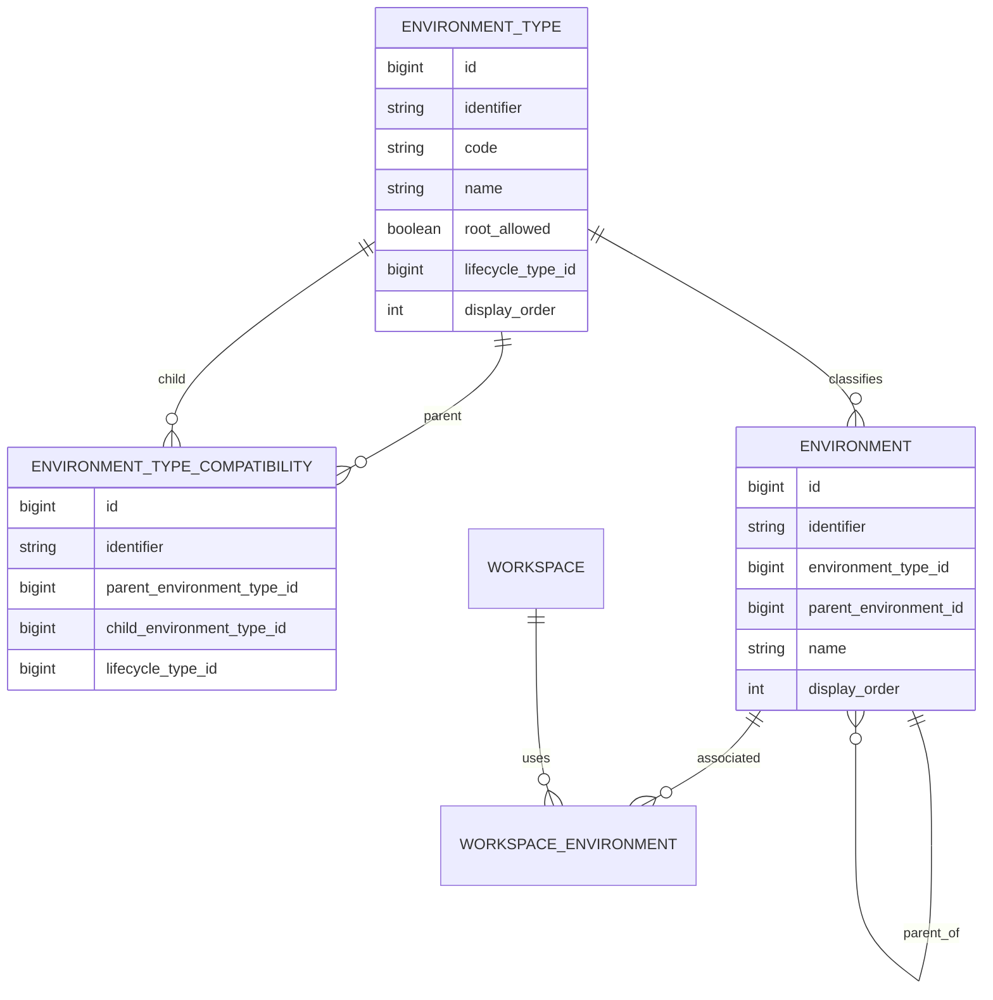

# Refinamento V2 — Environment Hierárquico, Environment Type e Topologia Dinâmica

> Baseline técnica: `BrunoBS/account-service`, branch `main`.

## 1. Objetivo

Evoluir `core/environment` para suportar uma topologia dinâmica de ambientes, preservando `Environment` como recurso único.

A feature não deve ser implementada especificamente para `SHARD` ou `CELL`. Esses nomes representam cenários de evolução da topologia. O mecanismo deve funcionar para qualquer `EnvironmentType` governado pela plataforma e suas compatibilidades cadastradas.

## 2. Baseline funcional

A baseline mínima da plataforma pode iniciar somente com:

```text
DEFAULT
CUSTOM
```

Ambos podem existir como ambientes raiz:

```text
DEFAULT  root_allowed = true
CUSTOM   root_allowed = true
```

Nesse estágio não existe hierarquia entre ambientes e a tabela de compatibilidade pode estar vazia.

Exemplo:

```text
DEV [DEFAULT]
HML [DEFAULT]
PRD [DEFAULT]
QA [CUSTOM]
```

## 3. Evolução dinâmica da topologia

Quando surgir uma necessidade de segmentação, a plataforma cadastra novos `EnvironmentType` e suas compatibilidades sem alterar o mecanismo da feature.

Exemplo com `SHARD`:

```text
+ SHARD root_allowed=false

DEFAULT → SHARD
CUSTOM  → SHARD
```

Posteriormente, com `CELL`:

```text
+ CELL root_allowed=false

SHARD → CELL
```

Resultado possível:

```text
DEV [DEFAULT]
└── SHARD-01 [SHARD]
    └── CELL-01 [CELL]

QA [CUSTOM]
└── SHARD-01 [SHARD]
```

`SHARD` pode continuar sendo folha quando não houver `CELL`.

## 4. Princípio arquitetural

A implementação Java não deve codificar a topologia concreta.

Evitar regras como:

```text
if type == SHARD
if type == CELL
DEFAULT sempre possui SHARD
SHARD sempre possui CELL
```

A validação deve trabalhar genericamente:

```text
EnvironmentType
        +
EnvironmentTypeCompatibility
        ↓
validação da topologia
```

Para ambiente raiz:

```text
parent == null
→ environmentType.rootAllowed?
```

Para ambiente filho:

```text
parentType + childType
→ existe compatibility ACTIVE(parentType, childType)?
```

Assim, novos tipos e novas relações não exigem alteração da estrutura de banco nem da regra genérica de validação.

## 5. EnvironmentType dentro da feature

A baseline atual possui `EnvironmentType` em `foundation/catalog/environmenttype`. Com a topologia dinâmica, o tipo passa a governar comportamento exclusivo do domínio Environment.

Direção proposta:

```text
core/environment
├── domain
│   ├── Environment
│   ├── EnvironmentType
│   └── EnvironmentTypeCompatibility
├── service
├── usecase
└── infra
```

Mover a responsabilidade Java não implica recriar automaticamente a tabela física existente. Código e banco devem evoluir separadamente.

## 6. Governança dos tipos

Os tipos são governados pela plataforma. O usuário da conta cria instâncias de `Environment`, não `EnvironmentType` arbitrários no fluxo normal.

Exemplos:

```text
QA / TESTE / PERFORMANCE → Environment(type=CUSTOM)
SHARD-01 / SHARD-02      → Environment(type=SHARD)
CELL-01 / CELL-02        → Environment(type=CELL)
```

`system_type` não é necessário porque todo `EnvironmentType` cadastrado pertence à governança da plataforma.

Novos tipos, como `SHARD`, `CELL` ou `REGION`, são evoluções administrativas da plataforma.

## 7. environment_type

Modelo mínimo proposto:

```sql
CREATE TABLE environment_type (
    id                  BIGINT PRIMARY KEY AUTO_INCREMENT,
    identifier          VARCHAR(36)  NOT NULL,
    code                VARCHAR(50)  NOT NULL,
    name                VARCHAR(100) NOT NULL,
    description         VARCHAR(255) NULL,
    root_allowed        BOOLEAN      NOT NULL DEFAULT FALSE,
    lifecycle_type_id   BIGINT       NOT NULL,
    display_order       INT          NOT NULL DEFAULT 0,
    created_at          TIMESTAMP    NOT NULL,
    updated_at          TIMESTAMP    NOT NULL,
    CONSTRAINT uk_environment_type_identifier UNIQUE (identifier),
    CONSTRAINT uk_environment_type_code UNIQUE (code)
);
```

Baseline mínima:

| code | root_allowed | lifecycle |
|---|---:|---|
| DEFAULT | true | ACTIVE |
| CUSTOM | true | ACTIVE |

Tipos adicionais são cadastrados conforme a necessidade da plataforma.

Foram removidos `parent_required`, `children_allowed` e `system_type`:

- `system_type` seria sempre verdadeiro;
- `children_allowed` é derivado da existência de compatibilidade ativa onde o tipo é pai;
- `parent_required` é redundante quando combinado com `root_allowed` e a regra de criação.

`root_allowed` permanece porque a compatibilidade N:N não responde se um tipo pode iniciar uma árvore sem pai.

## 8. environment_type_compatibility

A compatibilidade entre tipos é N:N:

```sql
CREATE TABLE environment_type_compatibility (
    id                          BIGINT PRIMARY KEY AUTO_INCREMENT,
    identifier                  VARCHAR(36) NOT NULL,
    parent_environment_type_id  BIGINT      NOT NULL,
    child_environment_type_id   BIGINT      NOT NULL,
    lifecycle_type_id           BIGINT      NOT NULL,
    created_at                  TIMESTAMP   NOT NULL,
    updated_at                  TIMESTAMP   NOT NULL,
    CONSTRAINT uk_environment_type_compat_identifier UNIQUE (identifier),
    CONSTRAINT uk_environment_type_parent_child UNIQUE (parent_environment_type_id, child_environment_type_id),
    CONSTRAINT fk_environment_type_compat_parent FOREIGN KEY (parent_environment_type_id) REFERENCES environment_type(id),
    CONSTRAINT fk_environment_type_compat_child FOREIGN KEY (child_environment_type_id) REFERENCES environment_type(id)
);
```

Com somente `DEFAULT` e `CUSTOM`, a tabela pode estar vazia:

```text
environment_type_compatibility
--------------------------------
<sem registros>
```

Ao adicionar `SHARD`:

| parent | child | lifecycle |
|---|---|---|
| DEFAULT | SHARD | ACTIVE |
| CUSTOM | SHARD | ACTIVE |

Ao adicionar `CELL`:

| parent | child | lifecycle |
|---|---|---|
| SHARD | CELL | ACTIVE |

A ausência de relação significa que a combinação não é permitida.

## 9. Exemplo de extensibilidade: REGION

Se a plataforma adicionar `REGION`:

| code | root_allowed |
|---|---:|
| REGION | false |

E decidir que `DEFAULT` e `CUSTOM` podem possuir `SHARD` ou `REGION`:

| parent | child |
|---|---|
| DEFAULT | SHARD |
| DEFAULT | REGION |
| CUSTOM | SHARD |
| CUSTOM | REGION |
| SHARD | CELL |

Resultado:

```text
DEFAULT ──┬──→ SHARD ──→ CELL
          └──→ REGION

CUSTOM  ──┬──→ SHARD ──→ CELL
          └──→ REGION
```

Se futuramente `REGION → SHARD` for permitido, basta cadastrar essa compatibilidade. Não há alteração de schema.

## 10. environment

`Environment` materializa a topologia efetiva de cada workspace.

Direção conceitual:

```sql
CREATE TABLE environment (
    id                    BIGINT PRIMARY KEY AUTO_INCREMENT,
    identifier            VARCHAR(36)  NOT NULL,
    workspace_identifier  VARCHAR(36)  NULL,
    environment_type_id   BIGINT       NOT NULL,
    parent_environment_id BIGINT       NULL,
    code                  VARCHAR(100) NULL,
    name                  VARCHAR(150) NOT NULL,
    description           VARCHAR(255) NULL,
    display_order         INT          NOT NULL DEFAULT 0,
    lifecycle_type_id     BIGINT       NOT NULL,
    created_at            TIMESTAMP    NOT NULL,
    updated_at            TIMESTAMP    NOT NULL,
    CONSTRAINT uk_environment_identifier UNIQUE (identifier),
    CONSTRAINT fk_environment_type FOREIGN KEY (environment_type_id) REFERENCES environment_type(id),
    CONSTRAINT fk_environment_parent FOREIGN KEY (parent_environment_id) REFERENCES environment(id)
);
```

Na implementação real, evoluir a tabela existente por migration incremental; não recriá-la.

Exemplo após a plataforma já possuir SHARD/CELL:

| name | type | parent | workspace |
|---|---|---|---|
| DEV | DEFAULT | null | plataforma |
| HML | DEFAULT | null | plataforma |
| PRD | DEFAULT | null | plataforma |
| QA INTERNO | CUSTOM | null | WS-001 |
| SHARD 01 | SHARD | DEV | WS-001 |
| SHARD 02 | SHARD | DEV | WS-001 |
| CELL 01 | CELL | SHARD 01 | WS-001 |

## 11. Workspace × Environment

Reutilizar/evoluir a associação existente na baseline. Antes da implementação, confrontar a estrutura física atual para escolher uma única fonte de verdade de ownership e evitar duplicação entre `environment.workspace_identifier` e a associação Workspace × Environment.

A ordem/fluxo de promoção entre ambientes não faz parte deste refinamento. Essa regra será definida posteriormente na configuração de ambientes e no refinamento do Promotion Engine.

## 12. Tabelas necessárias

```text
environment_type
environment_type_compatibility
environment
workspace_environment   // reutilizar/evoluir se realmente existir/for necessária na baseline
```

Não criar tabelas específicas como:

```text
shard
cell
region
environment_tree
environment_path
environment_leaf
environment_destination
```

A árvore concreta é representada por `environment.parent_environment_id`.

## 13. ER conceitual



## 14. Regra genérica de criação

### Ambiente raiz

```text
parent = null
```

O tipo precisa ter:

```text
root_allowed = true
```

### Ambiente filho

Resolver:

```text
parent.environmentType
requested.environmentType
```

E exigir:

```text
EnvironmentTypeCompatibility ACTIVE(parentType, childType)
```

Exemplo após SHARD/CELL terem sido cadastrados:

```text
DEV [DEFAULT] → SHARD-01 [SHARD]  ✓ existe DEFAULT→SHARD
DEV [DEFAULT] → CELL-01 [CELL]    ✗ não existe DEFAULT→CELL
```

Nenhum desses códigos deve ser necessário para executar a validação genérica.

## 15. Validações

### EnvironmentType / Compatibility

- identifier e code únicos;
- `(parent_type, child_type)` único;
- evitar self-compatibility sem decisão explícita;
- não remover/inativar compatibilidade em uso sem tratamento definido;
- não inativar tipo utilizado por ambientes ativos sem regra definida;
- impedir ciclos no grafo de tipos caso novas relações sejam administráveis;
- alterações de tipos/compatibilidades são administrativas da plataforma.

### Environment

- pai existe;
- self-parent proibido;
- pai pertence à topologia válida do workspace;
- sem pai exige `root_allowed=true`;
- com pai exige compatibilidade ativa;
- ciclos de ambientes proibidos;
- nó não pode ser movido para descendente;
- nome único entre irmãos;
- delete com filhos bloqueado inicialmente;
- preservar regras atuais de default/workspace.

## 16. Repository e consultas

Ampliar `EnvironmentRepository` com capacidades equivalentes a:

```text
findChildren(parentIdentifier)
hasChildren(identifier)
findRoots(workspaceIdentifier)
existsSiblingByName(...)
```

`EnvironmentQueryService` pode fornecer `findChildren`, `findRoots` e `findTree`.

Criar acesso próprio a `EnvironmentType` e `EnvironmentTypeCompatibility` dentro da feature.

Não introduzir cache antecipado. Otimizações de read model/SQL ficam para o refinamento específico de consultas do Golden.

## 17. API de Environment

Manter um único recurso. Os códigos abaixo são exemplos de dados, não branches de código.

CUSTOM raiz:

```json
{
  "name": "QA INTERNO",
  "environmentTypeCode": "CUSTOM",
  "parentIdentifier": null
}
```

Após SHARD existir:

```json
{
  "name": "SHARD 01",
  "environmentTypeCode": "SHARD",
  "parentIdentifier": "<DEV>"
}
```

Após CELL existir:

```json
{
  "name": "CELL 01",
  "environmentTypeCode": "CELL",
  "parentIdentifier": "<SHARD-01>"
}
```

Não criar endpoints específicos `/shards`, `/cells` ou `/regions`.

## 18. Administração de EnvironmentType

`EnvironmentType` pertence à feature, mas não é cadastro livre do usuário da conta.

Baseline mínima:

```text
DEFAULT
CUSTOM
```

Tipos e compatibilidades adicionais são administrados pela plataforma conforme necessidade.

Não é requisito desta fase expor CRUD público completo de tipos. Se houver futura API administrativa, ela deve respeitar lifecycle, ambientes existentes e integridade do grafo.

## 19. Nó folha

A folha é derivada da árvore concreta:

```text
leaf(environment) = !hasChildren(environment)
```

Ela não depende do nome do tipo.

Exemplo:

```text
PRD [DEFAULT]
├── SHARD A
│   ├── CELL 01
│   └── CELL 02
└── SHARD B
```

Folhas: `CELL 01`, `CELL 02` e `SHARD B`.

## 20. Configuração/publicação por folha — pendente

Não assumir que ambiente com filhos deixa automaticamente de ser configurável/publicável. Essa decisão impacta configuração existente, promoção, rollback e alteração de topologia.

A ordem/fluxo de promoção também fica fora deste refinamento e será definida na configuração do ambiente/Promotion Engine.

## 21. Destination Resolver

Componente posterior responsável por transformar destino solicitado + topologia em folhas efetivas.

Ele não deve conhecer códigos concretos como SHARD/CELL e não executa publicação.

## 22. Application e Publisher

Application × Environment precisa de refinamento posterior para decidir referência, cópia, subconjunto e propagação da árvore.

Publisher continua associado ao conceito `Environment`, nunca diretamente a entidades específicas como Shard, Cell ou Region.

## 23. Migration

Não alterar migrations já aplicadas.

A evolução deve ser incremental e preservar os dados existentes.

Baseline estrutural:

1. mover a responsabilidade Java de `EnvironmentType` para a feature;
2. preservar identifiers/códigos existentes;
3. adicionar `root_allowed` quando necessário;
4. criar `environment_type_compatibility`;
5. garantir `DEFAULT` e `CUSTOM` como baseline mínima;
6. adicionar `parent_environment_id` a Environment;
7. criar FKs e índices;
8. preservar referências existentes.

`SHARD`, `CELL`, `REGION` ou outros tipos **não são pré-requisitos da migration estrutural**. Eles podem ser cadastrados posteriormente pela governança da plataforma, acompanhados das compatibilidades desejadas.

## 24. GAP analysis

| Área | AS-IS | TO-BE | Ação |
|---|---|---|---|
| Environment | plano | árvore dinâmica | adicionar parent |
| EnvironmentType | Foundation/catalog | domínio Environment | mover responsabilidade |
| Baseline de tipos | DEFAULT/CUSTOM | DEFAULT/CUSTOM | preservar |
| Tipos adicionais | não suportados genericamente | dinâmicos | administrar pela plataforma |
| Root | implícito | root_allowed | persistir regra mínima |
| Compatibilidade | inexistente | N:N dinâmica | nova tabela |
| Validator | regras atuais | root + compatibility + árvore | ampliar genericamente |
| API type | catálogo | administração da plataforma | sem CRUD público obrigatório |
| Migration | baseline | incremental | preservar dados |
| Promoção | fora deste refinamento | configuração posterior | não implementar aqui |

## 25. Ondas

### E0 — Baseline

- inventariar implementação atual;
- mapear referências ao catálogo atual;
- mapear DEFAULT/CUSTOM existentes;
- ampliar regressão;
- validar upgrade Flyway.

### E1 — EnvironmentType dinâmico

- mover responsabilidade Java para Environment;
- manter modelo mínimo;
- adicionar `root_allowed`;
- criar compatibilidade N:N;
- preservar DEFAULT/CUSTOM;
- garantir validação sem códigos concretos;
- testes.

### E2 — Environment hierárquico

- adicionar parent;
- FKs/índices;
- validação genérica de root/compatibilidade;
- ciclos;
- CRUD;
- testes.

### E3 — Consultas hierárquicas

- roots;
- children;
- tree;
- sem cache antecipado.

### E4 — Semântica de folha

Após decisão funcional:

- configuração em agrupador;
- publicação em agrupador;
- transição folha ↔ agrupador;
- configurações existentes.

### E5 — Destination Resolver

- resolver folhas genericamente;
- sem publicação;
- sem conhecimento de SHARD/CELL.

### E6 — Promotion Engine

Refinamento separado para:

- ordem/fluxo entre ambientes;
- múltiplos destinos;
- seleção parcial, se aprovada;
- estado por destino;
- falha parcial;
- retry/idempotência;
- auditoria;
- rollback.

### E7 — Application/Publisher

- fechar integração com a árvore.

## 26. Decisões consolidadas

1. `DEFAULT` e `CUSTOM` formam a baseline mínima.
2. Ambos podem existir como raiz.
3. A tabela de compatibilidade pode estar vazia nessa baseline.
4. Novos tipos são cadastrados dinamicamente pela governança da plataforma.
5. `SHARD`, `CELL` e `REGION` são exemplos de tipos adicionais, não requisitos estruturais da feature.
6. A implementação não deve possuir hierarquia hardcoded por código de tipo.
7. Compatibilidade é N:N em tabela própria.
8. `root_allowed` é o único metadado hierárquico diretamente no tipo neste momento.
9. `parent_required`, `children_allowed` e `system_type` não são necessários.
10. A árvore real do workspace é materializada por `Environment.parent`.
11. A ausência de compatibilidade significa que a relação pai/filho não é permitida.
12. EnvironmentType passa para a responsabilidade da feature Environment.
13. Tipos/compatibilidades são governados pela plataforma, não pelo usuário da conta.
14. A ordem de promoção fica fora deste refinamento.
15. Migrations existentes permanecem imutáveis.

## 27. Pendências

- nó com filhos deixa de ser configurável?
- nó com filhos deixa de ser publicável?
- qual será o mecanismo administrativo para cadastrar novos EnvironmentTypes/compatibilidades?
- mover Environment na árvore será permitido?
- lifecycle do pai propaga para descendentes?
- como Application consome a árvore?
- como Publisher é resolvido?
- como Promotion Engine define ordem e caminhos de promoção?
- como promoção trata sucesso parcial?

Essas pendências não devem virar comportamento por suposição.
