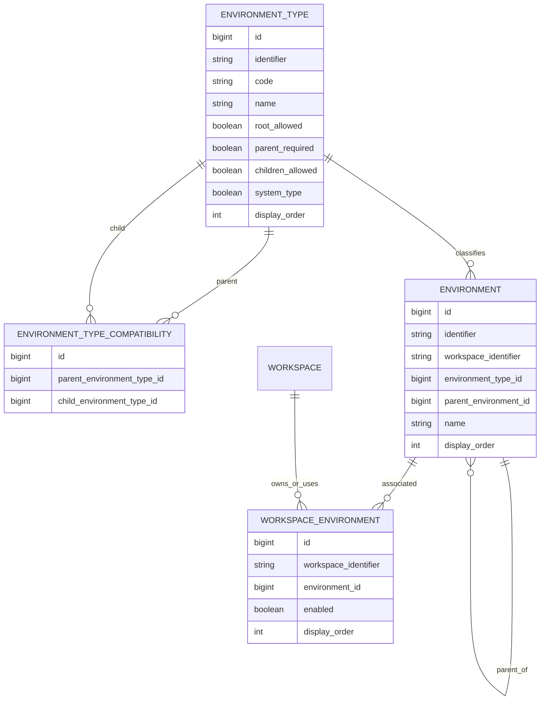

# Refinamento V2 — Environment Hierárquico, Environment Type e Topologia

> Baseline técnica analisada: `BrunoBS/account-service`, branch `main`.
>
> Esta V2 preserva a V1 como histórico e incorpora as decisões posteriores sobre `DEFAULT`, `CUSTOM`, `SHARD` e `CELL`, além da proposta de evolução de `EnvironmentType` de catálogo simples para domínio administrável da feature.

## 1. Objetivo

Evoluir a feature `core/environment` para suportar dois modelos simultaneamente:

1. contas que utilizam apenas ambientes raiz `DEFAULT` e `CUSTOM`, preservando a flexibilidade atual;
2. contas que segmentam esses ambientes por `SHARD` e, opcionalmente, `CELL`.

Não devem existir features ou fluxos paralelos para shard/cell. Tudo continua sendo `Environment`.

## 2. Decisão de tipos

Tipos iniciais:

```text
DEFAULT
CUSTOM
SHARD
CELL
```

`DEFAULT` e `CUSTOM` representam ambientes raiz.

`SHARD` representa subdivisão de um ambiente raiz.

`CELL` representa subdivisão de um `SHARD`.

Compatibilidade inicial:

```text
DEFAULT → SHARD
CUSTOM  → SHARD
SHARD   → CELL
```

`DEFAULT` e `CUSTOM` não são filhos na topologia inicial.

Exemplos:

```text
DEV [DEFAULT]
└── SHARD-01 [SHARD]
    ├── CELL-01 [CELL]
    └── CELL-02 [CELL]
```

```text
QA-INTERNO [CUSTOM]
└── SHARD-01 [SHARD]
    └── CELL-01 [CELL]
```

Uma conta que não utiliza segmentação continua podendo possuir somente:

```text
DEV [DEFAULT]
HML [DEFAULT]
PRD [DEFAULT]
QA [CUSTOM]
```

A própria árvore descreve a capacidade da conta. Não criar atributo do tipo `workspaceUsesShard`.

## 3. AS-IS

A baseline possui `Environment`, repository, Command/Query Service, Finder, Normalizer, `EnvironmentValidator`, controllers default/workspace, `EnvironmentType` no Foundation/catalog e migration de ambientes.

A estrutura atual é essencialmente plana e `EnvironmentType` é tratado como catálogo.

## 4. TO-BE

```text
Workspace
├── DEV [DEFAULT]
│   └── SHARD-01 [SHARD]
│       └── CELL-01 [CELL]
├── HML [DEFAULT]
├── PRD [DEFAULT]
│   ├── SHARD-01 [SHARD]
│   └── SHARD-02 [SHARD]
└── QA [CUSTOM]
    └── SHARD-01 [SHARD]
```

`Environment` continua sendo o recurso único.

## 5. EnvironmentType: catálogo ou feature?

### 5.1 Análise

Com a topologia, `EnvironmentType` deixa de representar somente uma lista estática de códigos. Ele passa a possuir comportamento e metadados que governam a árvore, por exemplo:

- se o tipo pode ser raiz;
- se exige pai;
- se pode possuir filhos;
- ordem/apresentação;
- lifecycle;
- compatibilidade entre tipos;
- possibilidade futura de novos tipos.

Isso ultrapassa a responsabilidade de um catálogo simples.

### 5.2 Direção proposta

Mover `EnvironmentType` de `foundation/catalog/environmenttype` para dentro da feature `core/environment`.

Estrutura conceitual:

```text
core/environment
├── domain
│   ├── Environment
│   └── EnvironmentType
├── service
├── usecase
└── infra
```

`EnvironmentType` passa a ser um recurso administrado pela própria feature.

### 5.3 CRUD controlado

Apesar de possuir CRUD, tipos estruturais da plataforma não devem poder ser removidos ou alterados livremente.

Tipos iniciais protegidos:

```text
DEFAULT
CUSTOM
SHARD
CELL
```

O CRUD deve distinguir tipos de sistema de tipos extensíveis, se futuramente permitirmos criação de novos tipos.

Portanto, "virar CRUD" não significa permitir apagar `DEFAULT` ou alterar arbitrariamente `SHARD`.

## 6. Não colocar parentType diretamente em EnvironmentType

Uma relação única `parentType` seria limitada porque um tipo pode aceitar mais de um tipo pai.

Exemplo:

```text
SHARD pode ser filho de DEFAULT e CUSTOM
```

Logo, se a compatibilidade for persistida, é melhor modelá-la em tabela própria.

## 7. Modelo de tabelas proposto

Os nomes físicos abaixo são exemplos. A implementação deve adaptar ao padrão real de nomenclatura do `account-service` e às migrations existentes.

### 7.1 `environment_type`

```sql
CREATE TABLE environment_type (
    id                  BIGINT PRIMARY KEY AUTO_INCREMENT,
    identifier          VARCHAR(36)  NOT NULL,
    code                VARCHAR(50)  NOT NULL,
    name                VARCHAR(100) NOT NULL,
    description         VARCHAR(255) NULL,
    root_allowed        BOOLEAN      NOT NULL DEFAULT FALSE,
    parent_required     BOOLEAN      NOT NULL DEFAULT TRUE,
    children_allowed    BOOLEAN      NOT NULL DEFAULT FALSE,
    system_type         BOOLEAN      NOT NULL DEFAULT FALSE,
    display_order       INT          NOT NULL DEFAULT 0,
    lifecycle_type_id   BIGINT       NOT NULL,
    created_at          TIMESTAMP    NOT NULL,
    updated_at          TIMESTAMP    NOT NULL,

    CONSTRAINT uk_environment_type_identifier UNIQUE (identifier),
    CONSTRAINT uk_environment_type_code UNIQUE (code)
);
```

Exemplo de dados:

| code | root_allowed | parent_required | children_allowed | system_type |
|---|---:|---:|---:|---:|
| DEFAULT | true | false | true | true |
| CUSTOM | true | false | true | true |
| SHARD | false | true | true | true |
| CELL | false | true | false | true |

`children_allowed` informa capacidade geral. Quais tipos de filho são válidos é responsabilidade da compatibilidade.

### 7.2 `environment_type_compatibility`

Tabela que representa as arestas válidas entre tipos.

```sql
CREATE TABLE environment_type_compatibility (
    id                       BIGINT PRIMARY KEY AUTO_INCREMENT,
    identifier               VARCHAR(36) NOT NULL,
    parent_environment_type_id BIGINT NOT NULL,
    child_environment_type_id  BIGINT NOT NULL,
    lifecycle_type_id        BIGINT NOT NULL,
    created_at               TIMESTAMP NOT NULL,
    updated_at               TIMESTAMP NOT NULL,

    CONSTRAINT uk_environment_type_compatibility_identifier
        UNIQUE (identifier),

    CONSTRAINT uk_environment_type_parent_child
        UNIQUE (parent_environment_type_id, child_environment_type_id),

    CONSTRAINT fk_environment_type_compat_parent
        FOREIGN KEY (parent_environment_type_id)
        REFERENCES environment_type(id),

    CONSTRAINT fk_environment_type_compat_child
        FOREIGN KEY (child_environment_type_id)
        REFERENCES environment_type(id)
);
```

Carga inicial:

| parent | child |
|---|---|
| DEFAULT | SHARD |
| CUSTOM | SHARD |
| SHARD | CELL |

Vantagem: se futuramente `REGION → SHARD` ou `CUSTOM → REGION` for necessário, a estrutura não precisa mudar.

### 7.3 `environment`

Exemplo conceitual da evolução da tabela atual:

```sql
CREATE TABLE environment (
    id                    BIGINT PRIMARY KEY AUTO_INCREMENT,
    identifier            VARCHAR(36)  NOT NULL,
    workspace_identifier  VARCHAR(36)  NULL,
    environment_type_id   BIGINT       NOT NULL,
    parent_environment_id BIGINT       NULL,
    code                  VARCHAR(100) NULL,
    name                  VARCHAR(150) NOT NULL,
    description           VARCHAR(255) NULL,
    display_order         INT          NOT NULL DEFAULT 0,
    lifecycle_type_id     BIGINT       NOT NULL,
    created_at            TIMESTAMP    NOT NULL,
    updated_at            TIMESTAMP    NOT NULL,

    CONSTRAINT uk_environment_identifier UNIQUE (identifier),

    CONSTRAINT fk_environment_type
        FOREIGN KEY (environment_type_id)
        REFERENCES environment_type(id),

    CONSTRAINT fk_environment_parent
        FOREIGN KEY (parent_environment_id)
        REFERENCES environment(id)
);
```

Na implementação real, não recriar a tabela existente: criar migration incremental adicionando apenas as colunas/FKs necessárias.

Exemplo de registros:

| id | name | type | parent | workspace |
|---:|---|---|---|---|
| 1 | DEV | DEFAULT | null | null/plataforma |
| 2 | HML | DEFAULT | null | null/plataforma |
| 3 | PRD | DEFAULT | null | null/plataforma |
| 10 | QA INTERNO | CUSTOM | null | WS-001 |
| 20 | SHARD 01 | SHARD | DEV | WS-001 |
| 21 | SHARD 02 | SHARD | DEV | WS-001 |
| 30 | CELL 01 | CELL | SHARD 01 | WS-001 |

### 7.4 Associação Workspace × Environment

Se a baseline já possui associação equivalente, ela deve ser evoluída/reutilizada, não duplicada.

Exemplo conceitual:

```sql
CREATE TABLE workspace_environment (
    id                     BIGINT PRIMARY KEY AUTO_INCREMENT,
    identifier             VARCHAR(36) NOT NULL,
    workspace_identifier   VARCHAR(36) NOT NULL,
    environment_id         BIGINT      NOT NULL,
    enabled                BOOLEAN     NOT NULL DEFAULT TRUE,
    display_order          INT         NOT NULL DEFAULT 0,
    created_at             TIMESTAMP   NOT NULL,
    updated_at             TIMESTAMP   NOT NULL,

    CONSTRAINT uk_workspace_environment_identifier UNIQUE (identifier),
    CONSTRAINT uk_workspace_environment UNIQUE (workspace_identifier, environment_id),
    CONSTRAINT fk_workspace_environment_environment
        FOREIGN KEY (environment_id) REFERENCES environment(id)
);
```

Esta associação é especialmente útil para ambientes `DEFAULT` compartilhados/disponibilizados pela plataforma.

Para ambientes `CUSTOM`, `SHARD` e `CELL`, a implementação deve evitar duplicar ownership entre `environment.workspace_identifier` e a tabela de associação sem necessidade. Durante E1 deve-se confrontar a estrutura física atual e escolher uma fonte de verdade para ownership.

## 8. Tabelas realmente necessárias

Para o primeiro desenho, são suficientes:

```text
environment_type
environment_type_compatibility
environment
workspace_environment   // reutilizar se já existir na baseline
```

Não criar inicialmente:

```text
environment_tree
environment_path
environment_leaf
environment_destination
shard
cell
```

A relação pai/filho em `environment` é suficiente. Folha é derivada por ausência de filhos.

## 9. Diagrama ER



## 10. Regras derivadas dos metadados

Exemplos:

```text
DEFAULT.rootAllowed = true
DEFAULT.parentRequired = false

CUSTOM.rootAllowed = true
CUSTOM.parentRequired = false

SHARD.rootAllowed = false
SHARD.parentRequired = true

CELL.rootAllowed = false
CELL.parentRequired = true
CELL.childrenAllowed = false
```

A compatibilidade é consultada separadamente:

```text
(DEFAULT, SHARD) = permitido
(CUSTOM, SHARD)  = permitido
(SHARD, CELL)    = permitido
(DEFAULT, CELL)  = não permitido inicialmente
(CUSTOM, CELL)   = não permitido inicialmente
```

## 11. CRUD de EnvironmentType

Direção de API conceitual:

```text
POST   /environment-types
GET    /environment-types
GET    /environment-types/{identifier}
PUT    /environment-types/{identifier}
PATCH  /environment-types/{identifier}/activate
PATCH  /environment-types/{identifier}/inactivate
DELETE /environment-types/{identifier}
```

Entretanto, tipos `system_type=true` possuem proteção:

- não podem ser fisicamente removidos;
- `code` estrutural não pode ser alterado arbitrariamente;
- mudanças que invalidem ambientes existentes devem ser rejeitadas;
- compatibilidades estruturais precisam validar uso existente.

A existência do CRUD serve para centralizar a administração da feature e permitir evolução, não para tornar os tipos básicos livres.

## 12. CRUD de compatibilidade

Há duas opções de contrato:

1. sub-recurso de `EnvironmentType`;
2. operações internas administradas junto com o tipo.

Preferência inicial:

```text
/environment-types/{identifier}/children-types
```

Exemplos conceituais:

```text
GET  /environment-types/{identifier}/children-types
POST /environment-types/{identifier}/children-types/{childTypeIdentifier}
DELETE /environment-types/{identifier}/children-types/{childTypeIdentifier}
```

Essas operações devem ser administrativas e protegidas.

## 13. Validações de EnvironmentType

- code único;
- identifier único;
- tipo de sistema protegido;
- `parent_required=true` incompatível com uso como raiz;
- não remover compatibilidade usada por ambientes existentes sem tratamento explícito;
- não inativar tipo enquanto existirem ambientes ativos dependentes, salvo regra específica futura;
- não permitir compatibilidade de tipo consigo mesmo sem decisão explícita;
- evitar ciclos de tipos se no futuro a profundidade se tornar genérica.

## 14. Validações de Environment

Evoluir `EnvironmentValidator`:

- pai existe;
- self-parent proibido;
- pai pertence à topologia válida do workspace;
- tipo raiz respeita `root_allowed`;
- tipo que exige pai respeita `parent_required`;
- compatibilidade pai/filho existe;
- ciclos de ambientes proibidos;
- nó não pode ser movido para descendente;
- nome único entre irmãos;
- delete com filhos bloqueado inicialmente;
- regras atuais de default/workspace preservadas.

## 15. Repository

Ampliar `EnvironmentRepository`:

```text
findChildren(parentIdentifier)
hasChildren(identifier)
findRoots(workspaceIdentifier)
existsSiblingByName(...)
```

Criar repository próprio para `EnvironmentType` dentro da feature e, se persistirmos compatibilidade, repository/porta apropriada para ela.

Não introduzir cache antecipado.

## 16. API de Environment

Continuar com um recurso único:

```json
{
  "name": "SHARD 01",
  "environmentTypeCode": "SHARD",
  "parentIdentifier": "<DEV>"
}
```

CUSTOM raiz:

```json
{
  "name": "QA INTERNO",
  "environmentTypeCode": "CUSTOM",
  "parentIdentifier": null
}
```

CELL:

```json
{
  "name": "CELL 01",
  "environmentTypeCode": "CELL",
  "parentIdentifier": "<SHARD-01>"
}
```

Não criar endpoints `/shards` ou `/cells`.

## 17. Nó folha

```text
leaf(environment) = !hasChildren(environment)
```

Exemplo:

```text
PRD [DEFAULT]
├── SHARD A
│   ├── CELL 01
│   └── CELL 02
└── SHARD B
```

Folhas:

```text
CELL 01
CELL 02
SHARD B
```

`SHARD` não é obrigado a possuir `CELL`; pode ser folha.

## 18. Configuração/publicação por folha — pendente

Ainda não fechar como regra automática que um ambiente com filhos deixa de ser configurável/publicável. Essa decisão impacta configurações existentes, promoção, rollback e alteração de topologia.

A estrutura de dados deve suportar a regra, mas E1/E2 não devem implementá-la por suposição.

## 19. Destination Resolver

Componente posterior:

```text
destino solicitado
+
topologia
↓
Destination Resolver
↓
folhas efetivas
```

Não conhece tipo de conta e não publica.

## 20. Application e Publisher

Application × Environment precisa de refinamento posterior para decidir referência, cópia, subconjunto e propagação da árvore.

Publisher deve continuar associado ao conceito `Environment`, nunca diretamente a `Shard`/`Cell` como entidades separadas.

## 21. Migration

Não alterar migrations já aplicadas.

Criar migrations incrementais para:

1. evoluir/migrar `EnvironmentType` do Foundation/catalog para a feature;
2. preservar os identifiers/códigos existentes;
3. inserir `DEFAULT`, `CUSTOM`, `SHARD`, `CELL` de forma idempotente conforme padrão do projeto;
4. criar `environment_type_compatibility`;
5. adicionar parent em `environment`;
6. criar FKs/índices;
7. preservar dados atuais e referências existentes.

A migração de package Java e a migração de banco são problemas distintos: mover a classe para `core/environment` não exige necessariamente recriar a tabela física se a tabela atual puder ser evoluída com segurança.

## 22. GAP analysis V2

| Área | AS-IS | TO-BE | Ação |
|---|---|---|---|
| Environment | plano | árvore | adicionar parent |
| EnvironmentType | Foundation/catalog | domínio da feature | mover responsabilidade |
| Tipos | DEFAULT/CUSTOM atuais | DEFAULT/CUSTOM/SHARD/CELL | preservar + ampliar |
| Compatibilidade | implícita/inexistente | N:N entre tipos | tabela de compatibilidade |
| Metadata type | catálogo simples | root/parent/children/system | ampliar modelo |
| Repository | CRUD atual | árvore | ampliar |
| Validator | centralizado | metadados + árvore | ampliar |
| API type | catálogo | CRUD protegido | criar na feature |
| Migration | baseline | incremental | preservar dados |
| Publicação | sem topologia | resolver folhas futuramente | onda posterior |

## 23. Ondas revisadas

### E0 — Baseline

- inventário final da implementação atual;
- testes de regressão;
- mapear referências ao `foundation/catalog/environmenttype`;
- mapear dados existentes de DEFAULT/CUSTOM.

### E1 — EnvironmentType na feature

- mover responsabilidade Java para `core/environment`;
- evoluir metadados;
- preservar tabela/dados quando possível;
- criar compatibilidade de tipos;
- seed DEFAULT/CUSTOM/SHARD/CELL;
- testes.

### E2 — Environment hierárquico

- parent;
- FK/índices;
- validações;
- CRUD;
- DEFAULT/CUSTOM raiz;
- SHARD filho de DEFAULT/CUSTOM;
- CELL filho de SHARD.

### E3 — Consultas de árvore

- roots;
- children;
- tree;
- sem cache antecipado.

### E4 — Semântica de folha

Após decisão funcional:

- configuração em agrupador;
- publicação em agrupador;
- transição folha ↔ agrupador;
- configuração existente.

### E5 — Destination Resolver

- resolução das folhas;
- sem publicação;
- sem regra por tipo de conta.

### E6 — Promoção/publicação

- múltiplos destinos;
- seleção parcial se aprovada;
- status individual;
- falha parcial;
- retry/idempotência;
- auditoria;
- rollback.

### E7 — Application/Publisher

- fechar integração com a árvore.

## 24. Decisões consolidadas

1. `DEFAULT`, `CUSTOM`, `SHARD` e `CELL` coexistem no modelo.
2. `DEFAULT` e `CUSTOM` são raízes no modelo inicial.
3. `DEFAULT → SHARD` é permitido.
4. `CUSTOM → SHARD` é permitido.
5. `SHARD → CELL` é permitido.
6. `SHARD` pode ser folha; `CELL` não é obrigatória.
7. Shard/Cell continuam sendo `Environment`.
8. Não existe flag de conta para dizer que ela usa shard.
9. A topologia configurada descreve a capacidade da conta.
10. `EnvironmentType` passa a ter responsabilidade suficiente para ser tratado dentro da feature, não apenas como catálogo Foundation.
11. Compatibilidade entre tipos, se persistida, deve ser N:N em tabela própria e não `parentType` único.
12. Migrations existentes não serão alteradas.

## 25. Pendências

- nó com filhos deixa de ser configurável?
- nó com filhos deixa de ser publicável?
- tipos customizados além dos quatro de sistema serão permitidos?
- CRUD de EnvironmentType será inicialmente somente administrativo para metadados/compatibilidade ou permitirá novos tipos?
- mover Environment na árvore será permitido?
- lifecycle de pai propaga para descendentes?
- como Application consome a árvore?
- como Publisher é resolvido?
- como promoção trata sucesso parcial?

## 26. Resultado esperado

Conta sem segmentação:

```text
DEV [DEFAULT]
HML [DEFAULT]
PRD [DEFAULT]
QA [CUSTOM]
```

Conta segmentada:

```text
DEV [DEFAULT]
└── SHARD-01

PRD [DEFAULT]
├── SHARD-01
│   ├── CELL-01
│   └── CELL-02
└── SHARD-02

QA [CUSTOM]
└── SHARD-01
```

O mesmo domínio e o mesmo fluxo atendem os dois modelos. A topologia é dado/configuração da feature `Environment`, não uma condição codificada por tipo de conta.
