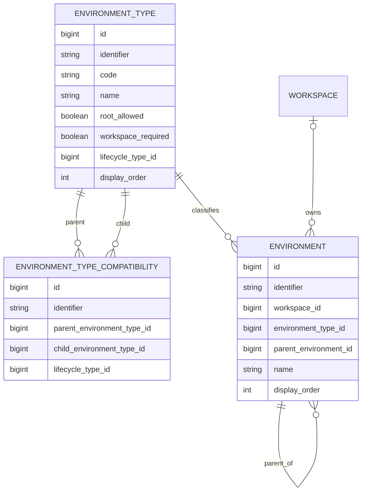

# Refinamento V2 — Environment Hierárquico, Environment Type e Topologia Dinâmica

> Baseline técnica: `BrunoBS/account-service`, branch `main`.

## 1. Objetivo

Evoluir `core/environment` para suportar uma topologia dinâmica de ambientes, preservando `Environment` como recurso único.

A feature não deve ser implementada especificamente para `SHARD` ou `CELL`. Esses nomes representam cenários de evolução da topologia. O mecanismo deve funcionar para qualquer `EnvironmentType` governado pela plataforma e suas compatibilidades cadastradas.

## 2. Baseline funcional

A baseline desta fase inclui quatro `EnvironmentType`:

| type code | workspace_required | root_allowed | papel inicial |
|---|---:|---:|---|
| DEFAULT | false | true | raiz global, como DEV/HML/PRD |
| CUSTOM | true | true | raiz de workspace |
| SHARD | true | false | filho de workspace conforme compatibilidade |
| CELL | true | false | filho de workspace conforme compatibilidade |

O campo `workspace_required` é cadastrado no `EnvironmentType` e governa o vínculo de suas instâncias: `false` exige `environment.workspace_id = NULL`; `true` exige um workspace. Assim, somente ambientes do tipo `DEFAULT` são globais nesta baseline. Os quatro tipos continuam cadastrados pela plataforma; o campo descreve as instâncias de `Environment`, não a propriedade do registro de tipo.

```text
DEV [DEFAULT, global]
└── SHARD-01 [SHARD, WS-001]
    └── CELL-01 [CELL, WS-001]

QA [CUSTOM, WS-001]
└── SHARD-02 [SHARD, WS-001]
```

A baseline de compatibilidades para a topologia acima inclui `DEFAULT → SHARD`, `CUSTOM → SHARD` e `SHARD → CELL`. As relações permanecem dados administráveis, sem condicional de Java específica para esses códigos.

## 3. Evolução dinâmica da topologia

A baseline já cadastra `SHARD` e `CELL`, com as compatibilidades necessárias para a topologia inicial:

```text
DEFAULT → SHARD
CUSTOM  → SHARD
SHARD   → CELL
```

Quando surgir outra necessidade de segmentação, a plataforma poderá cadastrar novos `EnvironmentType` e suas compatibilidades sem alterar o mecanismo da feature.

Resultado possível:

```text
DEV [DEFAULT]
└── SHARD-01 [SHARD]
    └── CELL-01 [CELL]

QA [CUSTOM]
└── SHARD-01 [SHARD]
```

`SHARD` pode continuar sendo folha quando não houver `CELL`.

## 4. Princípio arquitetural

A implementação Java não deve codificar a topologia concreta.

Evitar regras como:

```text
if type == SHARD
if type == CELL
DEFAULT sempre possui SHARD
SHARD sempre possui CELL
```

A validação deve trabalhar genericamente:

```text
EnvironmentType
        +
EnvironmentTypeCompatibility
        ↓
validação da topologia
```

Para ambiente raiz:

```text
parent == null
→ environmentType.rootAllowed?
```

Para ambiente filho:

```text
parentType + childType
→ existe compatibility ACTIVE(parentType, childType)?
```

Assim, novos tipos e novas relações não exigem alteração da estrutura de banco nem da regra genérica de validação.

## 5. EnvironmentType dentro da feature

A baseline atual possui `EnvironmentType` em `foundation/catalog/environmenttype`. Com a topologia dinâmica, o tipo passa a governar comportamento exclusivo do domínio Environment. Sua gestão passa a ser um CRUD administrativo da plataforma dentro de `core/environment`, sem depender do catálogo da Foundation.

Direção proposta:

```text
core/environment
├── domain
│   ├── Environment
│   ├── EnvironmentType
│   └── EnvironmentTypeCompatibility
├── repository
└── usecase
    ├── model
    ├── validation
    └── operations
        ├── environment
        │   ├── EnvironmentCommandService
        │   └── EnvironmentQueryService
        ├── environmenttype
        │   ├── EnvironmentTypeCommandService
        │   └── EnvironmentTypeQueryService
        └── compatibility
            ├── EnvironmentTypeCompatibilityCommandService
            └── EnvironmentTypeCompatibilityQueryService
```

Separar comandos (criação, atualização, ativação/inativação, exclusão) de consultas para cada recurso; auxiliares podem acompanhar o recurso responsável. Os controladores ficam no entrypoint e dependem dos serviços do use case.

Campos persistidos que representam catálogos usam os VOs definidos no projeto. Isso inclui `lifecycle_code` em `Environment`, `EnvironmentType` e `EnvironmentTypeCompatibility`: a entidade armazena `LifecycleTypeCode` como `@Embedded`, e a consulta interna recebe o VO. A API pode expor o código como string em seu DTO, na fronteira de serialização.

A estrutura física pode ser redefinida nesta fase de refinamento, pois ainda não há ambiente produtivo a migrar. Código, tabela e referências devem formar uma baseline coerente para instalação limpa.

## 6. Governança dos tipos

Os tipos são governados pela plataforma. O usuário da conta cria instâncias de `Environment`, não `EnvironmentType` arbitrários no fluxo normal.

Exemplos:

```text
QA / TESTE / PERFORMANCE → Environment(type=CUSTOM)
SHARD-01 / SHARD-02      → Environment(type=SHARD)
CELL-01 / CELL-02        → Environment(type=CELL)
```

`system_type` não é necessário porque todo `EnvironmentType` cadastrado pertence à governança da plataforma.

Os quatro tipos iniciais são `DEFAULT`, `CUSTOM`, `SHARD` e `CELL`. Outros tipos, como `REGION`, podem ser cadastrados futuramente pela plataforma.

## 7. environment_type

Modelo mínimo proposto:

```sql
CREATE TABLE environment_type (
    id                  BIGINT PRIMARY KEY AUTO_INCREMENT,
    identifier          VARCHAR(36)  NOT NULL,
    code                VARCHAR(50)  NOT NULL,
    name                VARCHAR(100) NOT NULL,
    description         VARCHAR(255) NULL,
    root_allowed        BOOLEAN      NOT NULL DEFAULT FALSE,
    workspace_required  BOOLEAN      NOT NULL,
    lifecycle_type_id   BIGINT       NOT NULL,
    display_order       INT          NOT NULL DEFAULT 0,
    created_at          TIMESTAMP    NOT NULL,
    updated_at          TIMESTAMP    NOT NULL,
    CONSTRAINT uk_environment_type_identifier UNIQUE (identifier),
    CONSTRAINT uk_environment_type_code UNIQUE (code)
);
```

`code` identifica unicamente o tipo e pode servir posteriormente como identificador para resolução de JSON Schema específico por tipo. Esta possibilidade não cria, nesta fase, obrigação de schema nem regra de validação por schema.

Baseline desta fase:

| code | root_allowed | workspace_required | lifecycle |
|---|---:|---:|---|
| DEFAULT | true | false | ACTIVE |
| CUSTOM | true | true | ACTIVE |
| SHARD | false | true | ACTIVE |
| CELL | false | true | ACTIVE |

`workspace_required = false` significa instância global e exige `workspace_id = NULL`; `true` significa instância específica e exige `workspace_id` preenchido. O domínio Environment valida isso ao criar, atualizar ou trocar o tipo. Alterar esse campo no CRUD administrativo requer checar instâncias existentes para não deixá-las inconsistentes. Tipos adicionais podem ser cadastrados conforme a necessidade.

Foram removidos `parent_required`, `children_allowed` e `system_type`:

- `system_type` seria sempre verdadeiro;
- `children_allowed` é derivado da existência de compatibilidade ativa onde o tipo é pai;
- `parent_required` é redundante quando combinado com `root_allowed` e a regra de criação.

`root_allowed` permanece porque a compatibilidade N:N não responde se um tipo pode iniciar uma árvore sem pai. `workspace_required` expressa o escopo das instâncias de forma declarativa, sem condicional de código para cada tipo.

## 8. environment_type_compatibility

A compatibilidade entre tipos é N:N:

```sql
CREATE TABLE environment_type_compatibility (
    id                          BIGINT PRIMARY KEY AUTO_INCREMENT,
    identifier                  VARCHAR(36) NOT NULL,
    parent_environment_type_id  BIGINT      NOT NULL,
    child_environment_type_id   BIGINT      NOT NULL,
    lifecycle_type_id           BIGINT      NOT NULL,
    created_at                  TIMESTAMP   NOT NULL,
    updated_at                  TIMESTAMP   NOT NULL,
    CONSTRAINT uk_environment_type_compat_identifier UNIQUE (identifier),
    CONSTRAINT uk_environment_type_parent_child UNIQUE (parent_environment_type_id, child_environment_type_id),
    CONSTRAINT fk_environment_type_compat_parent FOREIGN KEY (parent_environment_type_id) REFERENCES environment_type(id),
    CONSTRAINT fk_environment_type_compat_child FOREIGN KEY (child_environment_type_id) REFERENCES environment_type(id)
);
```

A baseline desta fase contém as relações necessárias para `SHARD` e `CELL`:

| parent | child | lifecycle |
|---|---|---|
| DEFAULT | SHARD | ACTIVE |
| CUSTOM | SHARD | ACTIVE |
| SHARD | CELL | ACTIVE |

A ausência de relação significa que a combinação não é permitida.

## 9. Exemplo de extensibilidade: REGION

Se a plataforma adicionar `REGION`:

| code | root_allowed |
|---|---:|
| REGION | false |

E decidir que `DEFAULT` e `CUSTOM` podem possuir `SHARD` ou `REGION`:

| parent | child |
|---|---|
| DEFAULT | SHARD |
| DEFAULT | REGION |
| CUSTOM | SHARD |
| CUSTOM | REGION |
| SHARD | CELL |

Resultado:

```text
DEFAULT ──┬──→ SHARD ──→ CELL
          └──→ REGION

CUSTOM  ──┬──→ SHARD ──→ CELL
          └──→ REGION
```

Se futuramente `REGION → SHARD` for permitido, basta cadastrar essa compatibilidade. Não há alteração de schema.

## 10. environment

`Environment` materializa a topologia efetiva. A associação atual ao workspace é pelo `workspace_id` do próprio ambiente, cuja nulidade deve corresponder a `environmentType.workspaceRequired`. Na baseline, isso resulta em `NULL` para `DEFAULT` e valor preenchido para `CUSTOM`, `SHARD` e `CELL`. O identificador público do workspace não substitui essa FK na estrutura física.

Direção conceitual:

```sql
CREATE TABLE environment (
    id                    BIGINT PRIMARY KEY AUTO_INCREMENT,
    identifier            VARCHAR(36)  NOT NULL,
    workspace_id          BIGINT       NULL,
    environment_type_id   BIGINT       NOT NULL,
    parent_environment_id BIGINT       NULL,
    code                  VARCHAR(100) NULL,
    name                  VARCHAR(150) NOT NULL,
    description           VARCHAR(255) NULL,
    display_order         INT          NOT NULL DEFAULT 0,
    lifecycle_type_id     BIGINT       NOT NULL,
    created_at            TIMESTAMP    NOT NULL,
    updated_at            TIMESTAMP    NOT NULL,
    CONSTRAINT uk_environment_identifier UNIQUE (identifier),
    CONSTRAINT fk_environment_workspace FOREIGN KEY (workspace_id) REFERENCES workspace(id),
    CONSTRAINT fk_environment_type FOREIGN KEY (environment_type_id) REFERENCES environment_type(id),
    CONSTRAINT fk_environment_parent FOREIGN KEY (parent_environment_id) REFERENCES environment(id)
);
```

Os nomes físicos devem ser conciliados com as convenções efetivas do projeto ao implementar a baseline; o modelo acima expressa as relações e não exige migração incremental de dados.

Exemplo da baseline com os quatro tipos:

| name | type | parent | workspace |
|---|---|---|---|
| DEV | DEFAULT | null | plataforma |
| HML | DEFAULT | null | plataforma |
| PRD | DEFAULT | null | plataforma |
| QA INTERNO | CUSTOM | null | WS-001 |
| SHARD 01 | SHARD | DEV | WS-001 |
| SHARD 02 | SHARD | DEV | WS-001 |
| CELL 01 | CELL | SHARD 01 | WS-001 |

## 11. Workspace × Environment

Nesta fase, `environment.workspace_id` é a única associação persistida para ownership do ambiente. `workspace_id = NULL` identifica um ambiente de tipo com `workspace_required = false`; um tipo com `workspace_required = true` exige `workspace_id` preenchido. Na baseline, isso equivale a `DEFAULT` global e `CUSTOM`, `SHARD`, `CELL` por workspace. Um ambiente específico pode descender de uma raiz global `DEFAULT` quando a compatibilidade entre os tipos permitir. Ao criar ou mover filhos, validar que qualquer pai específico pertence ao mesmo workspace do filho. A navegação de uma árvore compartilhada deve retornar somente os filhos do workspace em questão.

A tabela `workspace_environment` pertence a um refinamento posterior de configuração da conta no ambiente. Não criá-la nem presumir sua existência nesta implementação.

A ordem/fluxo de promoção entre ambientes não faz parte deste refinamento. Essa regra será definida posteriormente na configuração de ambientes e no refinamento do Promotion Engine.

## 12. Tabelas necessárias nesta fase

```text
environment_type
environment_type_compatibility
environment
```

`workspace_environment` fica para a fase posterior de configuração da conta no ambiente.

Não criar tabelas específicas como:

```text
shard
cell
region
environment_tree
environment_path
environment_leaf
environment_destination
```

A árvore concreta é representada por `environment.parent_environment_id`.

## 13. ER conceitual



`workspace_id` é opcional porque ambientes globais pertencem à plataforma.

## 14. Regra genérica de criação

### Ambiente raiz

```text
parent = null
```

O tipo precisa ter `root_allowed = true`. Aplicar também `workspace_required`: `false` exige `workspace_id = NULL`; `true` exige workspace válido. Na baseline, `DEFAULT` é raiz global, `CUSTOM` é raiz de workspace e `SHARD`/`CELL` não podem ser raiz.

### Ambiente filho

Resolver:

```text
parent.environmentType
requested.environmentType
```

E exigir compatibilidade ativa `EnvironmentTypeCompatibility(parentType, childType)`, além do vínculo indicado por `requested.environmentType.workspaceRequired`. Um pai global pode servir a vários workspaces; se o pai exigir workspace, o filho deve pertencer ao mesmo workspace. Na baseline, `SHARD` e `CELL` sempre exigem workspace.

Exemplo após SHARD/CELL terem sido cadastrados:

```text
DEV [DEFAULT] → SHARD-01 [SHARD]  ✓ existe DEFAULT→SHARD
DEV [DEFAULT] → CELL-01 [CELL]    ✗ não existe DEFAULT→CELL
```

Nenhum desses códigos deve ser necessário para executar a validação genérica.

## 15. Validações

### EnvironmentType / Compatibility

- erros de validação retornam `details.field` com o atributo específico (`code`, `name`, `description`, `rootAllowed`, `workspaceRequired`, `displayOrder`, `version`); erros de vínculo e topologia indicam `environmentTypeCode` ou `parentIdentifier`;
- erros da compatibilidade identificam `parentTypeCode` ou `childTypeCode`, inclusive para tipo inexistente e ciclo;
- identifier e code únicos;
- `workspace_required` obrigatório;
- alteração de `workspace_required` somente se não contradizer ambientes existentes;
- `(parent_type, child_type)` único;
- evitar self-compatibility sem decisão explícita;
- não remover/inativar compatibilidade em uso sem tratamento definido;
- não inativar tipo utilizado por ambientes ativos sem regra definida;
- impedir ciclos no grafo de tipos caso novas relações sejam administráveis;
- alterações de tipos/compatibilidades são administrativas da plataforma.

### Environment

- pai existe;
- self-parent proibido;
- pai pertence à topologia válida do workspace;
- sem pai exige `root_allowed=true`;
- com pai exige compatibilidade ativa;
- ciclos de ambientes proibidos;
- nó não pode ser movido para descendente;
- nome único entre irmãos;
- `workspace_required = false` exige `workspace_id = NULL`; `true` exige workspace válido, inclusive em updates e troca de tipo;
- filhos de pai específico pertencem ao mesmo workspace; filhos de pai global só ficam visíveis no workspace a que pertencem.

Quando o pai estiver inativo, seus descendentes deixam de ser acessíveis pela navegação dessa árvore. A forma de persistir essa condição — propagar a inativação, bloquear a operação ou outra regra — e a exclusão de nós com filhos serão decididas posteriormente. Não definir aqui uma propagação automática ou quarentena.

## 16. Repository e consultas

Ampliar `EnvironmentRepository` com capacidades equivalentes a:

```text
findChildren(parentIdentifier)
hasChildren(identifier)
findRoots(workspaceIdentifier)
existsSiblingByName(...)
```

`EnvironmentQueryService` pode fornecer `findChildren`, `findRoots` e `findTree`.

Criar acesso próprio a `EnvironmentType` e `EnvironmentTypeCompatibility` dentro da feature.

Não introduzir cache antecipado. Otimizações de read model/SQL ficam para o refinamento específico de consultas do Golden.

## 17. API de Environment

Manter um único recurso. Os códigos abaixo são exemplos de dados, não branches de código.

CUSTOM raiz:

```json
{
  "name": "QA INTERNO",
  "environmentTypeCode": "CUSTOM",
  "parentIdentifier": null
}
```

SHARD da baseline:

```json
{
  "name": "SHARD 01",
  "environmentTypeCode": "SHARD",
  "parentIdentifier": "<DEV>"
}
```

CELL da baseline:

```json
{
  "name": "CELL 01",
  "environmentTypeCode": "CELL",
  "parentIdentifier": "<SHARD-01>"
}
```

Não criar endpoints específicos `/shards`, `/cells` ou `/regions`.

## 18. Administração de EnvironmentType

`EnvironmentType` pertence a `core/environment` e é cadastrado, consultado, atualizado e inativado por operações administrativas da plataforma. Não é cadastro livre do usuário da conta no fluxo normal de Environment.

Baseline desta fase:

```text
DEFAULT
CUSTOM
SHARD
CELL
```

Novos tipos mantêm `code` único e definem `workspace_required` no cadastro, conforme o escopo das suas instâncias. São administrados pela plataforma. `EnvironmentTypeController` expõe o CRUD de tipos; `EnvironmentTypeCompatibilityController` expõe as operações de compatibilidade em rota própria. Ambos dependem dos respectivos Command e Query Services. As operações devem respeitar lifecycle, referências existentes e integridade do grafo; detalhes de autorização podem ser refinados depois.

## 19. Nó folha

A folha é derivada da árvore concreta:

```text
leaf(environment) = !hasChildren(environment)
```

Ela não depende do nome do tipo.

Exemplo:

```text
PRD [DEFAULT]
├── SHARD A
│   ├── CELL 01
│   └── CELL 02
└── SHARD B
```

Folhas: `CELL 01`, `CELL 02` e `SHARD B`.

## 20. Configuração/publicação por folha — pendente

Não assumir que ambiente com filhos deixa automaticamente de ser configurável/publicável. Essa decisão impacta configuração existente, promoção, rollback e alteração de topologia.

A ordem/fluxo de promoção também fica fora deste refinamento e será definida na configuração do ambiente/Promotion Engine.

## 21. Destination Resolver

Componente posterior responsável por transformar destino solicitado + topologia em folhas efetivas.

Ele não deve conhecer códigos concretos como SHARD/CELL e não executa publicação.

## 22. Application e Publisher

Application × Environment precisa de refinamento posterior para decidir referência, cópia, subconjunto e propagação da árvore.

Publisher continua associado ao conceito `Environment`, nunca diretamente a entidades específicas como Shard, Cell ou Region.

## 23. Estrutura de banco nesta fase

O serviço ainda está em refinamento e não possui ambiente produtivo a migrar. A baseline física pode ser reestruturada para refletir o modelo final, inclusive revendo migrations existentes. Não há requisito de upgrade incremental nem de preservação de dados legados.

Baseline estrutural:

1. mover `EnvironmentType` do catálogo da Foundation para `core/environment` com CRUD administrativo;
2. definir `code` único e `workspace_required` no tipo; cadastrar `DEFAULT=false` e `CUSTOM`/`SHARD`/`CELL=true` para esse campo;
3. persistir `root_allowed` e criar `environment_type_compatibility` com `DEFAULT → SHARD`, `CUSTOM → SHARD` e `SHARD → CELL`;
4. adicionar `parent_environment_id` a Environment, mantendo `workspace_id` como vínculo atual;
5. criar FKs e índices coerentes e validar instalação limpa das migrations.

`REGION` e outros tipos posteriores não são pré-requisitos da estrutura inicial. Eles podem ser cadastrados futuramente pela governança da plataforma, acompanhados das compatibilidades desejadas. `workspace_environment` também não pertence a esta fase.

## 24. GAP analysis

| Área | AS-IS | TO-BE | Ação |
|---|---|---|---|
| Environment | plano | árvore dinâmica | adicionar parent |
| EnvironmentType | Foundation/catalog | core/environment | mover e implementar CRUD administrativo |
| Baseline de tipos | DEFAULT/CUSTOM | DEFAULT/CUSTOM/SHARD/CELL | cadastrar quatro tipos |
| Tipos adicionais | não suportados genericamente | dinâmicos | administrar pela plataforma |
| Code do tipo | catálogo | identificador único do tipo | manter único, permitir schema por tipo no futuro |
| Root | implícito | root_allowed | persistir regra mínima |
| Escopo da instância | inferido do código do tipo | workspace_required em EnvironmentType | validar workspace_id genericamente |
| Compatibilidade | inexistente | N:N dinâmica | nova tabela |
| Validator | regras atuais | root + compatibility + árvore | ampliar genericamente |
| API type | catálogo | CRUD da plataforma no core | implementar operações administrativas |
| Vínculo workspace | environment.workspace_id | NULL só para DEFAULT; demais tipos por workspace | validar escopo e deixar workspace_environment para fase posterior |
| Banco | baseline atual | estrutura refinada | validar instalação limpa, sem obrigação de upgrade legado |
| Lifecycle dos descendentes | sem hierarquia | acesso condicionado ao pai | detalhar persistência e exclusão posteriormente |
| Promoção | fora deste refinamento | configuração posterior | não implementar aqui |

## 25. Ondas

### E0 — Baseline

- inventariar implementação atual;
- mapear referências ao catálogo atual;
- mapear DEFAULT/CUSTOM existentes e definir SHARD/CELL na baseline;
- ampliar regressão;
- validar instalação limpa das migrations reestruturadas.

### E1 — EnvironmentType dinâmico

- mover responsabilidade Java para core/environment;
- implementar CRUD administrativo com code único;
- manter modelo mínimo;
- adicionar `root_allowed` e `workspace_required`;
- criar compatibilidade N:N;
- cadastrar DEFAULT, CUSTOM, SHARD e CELL com as compatibilidades iniciais;
- garantir validação sem códigos concretos;
- testes.

### E2 — Environment hierárquico

- adicionar parent;
- FKs/índices;
- validação genérica de root/compatibilidade;
- ciclos, escopo via `workspace_required` e isolamento por workspace;
- CRUD;
- não fixar agora a regra de exclusão/inativação de nós com filhos;
- testes.

### E3 — Consultas hierárquicas

- roots;
- children;
- tree;
- ocultar descendentes de pai inativo na navegação;
- sem cache antecipado.

### E4 — Semântica de folha

Após decisão funcional:

- configuração em agrupador;
- publicação em agrupador;
- transição folha ↔ agrupador;
- configurações existentes.

### E5 — Destination Resolver

- resolver folhas genericamente;
- sem publicação;
- sem conhecimento de SHARD/CELL.

### E6 — Promotion Engine

Refinamento separado para:

- ordem/fluxo entre ambientes;
- múltiplos destinos;
- seleção parcial, se aprovada;
- estado por destino;
- falha parcial;
- retry/idempotência;
- auditoria;
- rollback.

### E7 — Application/Publisher

- fechar integração com a árvore.

## 26. Decisões consolidadas

1. `DEFAULT`, `CUSTOM`, `SHARD` e `CELL` formam a baseline desta fase.
2. Somente `DEFAULT` é global; `CUSTOM`, `SHARD` e `CELL` pertencem a um workspace.
3. `DEFAULT` e `CUSTOM` podem ser raiz; `SHARD` e `CELL` são filhos na baseline.
4. A baseline de compatibilidade inclui `DEFAULT → SHARD`, `CUSTOM → SHARD` e `SHARD → CELL`.
5. Outros tipos, como `REGION`, são administrados dinamicamente pela plataforma.
6. A implementação não deve possuir hierarquia hardcoded por código de tipo.
7. Compatibilidade é N:N em tabela própria.
8. `root_allowed` governa a raiz e `workspace_required` governa o escopo da instância em EnvironmentType.
9. `parent_required`, `children_allowed` e `system_type` não são necessários.
10. A árvore real do workspace é materializada por `Environment.parent`.
11. A ausência de compatibilidade significa que a relação pai/filho não é permitida.
12. EnvironmentType passa do catálogo Foundation para CRUD administrativo em `core/environment`.
13. O tipo possui `code` único, com possibilidade futura de schema por tipo; `workspace_required` é obrigatório e sua alteração deve preservar instâncias existentes.
14. Tipos/compatibilidades são governados pela plataforma, não pelo usuário da conta.
15. `environment.workspace_id` é o vínculo persistido nesta fase; `workspace_environment` fica para configuração posterior da conta no ambiente.
16. Inativar o pai torna descendentes inacessíveis na navegação; persistência dessa inativação e exclusão com filhos permanecem pendentes.
17. A ordem de promoção fica fora deste refinamento.
18. Não há exigência de migration incremental nem de preservação de dados de produção; validar a baseline em instalação limpa.
19. Os use cases de Environment, EnvironmentType e compatibilidade ficam separados por recurso e por Command/Query Service.
20. Todo atributo persistido que representa catálogo usa seu VO, inclusive lifecycle nos três domínios; strings ficam apenas nos contratos da API.


## 27. Pendências

- nó com filhos deixa de ser configurável?
- nó com filhos deixa de ser publicável?
- como administrar compatibilidades e qual contrato/autorização usar?
- mover Environment na árvore será permitido?
- inativação do pai propaga lifecycle aos descendentes ou impede a operação?
- excluir ambiente com filhos será bloqueado, propagado ou tratado com quarentena?
- como Application consome a árvore?
- como Publisher é resolvido?
- como Promotion Engine define ordem e caminhos de promoção?
- como promoção trata sucesso parcial?

Essas pendências não devem virar comportamento por suposição.
