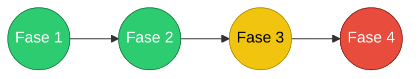

# Documentação Técnica --- Feature de Onboarding

## 1. Objetivo

O onboarding tem como objetivo **garantir que uma conta esteja
minimamente preparada para uso**, guiando o usuário através de um
conjunto de etapas obrigatórias.

O processo termina quando o usuário consegue:

1.  Criar uma conta
2.  Configurar o ambiente DEV da conta
3.  Criar a primeira aplicação
4.  Configurar o ambiente DEV da aplicação

Após essas etapas, o onboarding é considerado **concluído**.

------------------------------------------------------------------------

# 2. Fases do Onboarding

  Ordem   Tipo
  ------- -------------------------------------------
  1       CADASTRAR_CONTA
  2       CONFIGURAR_PRIMEIRO_AMBIENTE_DA_CONTA
  3       CADASTRAR_PRIMEIRA_APLICACAO
  4       CONFIGURAR_PRIMEIRO_AMBIENTE_DA_APLICACAO

Essas fases ficam registradas na tabela **TipoOnbording**.

------------------------------------------------------------------------

# 3. Modelo de Dados

## Tabela TipoOnbording

Define as etapas possíveis do onboarding.

    TipoOnbording
    -------------
    id
    nome
    ordem
    descricao

Exemplo:

  id   nome                                        ordem
  ---- ------------------------------------------- -------
  1    CADASTRAR_CONTA                             1
  2    CONFIGURAR_PRIMEIRO_AMBIENTE_DA_CONTA       2
  3    CADASTRAR_PRIMEIRA_APLICACAO                3
  4    CONFIGURAR_PRIMEIRO_AMBIENTE_DA_APLICACAO   4

------------------------------------------------------------------------

## Tabela OnbordingConcluidoConta

Registra quais etapas já foram concluídas.

    OnbordingConcluidoConta
    -----------------------
    id
    idConta
    idTipoOnbording
    dataConclusao
    usuario

Constraint obrigatória:

``` sql
UNIQUE (idConta, idTipoOnbording)
```

Isso garante que **uma etapa não seja registrada duas vezes**.

------------------------------------------------------------------------

## Tabela Conta

Adicionar campo:

    statusOnbording

Valores possíveis:

    PENDENTE
    FEEDBACK
    FINALIZADO

Fluxo:

    PENDENTE → FEEDBACK → FINALIZADO

------------------------------------------------------------------------

# 4. Registro das Fases

Cada fase é registrada **automaticamente pelos serviços do sistema**.

------------------------------------------------------------------------

## FASE 1 --- Cadastro da Conta

Serviço responsável:

    ContaService

Ao salvar a conta registrar:

``` json
{
  "idConta": 1,
  "tipoOnbording": "CADASTRAR_CONTA",
  "dataConclusao": "2026-03-08T09:15:23",
  "usuario": "usuario.logado"
}
```

------------------------------------------------------------------------

## FASE 2 --- Configuração do Ambiente DEV da Conta

Serviço responsável:

    ConfiguracaoContaService

Condição:

    Ambiente.tipo = DEFAULT
    GrupoAutorizador = DEV

Registrar:

``` json
{
  "idConta": 1,
  "tipoOnbording": "CONFIGURAR_PRIMEIRO_AMBIENTE_DA_CONTA",
  "dataConclusao": "...",
  "usuario": "usuario.logado"
}
```

------------------------------------------------------------------------

## FASE 3 --- Cadastro da Primeira Aplicação

Serviço responsável:

    AplicacaoService

Regra:

Registrar onboarding **somente se for a primeira aplicação da conta**.

``` json
{
  "idConta": 1,
  "tipoOnbording": "CADASTRAR_PRIMEIRA_APLICACAO",
  "dataConclusao": "...",
  "usuario": "usuario.logado"
}
```

------------------------------------------------------------------------

## FASE 4 --- Configuração do Ambiente DEV da Aplicação

Serviço responsável:

    ConfiguracaoAplicacaoService

Condição:

    Ambiente.tipo = DEFAULT
    GrupoAutorizador = DEV

Registrar **somente na primeira aplicação configurada**.

``` json
{
  "idConta": 1,
  "tipoOnbording": "CONFIGURAR_PRIMEIRO_AMBIENTE_DA_APLICACAO",
  "dataConclusao": "...",
  "usuario": "usuario.logado"
}
```

------------------------------------------------------------------------

# 5. Regras de Reversão

Caso todas as aplicações configuradas sejam removidas:

    remover registro CONFIGURAR_PRIMEIRO_AMBIENTE_DA_APLICACAO

Regra:

    se não existir aplicação ativa com ambiente configurado

------------------------------------------------------------------------

# 6. Consulta de Progresso

O progresso é calculado usando:

    TipoOnbording (ordem)
    +
    OnbordingConcluidoConta

Query base:

``` sql
SELECT 
    t.id,
    t.nome,
    t.ordem,
    o.dataConclusao
FROM TipoOnbording t
LEFT JOIN OnbordingConcluidoConta o
       ON o.idTipoOnbording = t.id
      AND o.idConta = :idConta
ORDER BY t.ordem;
```

------------------------------------------------------------------------

# 7. Cálculo do Status

Regra:

    dataConclusao != null → CONCLUIDO
    primeira fase sem data → EM_ANDAMENTO
    demais → PENDENTE

Algoritmo:

    encontrouEmAndamento = false

    para cada fase:

        se dataConclusao != null
            status = CONCLUIDO

        senao se !encontrouEmAndamento
            status = EM_ANDAMENTO
            encontrouEmAndamento = true

        senao
            status = PENDENTE

------------------------------------------------------------------------

# 8. Estados do Progresso

  Status         Significado
  -------------- --------------------------
  CONCLUIDO      etapa já realizada
  EM_ANDAMENTO   próxima etapa a executar
  PENDENTE       etapa futura

------------------------------------------------------------------------

# 9. Representação para UI

Exemplo retorno da API:

``` json
[
  {
    "fase": "CADASTRAR_CONTA",
    "ordem": 1,
    "status": "CONCLUIDO"
  },
  {
    "fase": "CONFIGURAR_PRIMEIRO_AMBIENTE_DA_CONTA",
    "ordem": 2,
    "status": "CONCLUIDO"
  },
  {
    "fase": "CADASTRAR_PRIMEIRA_APLICACAO",
    "ordem": 3,
    "status": "EM_ANDAMENTO"
  },
  {
    "fase": "CONFIGURAR_PRIMEIRO_AMBIENTE_DA_APLICACAO",
    "ordem": 4,
    "status": "PENDENTE"
  }
]
```



------------------------------------------------------------------------

# 10. Barra de Progresso

Mapeamento:

    CONCLUIDO → verde
    EM_ANDAMENTO → amarelo
    PENDENTE → vermelho

------------------------------------------------------------------------

# 11. Fluxo UX

Conta nova:

    statusOnbording = PENDENTE

Sistema mostra onboarding.

Após completar todas as fases:

    statusOnbording = FEEDBACK

UI apresenta popup de feedback.

Após responder feedback:

    statusOnbording = FINALIZADO

Onboarding não é mais exibido.

------------------------------------------------------------------------

# 12. Estrutura de Serviços

Sugestão:

    onboarding
     ├─ OnboardingService
     ├─ OnboardingRepository
     ├─ OnboardingProgressService

Responsabilidades:

  Service                     Responsabilidade
  --------------------------- --------------------
  OnboardingService           registrar fases
  OnboardingProgressService   calcular progresso
  OnboardingRepository        persistência

------------------------------------------------------------------------

# 13. Fluxo Completo

    Criar conta
        ↓
    registrar CADASTRAR_CONTA
        ↓
    configurar ambiente DEV da conta
        ↓
    registrar CONFIGURAR_PRIMEIRO_AMBIENTE_DA_CONTA
        ↓
    criar primeira aplicação
        ↓
    registrar CADASTRAR_PRIMEIRA_APLICACAO
        ↓
    configurar ambiente DEV da aplicação
        ↓
    registrar CONFIGURAR_PRIMEIRO_AMBIENTE_DA_APLICACAO
        ↓
    onboarding concluído
        ↓
    statusConta = FEEDBACK

------------------------------------------------------------------------

# 14. Pontos Técnicos Importantes

### Constraint obrigatória

``` sql
UNIQUE(idConta, idTipoOnbording)
```

### Registrar fase somente uma vez

Antes de salvar verificar se já existe.

### Primeira aplicação

Registrar onboarding somente se:

    quantidadeAplicacoesConta == 1

------------------------------------------------------------------------

# Conclusão

Esse modelo garante:

-   rastreabilidade do onboarding
-   progresso simples de calcular
-   baixo acoplamento
-   fácil evolução futura
-   UX guiada
-   auditoria completa
