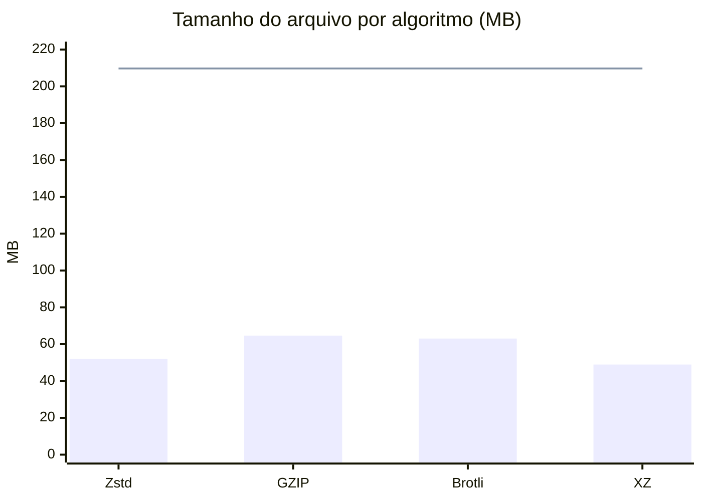
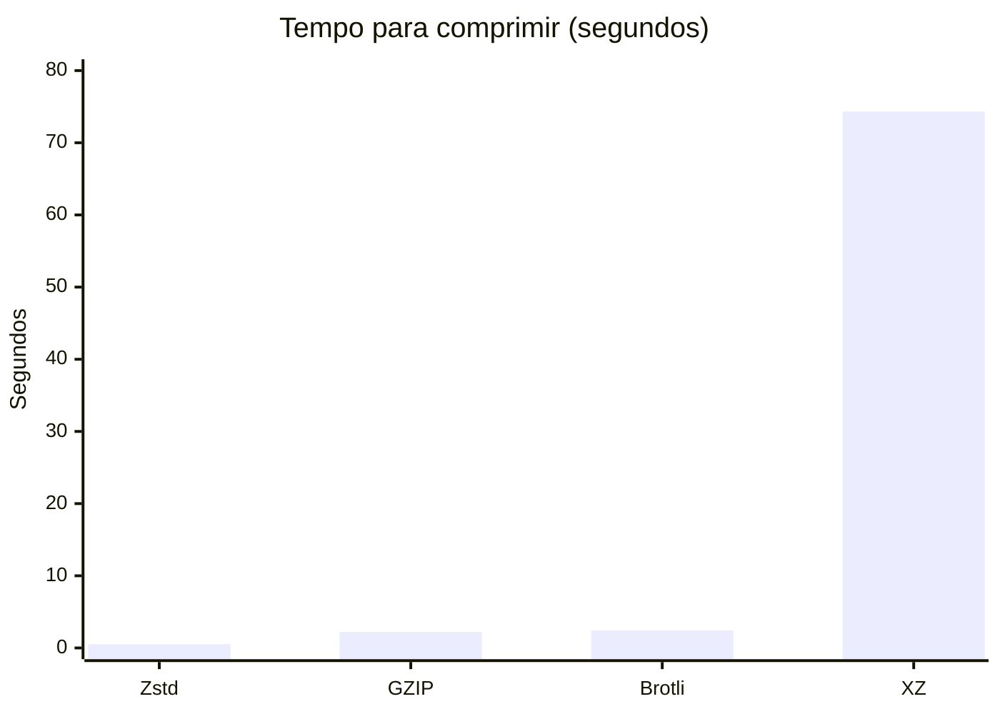
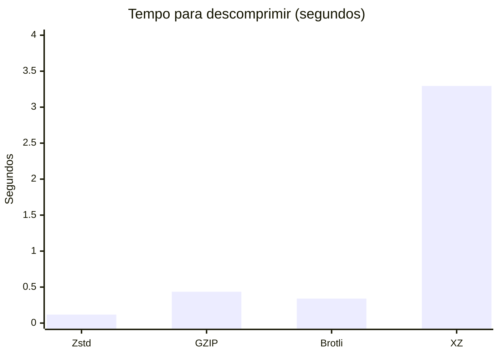
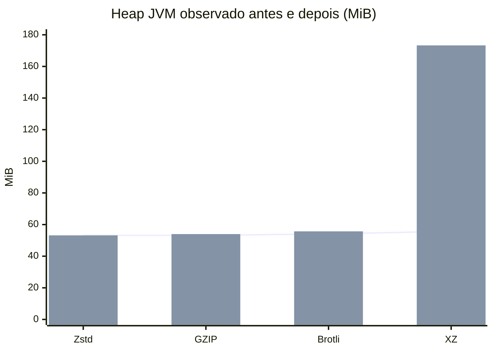

# Comparação dos algoritmos de compressão

**Última medição refletida neste relatório:** 05/10/2026 às 22:16:56 -03:00 (horário de São Paulo). O próximo `compare` substituirá este conteúdo com a data e a hora locais da nova execução, além dos gráficos de CPU, heap, RSS e memória residente privada por etapa.

## Escopo da execução

A comparação exibida aqui usou o mesmo arquivo JSON de **209.719.653 bytes (209,72 MB)**, buffer de **128 KiB** e configurações padrão do comando `compare`: Zstd nível 1, GZIP nível 6, Brotli qualidade 5 e XZ preset 6. Todos os roundtrips passaram na validação SHA-256. A partir da próxima execução, o comando `compare` recria automaticamente este Markdown com os dados atuais do CSV, inclusive CPU e picos de heap, RSS e memória residente privada medidos separadamente na compressão e na descompressão.

Os gráficos abaixo usam os resultados registrados em `comparacao-algoritmos/comparacao.csv`. Tamanhos estão em MB decimais; tempos estão em segundos.

## Tamanho original e compactado

A linha horizontal representa o tamanho original. As barras mostram o tamanho compactado.

## Tempo de compressão

## Tempo de descompressão

## Memória observada e CPU

O CSV registra **amostras de heap da JVM antes e depois** de cada roundtrip, não o pico de memória nem o RSS do processo. Como os algoritmos foram executados em sequência na mesma JVM, o heap observado antes de cada algoritmo já pode incluir efeitos das execuções anteriores. A diferença entre as amostras não deve ser interpretada como memória alocada exclusivamente pelo algoritmo.

A linha mostra o heap amostrado antes; as barras mostram o heap amostrado depois. Valores convertidos para MiB (1 MiB = 1.048.576 bytes).

**Esta execução histórica não mediu CPU nem picos de memória por etapa.** Os valores de heap antes/depois abaixo são apenas as amostras disponíveis nessa execução; não são picos nem representam todo o consumo de memória do processo. Para atualizar este relatório com as novas métricas, execute novamente `mvn -q compile exec:java -Dexec.args='compare dataset-realista.json 128'` dentro de `poc-compactacao`. O comando recria o CSV e este Markdown com os novos dados.

## Métricas por algoritmo — execução histórica

Nesta execução, a memória disponível é o heap medido antes e depois do roundtrip. As medições de CPU e os valores de memória por etapa, incluindo RSS e picos, não foram registrados nessa rodada. Os valores de heap são mantidos em bytes, como no CSV original.

| Algoritmo | Compactado (bytes) | Redução | Compressão | Descompressão | Heap antes (bytes) | Heap depois (bytes) | SHA-256 |
|---|---:|---:|---:|---:|---:|---:|---|
| Zstd | 52.041.794 | 75,185% | 0,518 s | 0,118 s | 55.753.224 | 55.753.224 | Confere |
| GZIP | 64.647.507 | 69,174% | 2,214 s | 0,436 s | 55.753.224 | 56.591.936 | Confere |
| Brotli | 63.057.549 | 69,932% | 2,433 s | 0,340 s | 56.723.040 | 58.400.792 | Confere |
| XZ | 48.954.200 | 76,657% | 74,323 s | 3,295 s | 58.400.792 | 181.719.336 | Confere |

## Análise e recomendação — execução histórica

**Menor arquivo:** XZ (48.954.200 bytes; 76,657% de redução).  
**Compressão e descompressão mais rápidas:** Zstd (0,518 s e 0,118 s; 0,636 s no roundtrip).

Como CPU e memória por etapa não foram medidas nessa execução, a sugestão histórica considera apenas tamanho compactado e tempo total do roundtrip, com peso igual para ambos. A posição 1 é a melhor em cada critério.

| Algoritmo | Posição por tamanho | Roundtrip (s) | Posição por tempo | Média das posições |
|---|---:|---:|---:|---:|
| Zstd | 2 | 0,636 | 1 | 1,50 |
| GZIP | 4 | 2,650 | 2 | 3,00 |
| Brotli | 3 | 2,773 | 3 | 3,00 |
| XZ | 1 | 77,618 | 4 | 2,50 |

**Sugestão para esta execução: Zstd.** Ele não gera o menor arquivo, mas oferece o melhor equilíbrio entre tamanho e tempo nessa amostra. A recomendação pode mudar quando houver medições de CPU e memória, ou se a prioridade principal for reduzir ao máximo o tamanho do arquivo. Os resultados também dependem da máquina, do conteúdo e do buffer.
