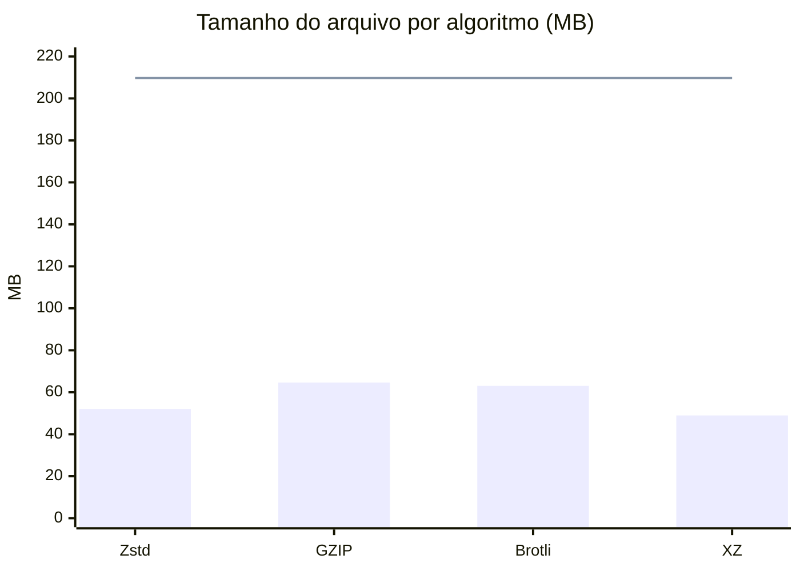
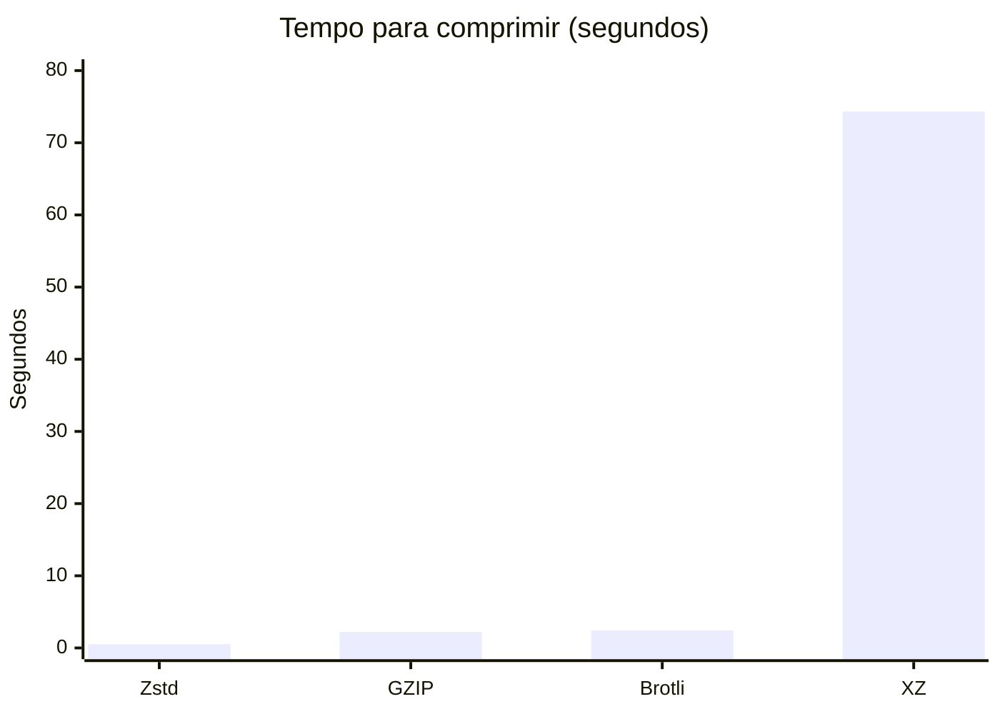
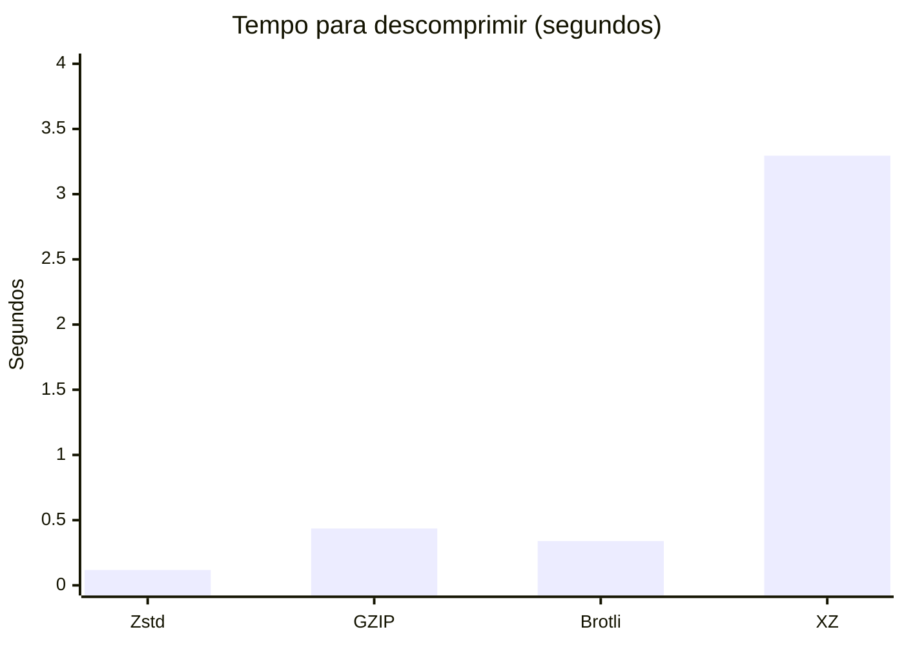
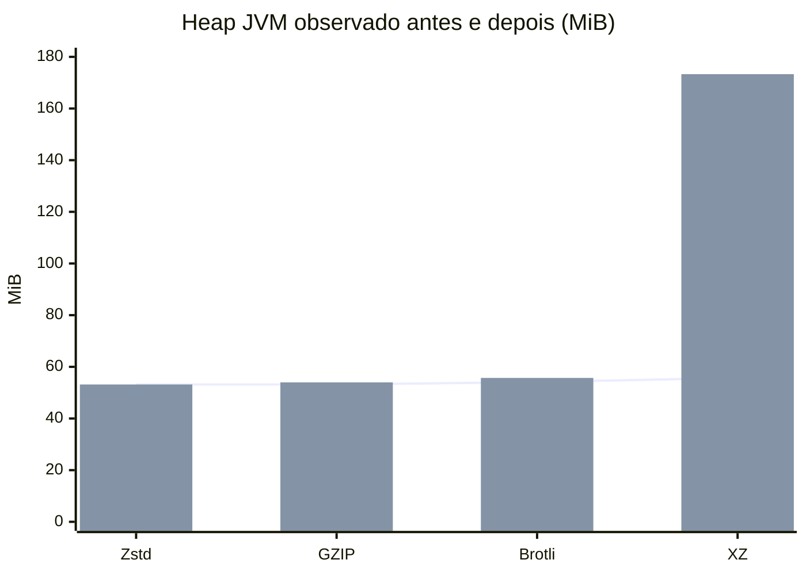

# Comparação dos algoritmos de compressão

**Última medição refletida neste relatório:** 05/10/2026 às 22:16:56 -03:00 (horário de São Paulo). O próximo `compare` substituirá este conteúdo com a data e a hora locais da nova execução, além dos gráficos de CPU e heap por etapa.

## Escopo da execução

A comparação exibida aqui usou o mesmo arquivo JSON de **209.719.653 bytes (209,72 MB)**, buffer de **128 KiB** e configurações padrão do comando `compare`: Zstd nível 1, GZIP nível 6, Brotli qualidade 5 e XZ preset 6. Todos os roundtrips passaram na validação SHA-256. A partir da próxima execução, o comando `compare` recria automaticamente este Markdown com os dados atuais do CSV, inclusive CPU e heap medidos por etapa.

Os gráficos abaixo usam os resultados registrados em `comparacao-algoritmos/comparacao.csv`. Tamanhos estão em MB decimais; tempos estão em segundos.

## Tamanho original e compactado

A linha horizontal representa o tamanho original. As barras mostram o tamanho compactado.

## Tempo de compressão

## Tempo de descompressão

## Memória observada e CPU

O CSV registra **amostras de heap da JVM antes e depois** de cada roundtrip, não o pico de memória nem o RSS do processo. Como os algoritmos foram executados em sequência na mesma JVM, o heap observado antes de cada algoritmo já pode incluir efeitos das execuções anteriores. A diferença entre as amostras não deve ser interpretada como memória alocada exclusivamente pelo algoritmo.

A linha mostra o heap amostrado antes; as barras mostram o heap amostrado depois. Valores convertidos para MiB (1 MiB = 1.048.576 bytes).

**Esta execução histórica não mediu CPU nem pico de heap por etapa.** Para atualizar este relatório com as novas métricas, execute novamente `mvn -q exec:java -Dexec.args='compare dataset-realista.json 128'` dentro de `poc-compactacao`. O comando recria o CSV e este Markdown com os novos dados.

### Amostras de heap em bytes

| Algoritmo | Heap antes (bytes) | Heap depois (bytes) |
|---|---:|---:|
| Zstd | 55.753.224 | 55.753.224 |
| GZIP | 55.753.224 | 56.591.936 |
| Brotli | 56.723.040 | 58.400.792 |
| XZ | 58.400.792 | 181.719.336 |

## Resultado registrado

| Algoritmo | Compactado (bytes) | Redução | Compressão | Descompressão | SHA-256 |
|---|---:|---:|---:|---:|---|
| Zstd | 52.041.794 | 75,185% | 0,518 s | 0,118 s | Confere |
| GZIP | 64.647.507 | 69,174% | 2,214 s | 0,436 s | Confere |
| Brotli | 63.057.549 | 69,932% | 2,433 s | 0,340 s | Confere |
| XZ | 48.954.200 | 76,657% | 74,323 s | 3,295 s | Confere |

Nesta amostra, o XZ produziu o menor arquivo. O Zstd teve o menor tempo de compressão e descompressão. Os tempos variam com máquina, JVM, armazenamento e carga do sistema; uma comparação de CPU e memória de pico exige métricas adicionais.
